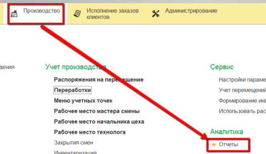
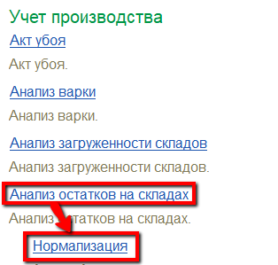
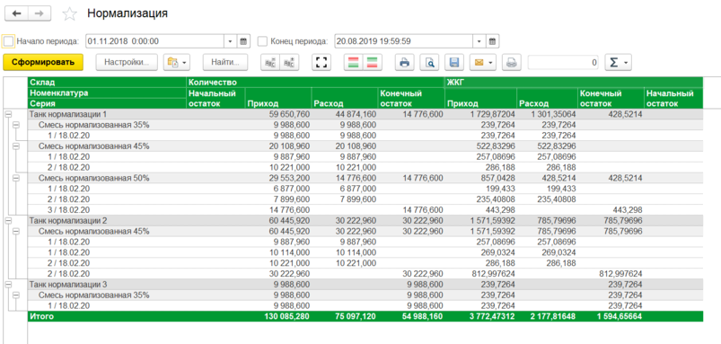
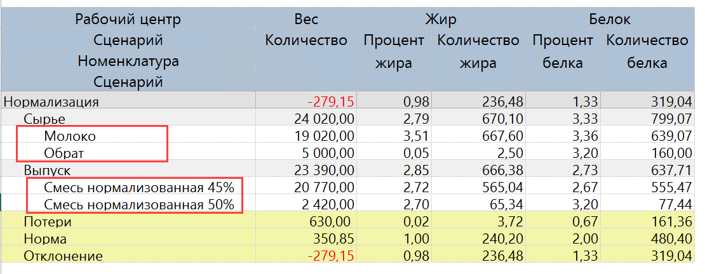

# Анализ потерь

Для анализа информации по участку нормализации молока в системе есть
несколько отчетов. Все они находятся в подсистеме "Производство" -\>
"Отчеты":

 

 

Начальный/конечный остаток и приход/расход по молоку в кг и жкг можно посмотреть в отчете "Анализ остатков на складах", вариант "Нормализация".

- Открыть отчет:  

- Необходимо установить параметры:
    -   Начало периода;
    -   Конец периода.    
    и сформировать:  

- В отчете отображается приход, расход, начальный и конечный остаток
    молока в танках в пределах указанного в параметрах периода в кг и
    жкг.

Баланс участка нормализации по кг, жкг и бкг можно посмотреть с
    помощью отчета "Баланс жира и белка".

- Необходимо установить параметр:
  -   Период.  
  и сформировать:  

- Здесь можно видеть:
  -   Сколько какого продукта было выпущено, сколько при этом потратилось
    сырья;
  -   Какое было содержание жира и белка в сырье, какое получилось в
    выпусках (как в кг, так и в %);
  -   Получившийся процент потерь по кг, жкг и бкг и нормативный
    в пределах указанного в параметрах периода.