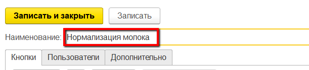
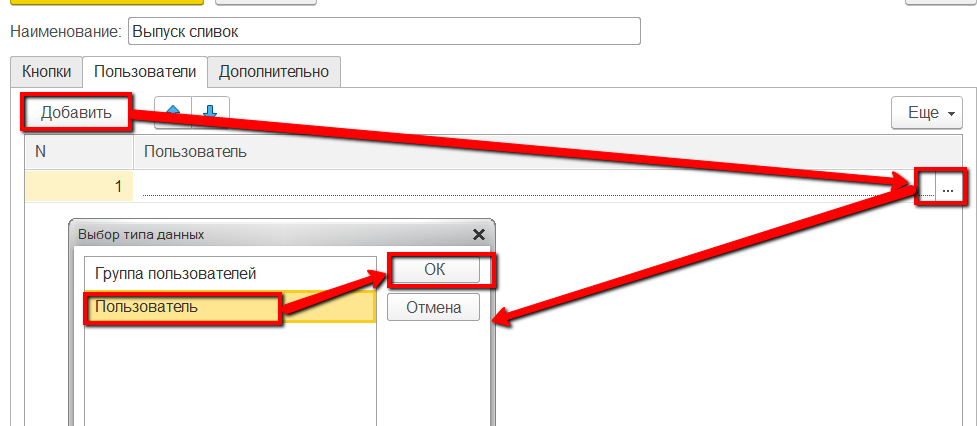
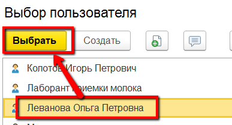
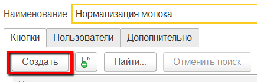
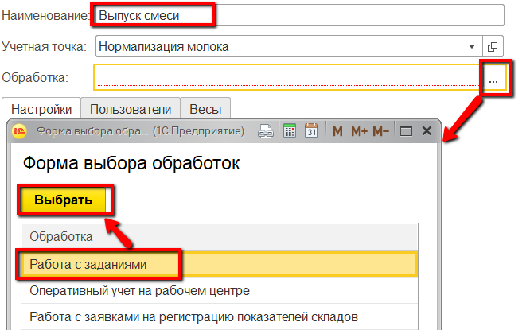
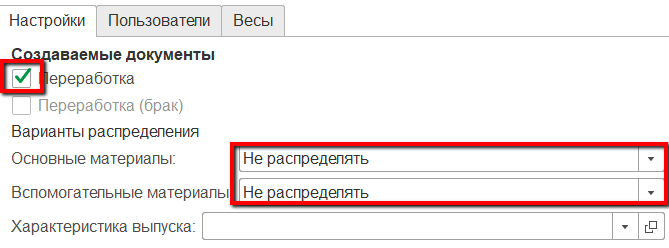
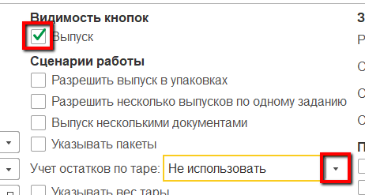
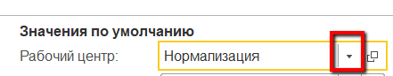
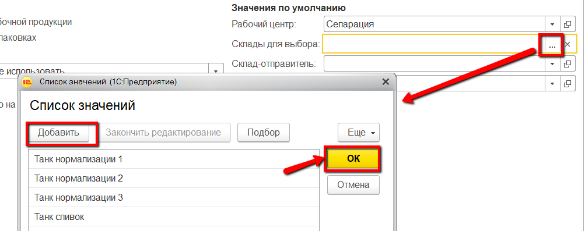

**Учетные точки**
=================

Настройка всех интерфейсов, через которые ведется оперативный учет на
участке нормализации, происходит через справочники "Учетные точки" и
"Кнопки учетных точек".

**Справочник "Учетные точки".** 

Данный справочник используется для того,
чтобы отделить наборы операций, выполняемых на разных участках
производства. Например, логично отделить операции, связанные с выпусками
на этапе нормализации, от операций, связанных с выпусками на этапе варки.  
При этом, если на предприятии на один только участок нормализации
ставится несколько сенсорных киосков (в ключевых точках - отдельно около
счетчика выпущенной смеси, отдельно около переданной смеси в
сыроизготовители и тп), то разумно на каждый киоск сделать отдельную
учетную точку, пусть и  с одной операцией.
 

 

-   Открыть справочник "Учетные точки" и перейти к созданию нового элемента:  

-   Указать наименование:  

-   Указать список пользователей, у которых будет доступ к этой учетной
    точке (т.е. только они смогут выполнять операции, относящиеся к этой
    учетной точке):  
  

-  Нажать "Записать и закрыть".

**Справочник "Кнопки учетных точек".**  

Данный справочник используется для того, чтобы настраивать различные операции, выполняемые на определенном участке производства. Например, для этапа нормализации логично выделить кнопку для выпуска смеси, еще, возможно, для её передачи в сырцех.
     
-   Открыть справочник "Учетные точки". Среди списка найти нужную,
    открыть:  

-   В таблице кнопок нажать "Создать":  

-   Указать наименование и выбрать обработку "Работа с заданиями" - если
    выпуск смеси идут строго по заданию на смену или "Оперативный учет
    на рабочем центре" - в противном случае:  

-   Указать в создаваемых документах "Переработка" и что при её создании
    нет списания материалов:  

-   Указать видимость кнопки выпуска и что не ведется учет по таре:  

-   Указать участок нормализации:  

-   Ограничить склады для выпуска:  

-   Нажать "Записать и закрыть".

 

Более подробная информация о параметрах кнопок учетных точек описана в
разделе ["Кнопки учетных точек"](../../../../CommonInformation/Handbooks/ButtonOfAccountPoint/readme.md).
