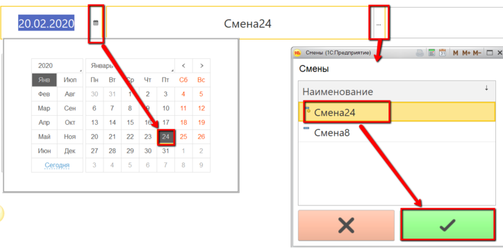

# Выпуск через киоск по заданию

Выпуск нормализованного молока по заданию в системе происходит через
учетную точку, привязанную к участку, где нормализуется молоко.

 

 

-   Открыть "Меню учетных точек" :  

-   Указать текущую дату и смену, если они еще не указаны:  
 
-   Указать учетную точку, которая соответствует участку нормализации
    молока:  

-   Нажать кнопку, соответствующую выпуску смеси. Отобразится задание на
    выпуск смесей в производственном порядке. Нажать на первую и нажать
    "Приступить":  

-   Указать, с какого танка было взять молоко:  
  
и сколько нормализованной смеси получилось:  

-   Подтвердить, нажав кнопку с галочкой.
     

