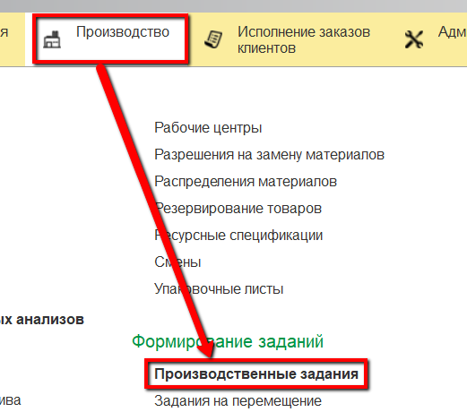
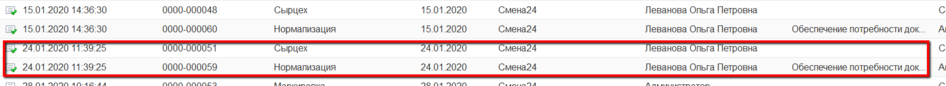

# Формирование задания на смену

Задание на смену на выпуск смеси формируется автоматически при создании
задания на варку (см.[Варка сыра. Формирование задания на смену](../../CookingCheese/TaskFormation/TaskFormation.md)).

 

 

-   Если открыть документы "Производственное задание":  
  
то можно видеть, что к документу, соответствующему заданию на варку, всегда идет аналогичный документ с тем же временем создания,
    но он создан автоматически, а не вручную.
  

Это задание для участка, где нормализуется смесь, при этом номера
    партий смесей соответствуют номерам партий варок сыра. Т.е. под каждую
    указанную в задании варку идет отдельная сторока задания для
    выработки смеси в соответствие со спецификацией.
