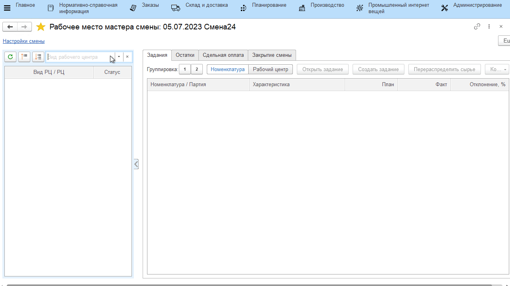
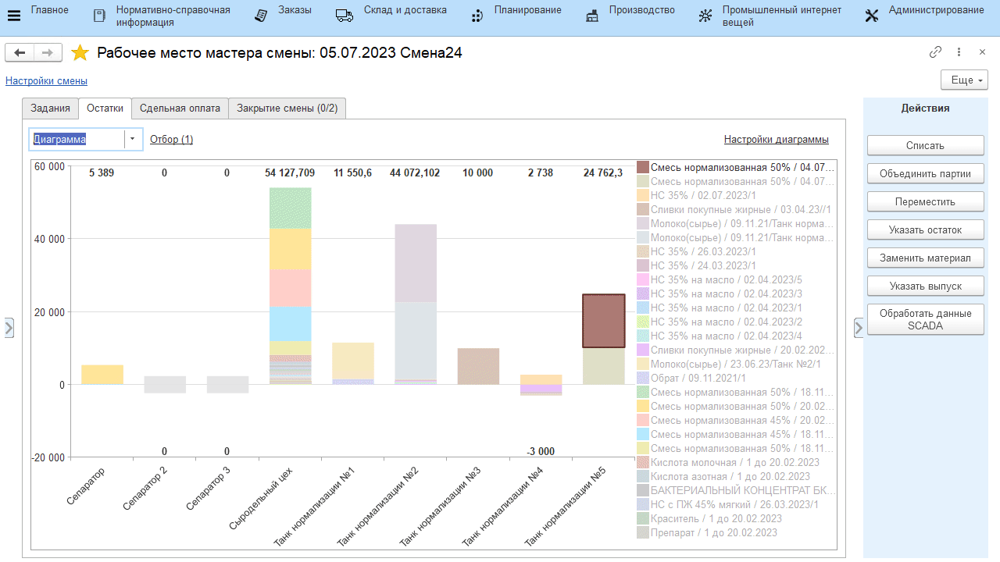

# Передача молока в сыроизготовитель

Передача смеси в сыроизготовители осуществляется мастером смены через **"Рабочее место мастера смены"**. 

-   Открыть **"Рабочее место мастера смены"**;
-   Указать смену и вид рабочего центра, к которому относится участок нормализации молока;
-   В таблице ниже выбрать участок нормализации молока;
-   На вкладке *"Остатки"* отображается информация по
    оборотам нормализованного молока в каждом танке.
    Для просмотра только остатков (по данным системы) можно
    переключиться в режим диаграммы;

-   Для передачи смеси в сыроизготовители нужно выбрать танк, с которого будет передана смесь, и нажать **"Переместить"**;
-   В открывшейся форме указать, сколько и в какой сыроизготовитель
    передается смеси, и подтвердить;

