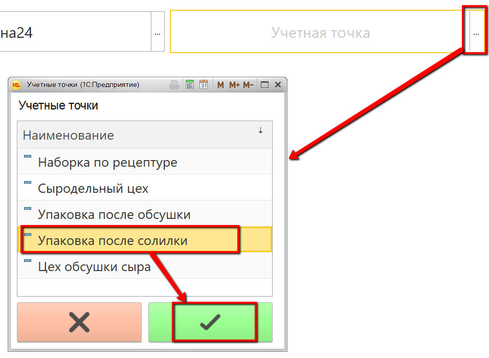
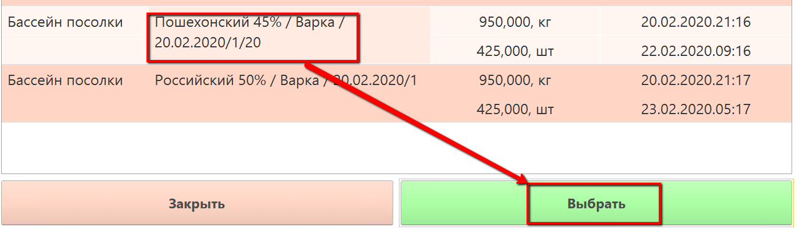
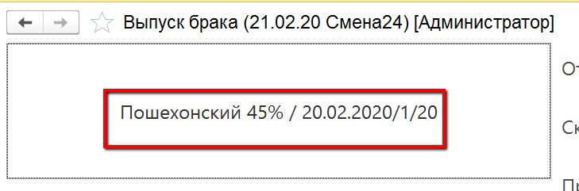
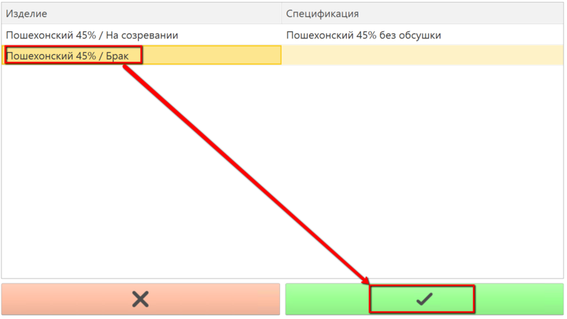
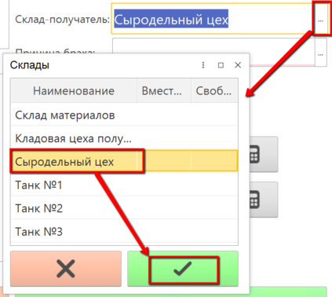
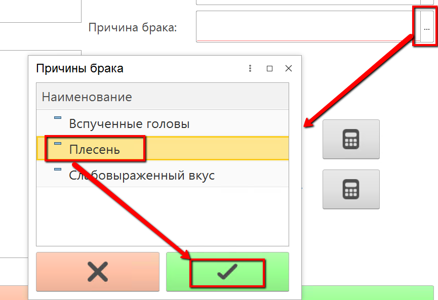
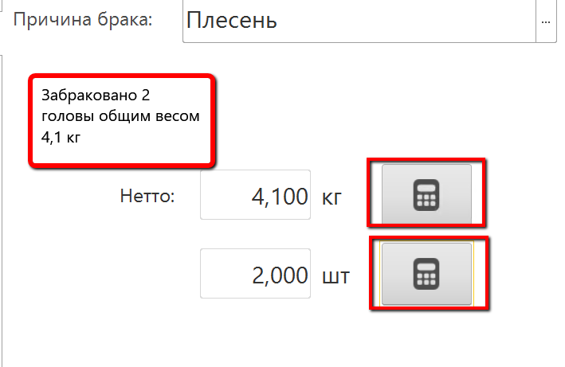

# Учет брака сыра

Учет отбраковки сыра в процессе его извлечения из бассейна в системе
происходит через учетную точку, привязанную к участку, где сыр
извлекается из солилки и передается на созревание.

 

-   Открыть "Меню учетных точек":
    
     
-   Указать текущую дату и смену, если они еще не указаны:
    
     
-   Указать учетную точку, которая соответствует участку извлечения сыра
    из бассейна соления:
    
     
-   Нажать кнопку, соответствующую учету брака сыра. Отобразятся все
    варки сыра в кг и штуках, которые по учету в системе находятся в
    солилке.
    
-   Нажать на варку сыра, по которой нужно учесть брак, и нажать
    "Выбрать":
    
     
-   В открывшейся форме указать, что идет учет брака:
    
    
     
-   Указать, на какой склад передается брак:
    
     
-   Указать, по какой причине бракуется сыр:
    
     
-   Указать количество брака (при подключенных к киоску весах - получить
    вес по соответствующей кнопке):
    
     
-   Подтвердить, нажав кнопку с галочкой.
     

