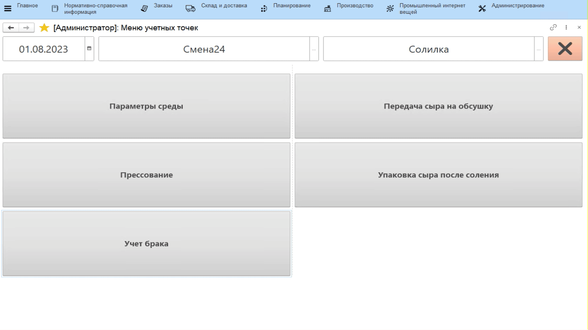

# Учет брака сыра

Учет отбраковки сыра в процессе его извлечения из бассейна в системе
происходит через учетную точку, привязанную к участку, где сыр
извлекается из солилки и передается на созревание.

-   Открыть **"Меню учетных точек"**;
-   Указать текущую дату и смену, если они еще не указаны;
-   Указать учетную точку, которая соответствует участку извлечения сыра
    из бассейна соления;
-   Нажать кнопку, соответствующую учету брака сыра. Отобразятся все
    варки сыра в кг и штуках, которые по учету в системе находятся в
    солилке;
-   Нажать на варку сыра, по которой нужно учесть брак, и нажать
    **"Выбрать"**;
-   Указать, на какой склад передается брак;
-   Указать, по какой причине бракуется сыр;
-   Указать количество брака в килограммах (при подключенных к киоску весах - получить
    вес по соответствующей кнопке) и количество бракованных голов;
-   Подтвердить, нажав кнопку с галочкой.

