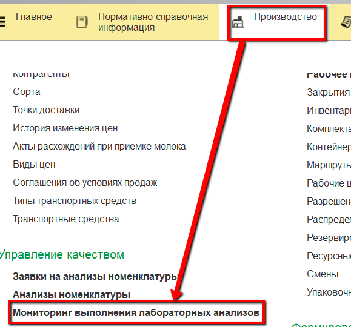
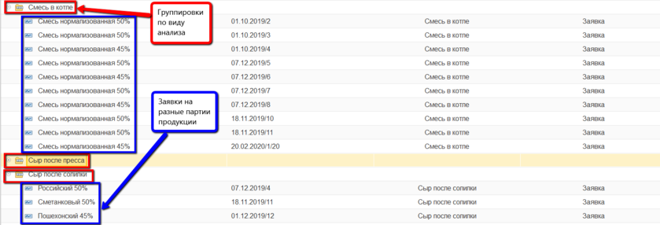
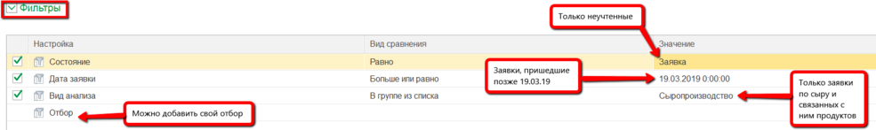
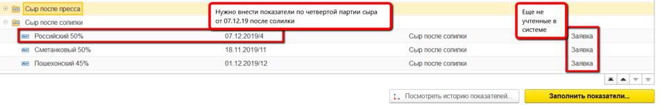
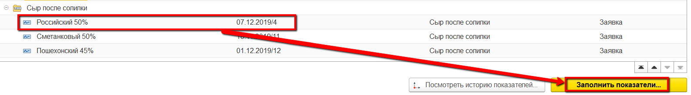
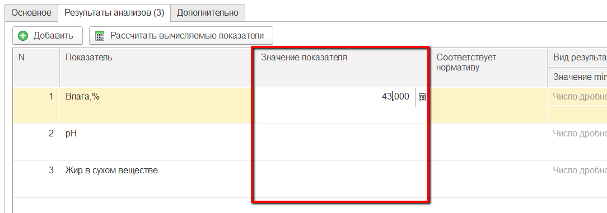

# Учет лабораторных анализов

По мере учета в системе выпусков различной продукции появляются и заявки
на учет их лабораторных анализов. Каждую такую заявку лаборант должен
заполнить фактическими значениями показателей.

 

-   Открыть "Мониторинг выполнения лабораторных анализов":
    
     
-   В появившемся окне все анализы распределены по группам:
    
     
-   Можно настроить отборы для отображения только нужного списка
    анализов:
    
     
-   Необходимо будет заполнить показатели анализов, которые отображаются
    с состоянием "Заявка". При этом каждая строка в списке - анализ по
    конкретной партии конкретной продукции:
    
     
-   Выбрать нужную строку, нажать кнопку "Заполнить показатели":\
    
     
-   Перейти на вкладку "Результаты анализов", необходимо заполнить
    колонку "Значения показателя".
    Напротив первого показателя (в примере это "Влага") записать
    полученное значение Влаги в этой партии выбранной продукции:
    
     
-   Аналогично заполнить остальные показатели. Когда все показатели буду
    заполнены, нажать "Провести и закрыть".

 
