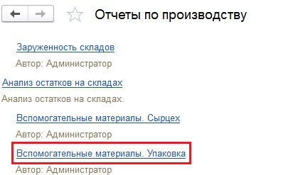
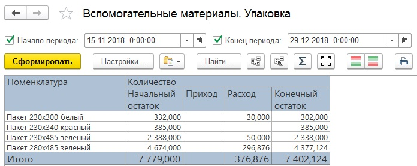

# Анализ расхода пакетов

Для анализа информации по расходу пакетов на упаковку сыра в системе
есть несколько отчетов. Все они находятся в подсистеме "Производство"
-\> "Отчеты":

 

 

Остатки пакетов и прочих материалов на участке упаковки сыра можно
    посмотреть в отчете "Анализ остатков на складах", вариант "Вспомогательные материалы. Упаковка".  

- Необходимо установить параметры:
    -   Начало периода;
    -   Конец периода.  
    И сформировать:  
      
    В отчете отображается приход, расход, начальный и конечный остаток материалов в пределах указанного в параметрах периода.

