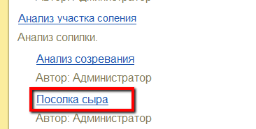
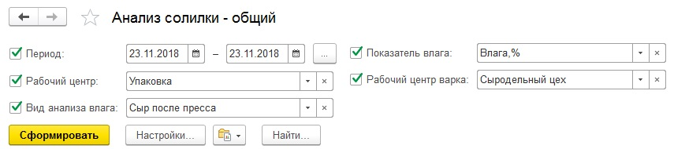
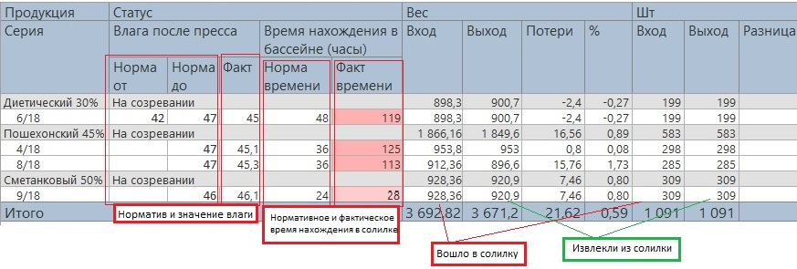
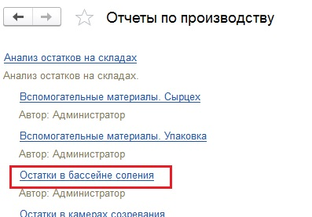
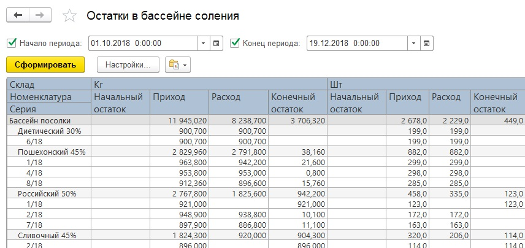

# Анализ соления

Для анализа информации по участку соления сыра в системе есть несколько
отчетов. Все они находятся в подсистеме "Производство" -\> "Отчеты":

 

Общий обзор по участку соления можно получить, сформировав отчет "Анализ участка соления", вариант "Посолка сыра".  
  

Необходимо установить параметры, если они еще не установлены:

- Период;
    - Рабочий центр - участок, где солится сыр;
    - Вид анализа влага - вид анализа, в котором учитывается показатель влаги в сыре после пресса;
    - Показатель влага - показатель, отвечающий за показатель влаги в системе;
    - Рабочий центр варка - участок, где варится сыр.  
    и сформировать:
      
      
    В сформировавшемся отчете по каждой варке видно следующую
    информацию:
    - Содержание в сыре влаги после пресса, а также норматив этого
    показателя;
    - Нормативное и фактическое время нахождения варки сыра в солилке
    (причем, чем сильнее нарушен норматив, тем столбец факт подсвечен
    краснее);
    - Сколько кг сыра зашло в солилку, сколько извлекли, и рассчитаны
    потери в весе на данном переделе как в кг, так и в %;
    - Сколько голов сыра зашло в солилку, сколько извлекли, и рассчитана
    разница этих значений (можно смотреть, не "потерялись" ли головы
    сыра).

Начальный/конечный остаток и приход/расход по варкам сыра в кг и шт можно посмотреть в отчете "Анализ остатков на складах", вариант "Остатки в бассейне соления".  
  

- Необходимо установить параметры:
    -   Начало периода;
    -   Конец периода.
    И сформировать:  
      
- В отчете по каждой варке сыра видно:
    -   Начальный и конечный остаток в кг и штуках в пределах указанного
    периода в бассейне соления;
    -   Приход и расход в кг и штуках в пределах указанного периода.

