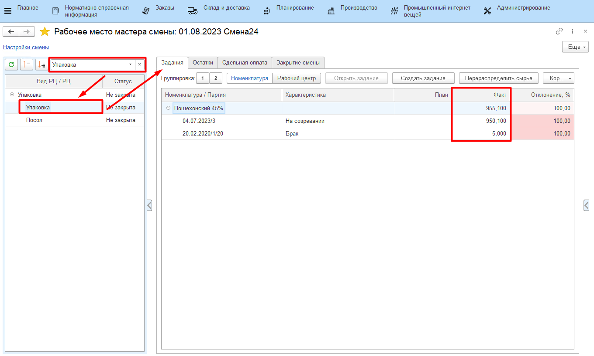
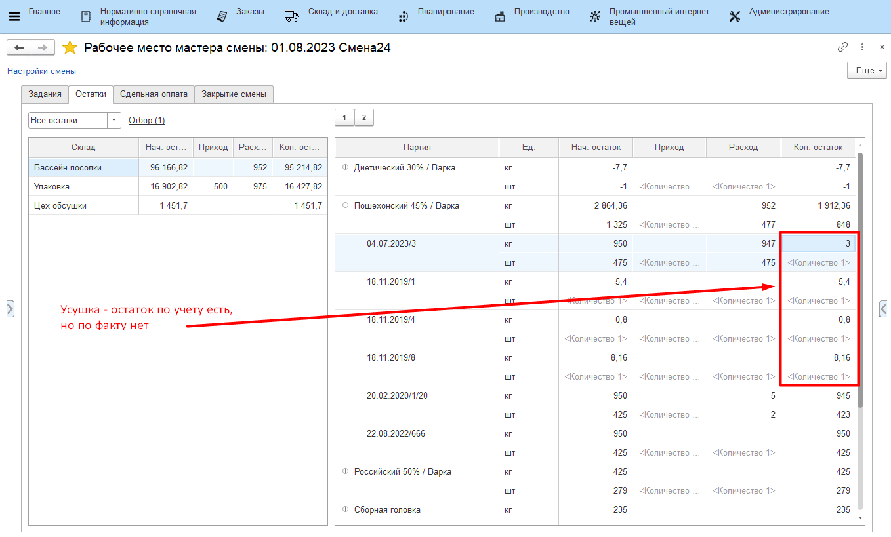
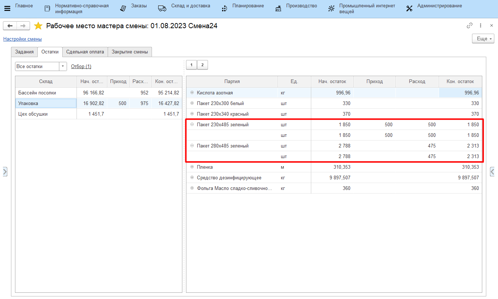
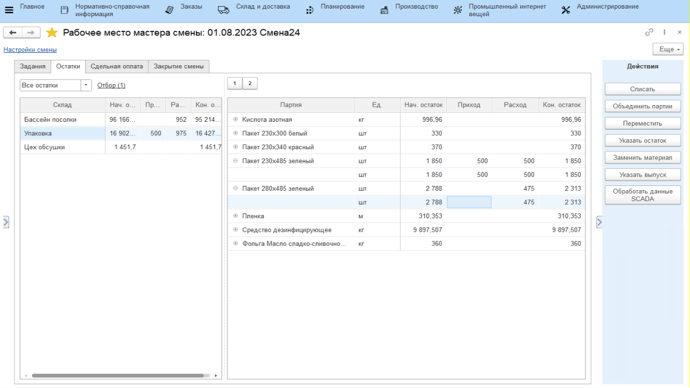
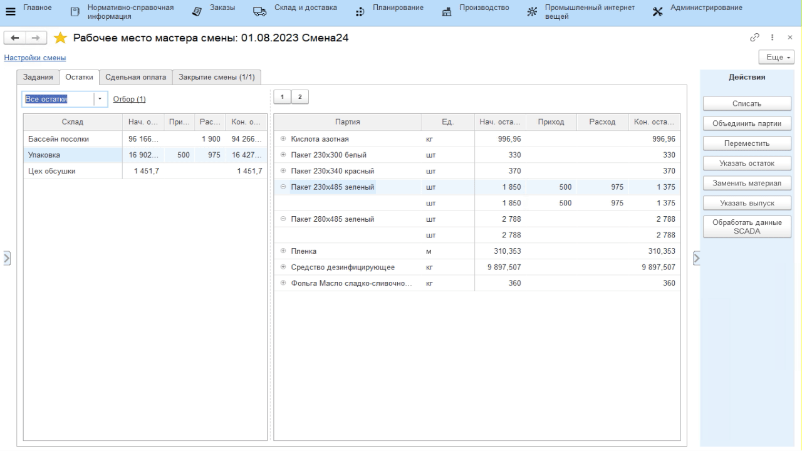
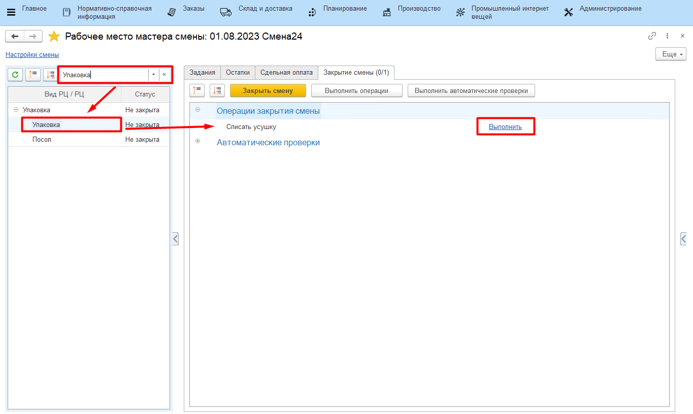
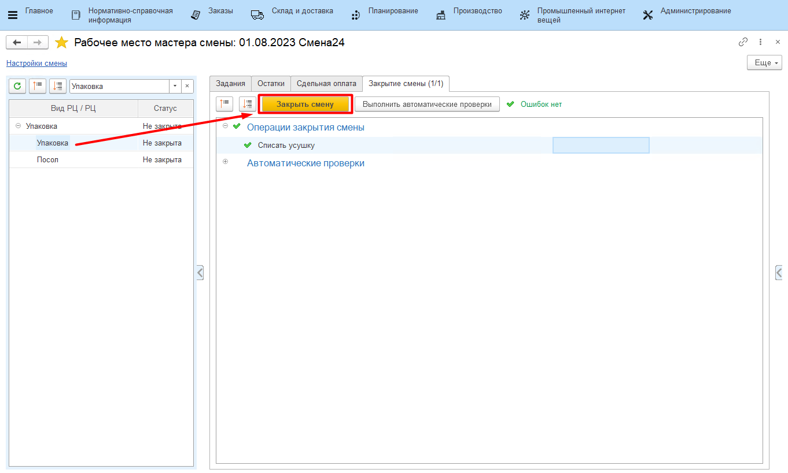

# Закрытие смены

Контроль всех введенных в систему данных за рабочую смену осуществляется
мастером смены через **"Рабочее место мастера смены"**.

-   Открыть **"Рабочее место мастера смены"**;
-   Указать смену для контроля и вид рабочего центра, на котором сыр извлекается из солилки и
    упаковывается в пакеты;
-   В таблице выбрать участок извлечения сыра из солилки, который необходимо
    проверить на корректность. Справа заполнится различная информация по
    данному участку. Например, на вкладке *"Задания"* отображается вся
    информация по выпускам за указанную смену:

 
    
На вкладке *"Остатки"* можно видеть условные остатки кг сыра, получившиеся в результате разницы между входным количеством сыра в солилку и извлеченным. Они получаются из-за процесса усушки. Эти остатки необходимо "списать" при итоговом закрытии смены (см. далее).

 

На вкладке *"Остатки"* также можно видеть израсходованные пакеты (столбец "Расход"). Проверяется и контролируется неотрицательность остатков (столбец "Кон.остаток").

Если при упаковке сыра по ошибке были выбраны не те пакеты (см. [Учет извлечения сыра](../../PoolCheeseExtractionAndPacking/AccountingPoolCheeseExtractionAndPacking.md)), здесь их можно заменить на корректные. Для этого:

-   Выбрать ошибочные пакеты и нажать **"Заменить материал"**;
-   Выбрать пакеты для замены;
-   Указать количество заменяемых пакетов и подтвердить:

-   Если в процессе упаковки сыра были выявлены бракованные пакеты, то
    здесь же можно учесть и их. Для этого выбрать пакет для учета его
    брака и нажать **"Списать"**;
-   Указать, что идет списание брака;
-   Указать статью затрат для брака и указать количество отбракованных
    пакетов. Подтвердить:  

После выполнения всех вышеперечисленных действий и проверки корректности всех данных, смену необходимо закрыть для невозможности внесения в нее изменений. Для этого:

-   Выбрать участок в таблице слева и перейти на вкладку *"Закрытие смены"*;
-   Выполнить операцию **"Списание усушки"**;
-   Нажать **"Закрыть"**: 

При закрытии могут возникнуть ошибки (например, отрицательных остатков - как следствие неточного или неоперативного учета). Исправить их, после чего вернуться и снова нажать **"Закрыть"**.

    