# Закрытие смен и контроль расхода пакетов

Контроль всех введенных в систему данных за рабочую смену осуществляется
мастером смены через "Рабочее место мастера смены"

 

 

-   Открыть "Рабочее место мастера смены":  
    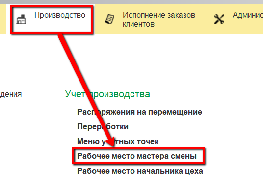
    
-   Указать дату и смену:  
    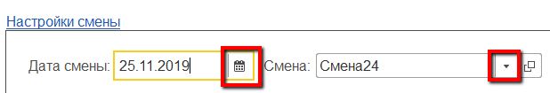
    
-   Указать участок, на котором сыр извлекается из солилки и
    упаковывается в пакеты:  

    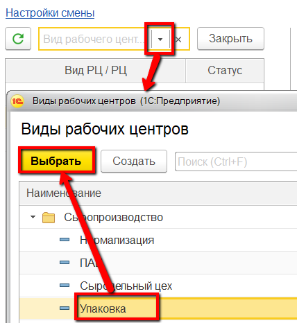

-   В таблице ниже выбрать участок извлечения сыра из солилки, который
    необходимо проверить на корректность. Справа заполнится различная
    информация по данному участку. Например, на вкладке "Выпуск"
    отображается вся информация по извлеченным варкам за указанную смену:  

    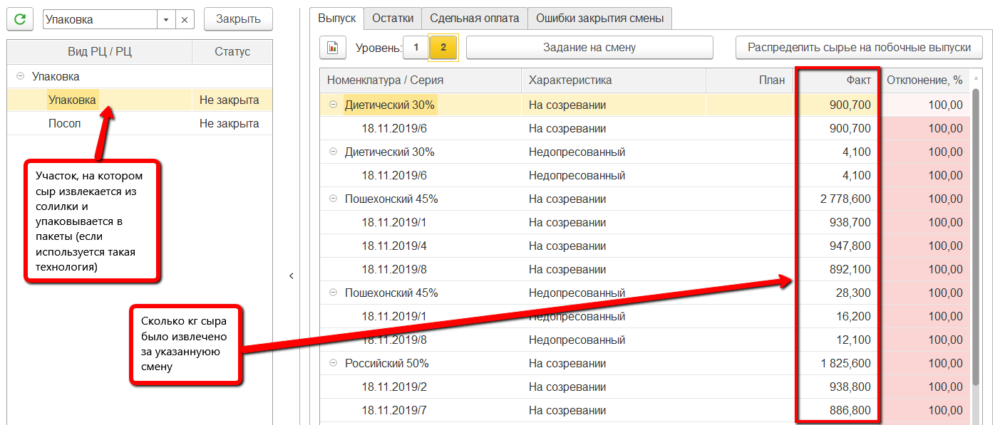

-   На вкладке "Остатки" -\> "Полуфабрикаты" можно видеть условные
    остатки кг сыра, получившиеся в результате разницы между входным
    количеством сыра в солилку и извлеченным. Они получаются из-за
    процесса усушки. Эти остатки необходимо "списать" со статьей
    расходов "Усушка" для дальнейшего учета в системе. Для этого
    выделить все строки, конечный остаток которых ненулевой, нажать
    "Списать усушку":  
    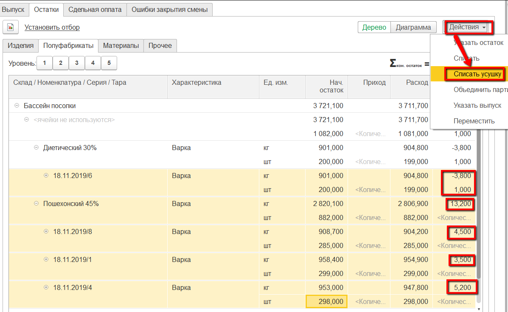

-   На вкладке "Остатки" -\> "Материалы" можно видеть израсходованные
    пакеты (столбец "Расход"). Проверяется и контролируется
    неотрицательность остатков (столбец "Кон.остаток").
    Если при упаковке сыра по ошибке были выбраны не те пакеты (см.
    [Учет извлечения сыра](../../PoolCheeseExtractionAndPacking/AccountingPoolCheeseExtractionAndPacking.md)), здесь их можно заменить на корректные. Для этого выбрать ошибочные пакеты и нажать "Заменить материал":  
    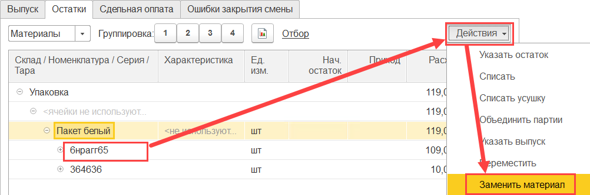
    
-   Выбрать пакеты для замены:  
    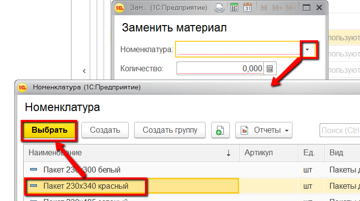

-   Указать количество заменяемых и подтвердить:  
    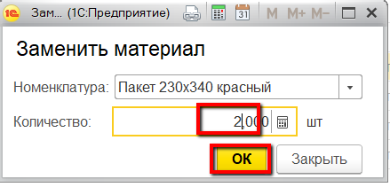

-   Если в процессе упаковки сыра были выявлены бракованные пакеты, то
    здесь же можно учесть и их. Для этого выбрать пакет для учета его
    брака и нажать "Списать":  
    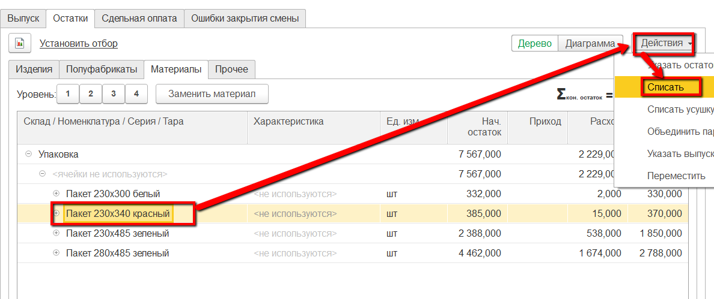

-   Указать, что идет списание брака:  
    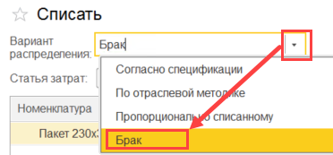

-   Указать статью затрат для брака и указать количество отбракованных
    пакетов. Подтвердить:  
    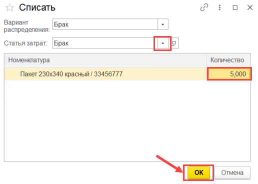

-   После выполнения всех вышеперечисленных действий и проверки
    корректности всех данных, смену необходимо закрыть для невозможности
    внесения в нее изменений. Для этого выбрать участок в таблице слева
    и нажать "Закрыть":  
    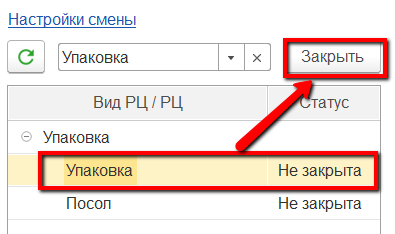

-   При возникновении ошибок (например, отрицательных остатков - как следствие неточного или неоперативного учета) система выдаст
предупреждения. Устранить ошибки, нажать еще раз "Закрыть".
    