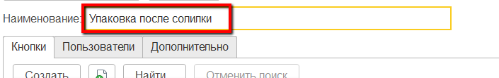
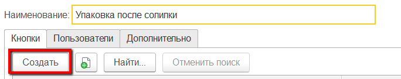
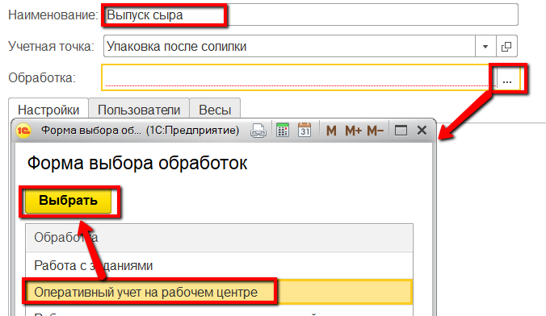
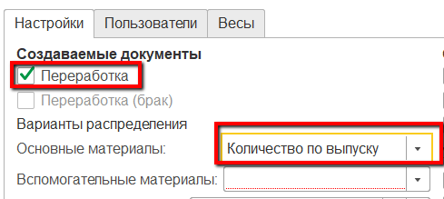
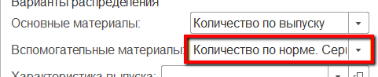
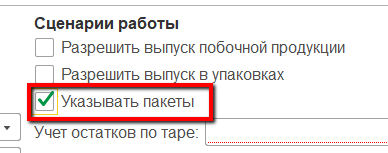
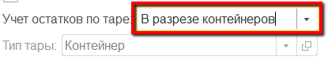
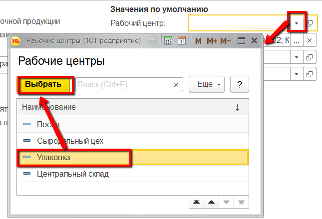
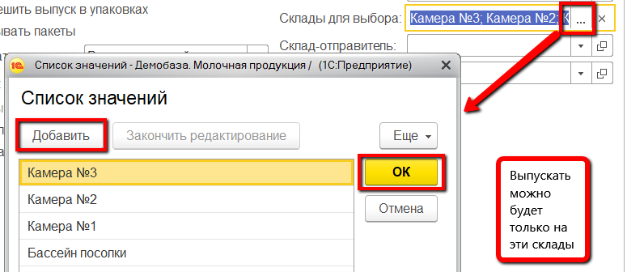

**Учетные точки**
=================

Настройка всех интерфейсов, через которые ведется оперативный учет на
сырцехе, происходит через справочники "Учетные точки" и "Кнопки учетных
точек".

**Справочник "Учетные точки"** 

Данный справочник используется для того,
чтобы отделить наборы операций, выполняемых на разных участках
производства. Например, логично отделить операции, связанные с выпусками
на этапе посола сыра, от операций, связанных с выпусками на этапе
нормализации. При этом, если на предприятии на один только участок
соления ставится несколько сенсорных киосков (в ключевых точках -
отдельно около счетчика выпущенных голов, отдельно около табло с
параметрами помещений и тп), то разумно на каждый киоск сделать
отдельную учетную точку, пусть и  с одной операцией.
 

 

-   Открыть справочник "Учетные точки" и перейти к созданию нового
    элемента:
    
     
-   Указать наименование:
    
     
-   Указать список пользователей, у которых будет доступ к этой учетной
    точке (т.е. только они смогут выполнять операции, относящиеся к этой
    учетной точке):
    
    
     
-   Нажать "Записать и закрыть".

**Справочник "Кнопки учетных точек".**  

Данный справочник используется для того, чтобы настраивать различные операции,
выполняемые на определенном участке производства. Например, для
этапа упаковки логично выделить кнопку для упаковки сыра,
находящегося в солилке.

-   Открыть справочник "Учетные точки". Среди списка найти нужную,
    открыть:
    
     
-   В таблице кнопок нажать "Создать":
    
     
-   Указать наименование и выбрать обработку "Оперативный учет на
    рабочем центре":
    
     
-   Указать в создаваемых документах "Переработка", и, что при её
    создании, основной материал списывается по факту:
    
     
-   Указать, что вспомогательные материалы списываются по норме с одним
    из вариантов подбора партий (серии пакетов, если по таковым ведется
    учет, по-прежнему будут указываться оператором):
    -   По ФИФО - первые, пришедшие на склад упаковки партии;
    -   По ФЕФО - с самым ранним заканчивающимся сроком годности;
    -   Средневзвешанное - пропорциональное списание всех партий в остатках;
    
     
-   Указать, что в АРМе оператор выбирает пакет, в который происходит упаковка голов:

    
     
-   Если сыр укладывают на контейнеры или тары, то указать, что ведется учет по таре (указать, по какой именно):

    
     
-   Указать участок упаковки сыра:

    
     
-   Ограничить склады для выпуска:

    
     
-   Нажать "Записать и закрыть".

Более подробная информация о параметрах кнопок учетных точек описана в
разделе ["Кнопки учетных точек"](../../../../CommonInformation/Handbooks/ButtonOfAccountPoint/readme.md).