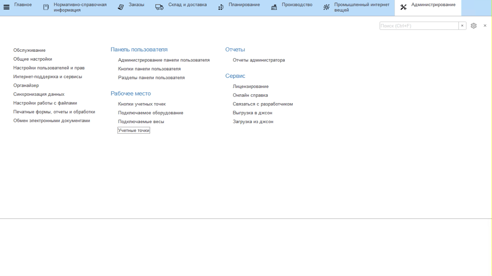
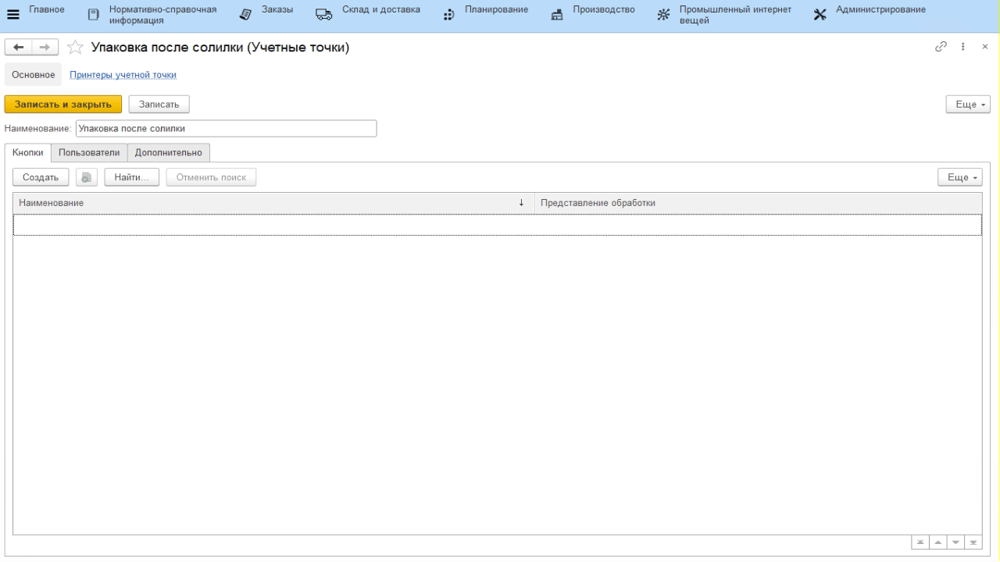
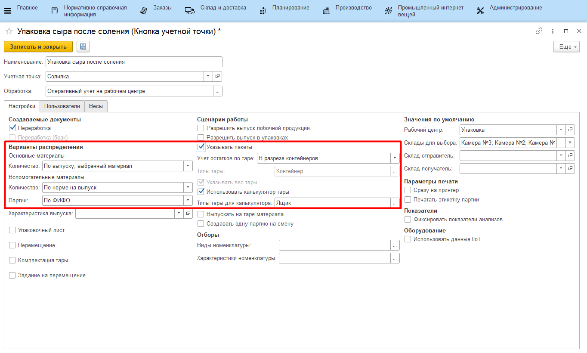

# Учетные точки

Настройка всех интерфейсов, через которые ведется оперативный учет на
участке нормализации, происходит через справочники **"Учетные точки"** и
**"Кнопки учетных точек"**.

## Справочник "Учетные точки"

Данный справочник используется для того,
чтобы отделить наборы операций, выполняемых на разных участках
производства. Например, логично отделить операции, связанные с выпусками на этапе посолки сыра, от операций, связанных с выпусками на этапе нормализации. При этом, если на предприятии на один только участок нормализации ставится несколько сенсорных киосков (в ключевых точках - отдельно около счетчика выпущенной смеси, отдельно для передачи смеси в сырцех), то разумно на каждый киоск сделать свою учетную точку, пусть и с одной операцией.
 

-   Открыть справочник **"Учетные точки"** и перейти к созданию нового
    элемента;
-   Указать наименование;
-   Указать список пользователей, у которых будет доступ к этой учетной
    точке (т.е. только они смогут выполнять операции, относящиеся к этой
    учетной точке);
-  Нажать **"Записать и закрыть"**.

## Справочник "Кнопки учетных точек"

Данный справочник используется для того, чтобы настраивать различные операции, выполняемые на определенном участке производства. Например, для этапа упаковки логично выделить кнопку для упаковки сыра, находящегося в солилке.  

-   Открыть справочник **"Учетные точки"**. Среди списка найти нужную, открыть;  
-   В таблице кнопок нажать **"Создать"**;
-   Указать наименование и выбрать обработку **"Оперативный учет на рабочем центре"**:

-   Указать в создаваемых документах **"Переработка"**;
-   Указать, что при её создании основной материал списывается по факту (вариант распределения основных материалов - *"По выпуску"*);
-   Указать, что вспомогательные материалы списываются по норме с одним из вариантов подбора партий (серии пакетов, если по таковым ведется учет, по-прежнему будут указываться оператором)
    - По ФИФО - первые, пришедшие на склад упаковки партии;
    - По ФЕФО - с самым ранним заканчивающимся сроком годности;

-   Указать, что на точке оператор выбирает пакет, в который происходит упаковка голов;
-   Если сыр укладывают на контейнеры или тары, то указать, что ведется учет по таре (указать, по какой именно);
-   Указать участок упаковки сыра;
-   Ограничить склады для выпуска;
-   Нажать **"Записать и закрыть"**.

Более подробная информация о параметрах кнопок учетных точек описана в
разделе ["Кнопки учетных точек"](../../../../CommonInformation/Handbooks/ButtonOfAccountPoint/readme.md).
