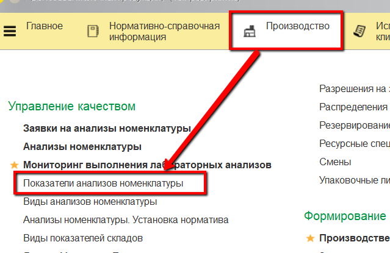
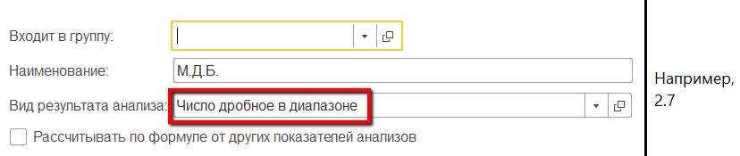
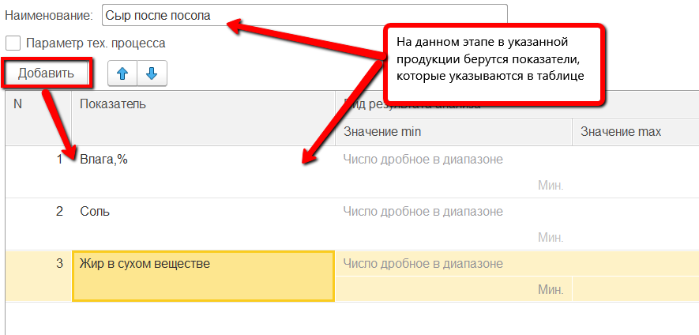

**Лабораторные анализы**
========================

**Справочник "Показатели анализов номенклатуры"**

Все показатели лабораторных анализов, которые учитываются на этапе
посола сыра, необходимо отразить в справочнике "Показатели анализов
номенклатуры", если таковых еще нет в нём.

Примечание. Одинаковые показатели, которые берутся по разным продуктам,
например жир или белок, НЕ нужно создавать отдельно для каждого
продукта.

 

-   Открыть справочник и перейти к созданию нового элемента:
    
     
-   Указать наименование показателя и выбрать, к какому виду относится
    его результат:
    -   Число целое в диапазоне - значение показателя будет целым числом из
    заданного в дальнейшем диапазона;
    -   Число дробное в диапазоне - аналогично первому, но значение может
    быть дробным;
    
     
-   Признак - имеет два значения: "Да" - соответствует и "Нет" - не
    соответствует указанному признаку;
    
     
-   Значение из списка - может соответствовать одному из перечисленных в
    таблице значению.
     
-   Также возможно, что создаваемый показатель рассчитывается от
    значений других. В таком случае отметить этот пункт галочкой и
    открыть окно для указания формулы:
    
     
-   В открывшемся окне указать, по какой формуле считается данный
    показатель и нажать "Записать и закрыть":
    Окно создания формулы для показателя.
    
     
-   Нажать "Записать и закрыть".

 

**Справочник "Виды анализов номенклатуры"**

Теперь созданные показатели анализов можно объединять в наборы,
соответствующие тем группам показателей, которые по конкретной продукции
берутся вместе (на одном этапе производства). Такие наборы создаются в
справочнике "Виды анализов номенклатуры" (один элемент справочника =
один набор).

 

-   Открыть справочник и перейти к созданию нового элемента:
    
     
-   Указать наименование набора (для удобства "\<Продукция, по которой берется этот набор показателей\> + \<Этап, на котором берется этот набор показателей\>") и в таблице перечислить все показатели, которые входят в набор:
    
     
-   Нажать "Записать и закрыть".

