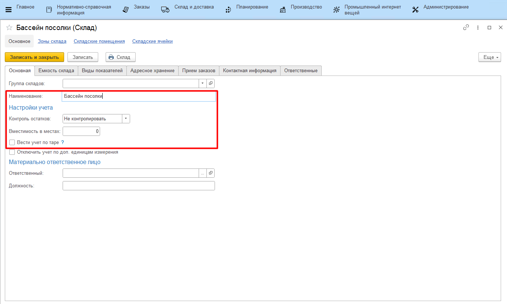
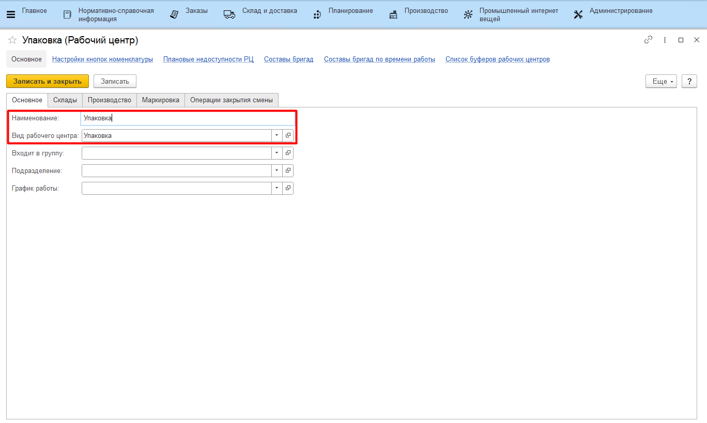
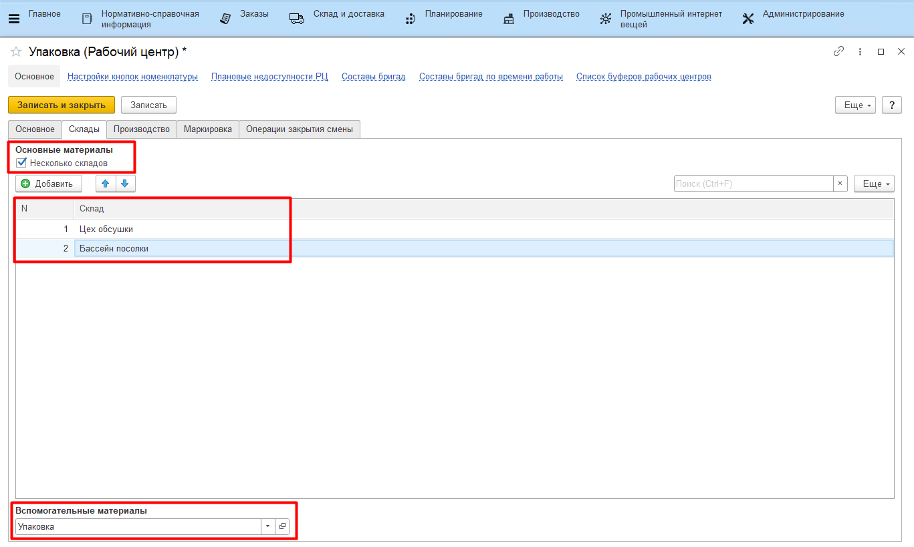
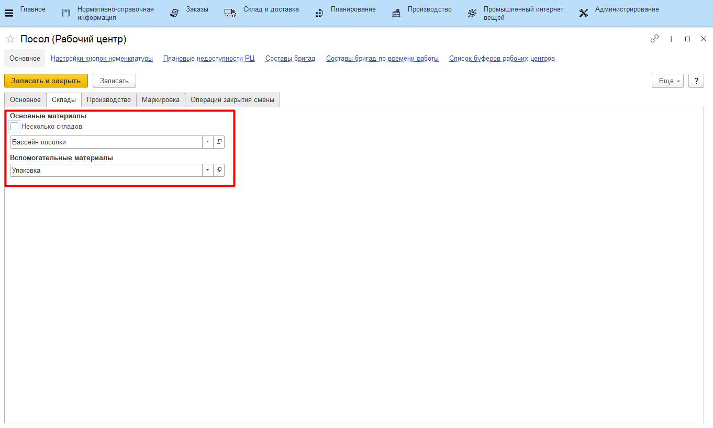

# Рабочие центры

## Справочник "Склады"

Информация по каждому складу (месту хранения), принадлежащему к автоматизируемому участку, фиксируется в справочнике **"Склады"**.

-   Открыть справочник и перейти к созданию нового элемента;
-   На вкладке *"Основное"* указать
    -   Название склада (места хранения);
    -   Настройка контроля остатков:   
    *Контролировать* - если при попытке списать какой-либо продукт (материал и пр.) с данного склада по нему может образоваться отрицательный остаток, система выдаст предупреждение и не выполнит действие.  
    *Не контролировать* - остатки могут уходить в минус.  
-   Нажать **"Записать и закрыть"**.

## Справочник "Рабочие центры"

Информация по участку производства (или нескольким), на котором проходит посолка сыра, фиксируется в справочнике **"Рабочие центры"**.

-   Открыть справочник и перейти к созданию нового элемента;
-   На вкладке *"Основное"* указать:
    -   Вид рабочего центра - общее название участка, подлежащего
    автоматизации;
    -   Название создаваемого участка;

     

-   На вкладке *"Склады"*:
    -   Отметить галочкой *"Несколько складов"*, если к участку относится
    несколько складов производства (за исключением склада, где хранятся
    материалы). После этого в таблице перечислить все эти склады, а в
    поле *"Склад вспомогательных материалов"* указать склад хранения
    материалов (если таковой имеется): 

    

    -   Если склад один, галочку снять. В поле *"Склад основных материалов"*
    указать склад производства, а в поле *"Склад вспомогательных материалов"* - склад хранения материалов (если таковой имеется);

    

-   Нажать **"Записать и закрыть"**.
