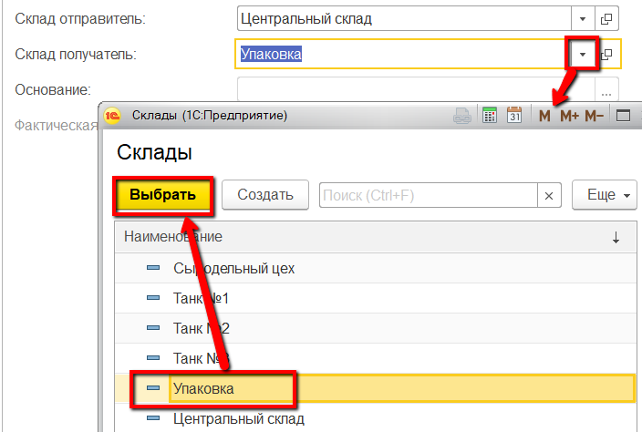
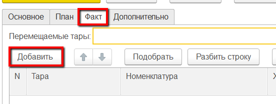
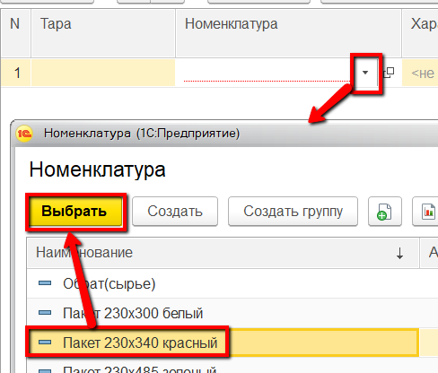
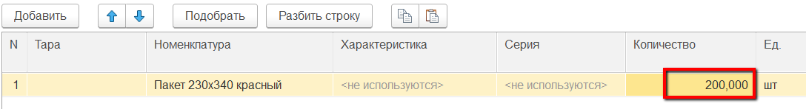

# Перемещение с другого склада

Поступления материалов с другого склада фиксируются документом
"Распоряжение на перемещение".

 

 

-   Открыть документы "Распоряжения на перемещение" и перейти к созданию
    нового:
    
     
-   Указать, с какого склада поступили материалы:
    
     
-   Указать, на какой склад поступили материалы:
    
     
-   Отметить, что материалы уже поступили:
    
     
-   Если учет поступлений идет неоперативно (поступление было предыдущим
    днем, неделей и т.п.), то указать фактическую дату поступления:
    
     
-   Перейти на вкладку "Факт" и нажать "Добавить":
    
     
-   Указать, какой материал поступил:
    
     
-   Указать количество поступившего материала:
    
     
-   Повторить п. 6-8 для остальных материалов и нажать "Провести и закрыть".
     