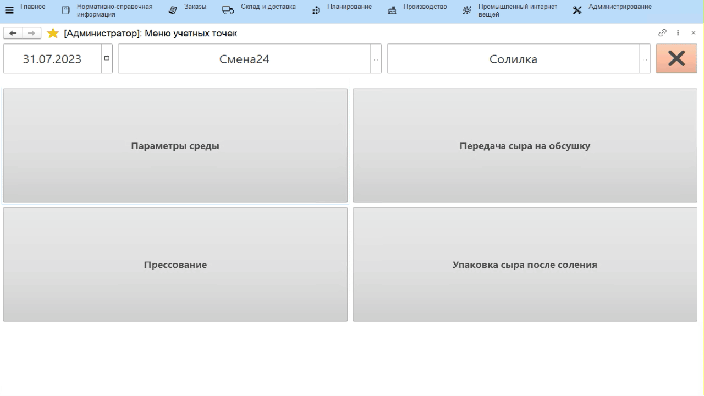

# Учет фактических значений через киоск

- Открыть **"Меню учетных точек"**;
- Указать текущую дату и смену";
- Указать учетную точку, отвечающую за участок, параметры которого нужно учесть;
- Нажать кнопку, соответствующую внесению показателей. Откроется окно с заявками по этому участку. Выбрать нужную и перейти к внесению показателей;
- Заполнить значения каждого показателя и нажать кнопку сохранения:

 
