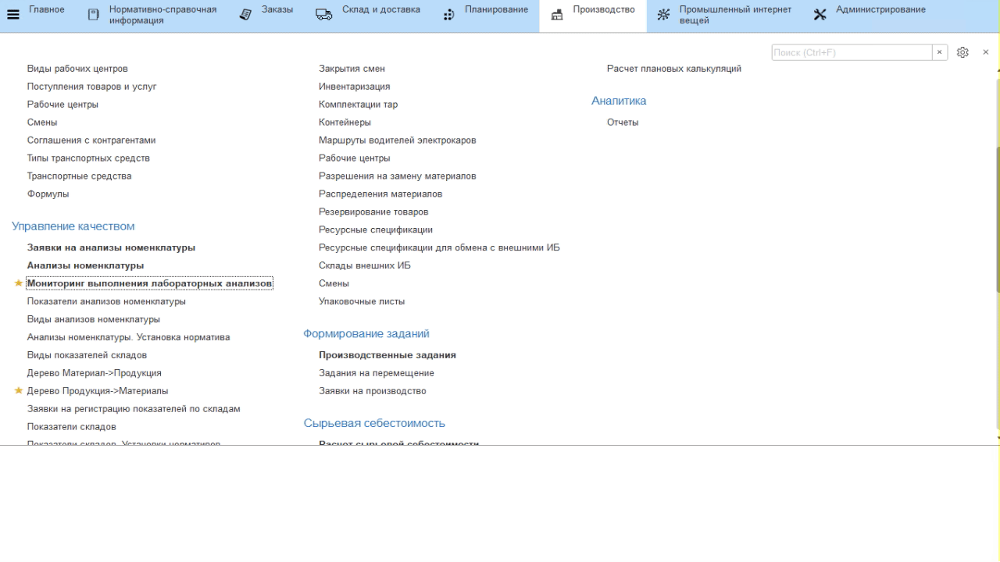

# Учет фактических значений через ПК

С заданной периодичностью в системе появляются заявки на внесение
текущих показателей помещений производства, ответстсвенный за это видит
их в своем рабочем месте и оперативно фиксирует.

-   Открыть рабочее место **"Мониторинг выполнения лабораторных анализов"**;
-   Перейти на вкладку *"По складам"*;
-   В появившемся окне все анализы распределены по группам;
-   Можно настроить отборы для отображения только нужного списка заявок;
-   Необходимо заполнить показатели заявок, которые отображаются с состоянием *"Заявка"*. При этом каждая строка в списке - заявка по конкретному помещению на указанную дату;
-   Выбрать нужную строку, нажать кнопку **"Заполнить показатели"**;
-   Перейти на вкладку *"Показатели"*, необходимо заполнить колонку
    *"Значения показателя"*. Напротив первого показателя (в примере это "Температура") записать
    полученное значение температуры на этом складе на указанное время;
-   Аналогично заполнить остальные показатели. Когда все показатели буду
    заполнены, нажать **"Провести и закрыть"**.

