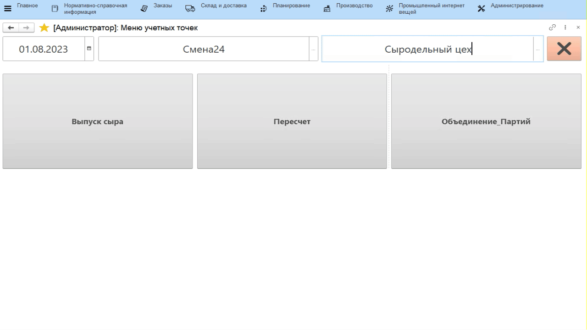
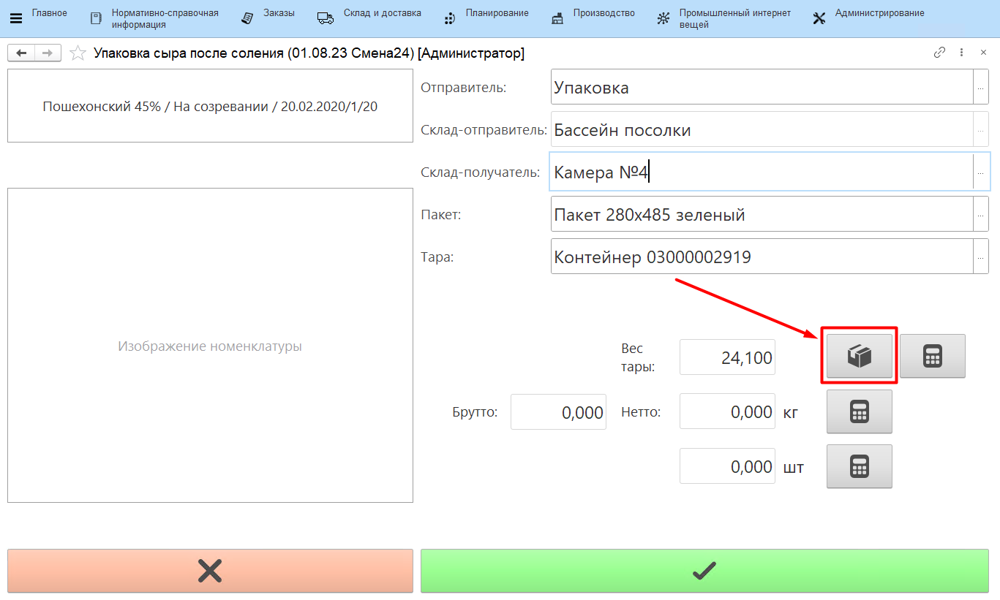
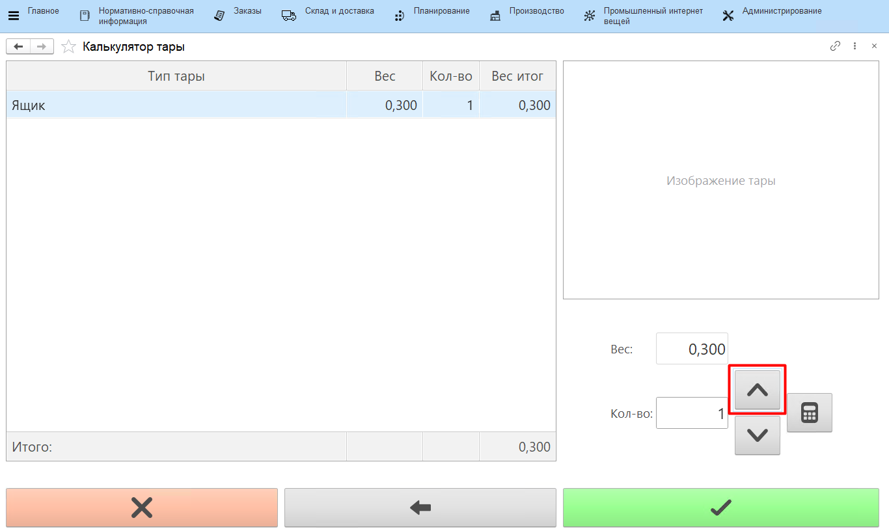
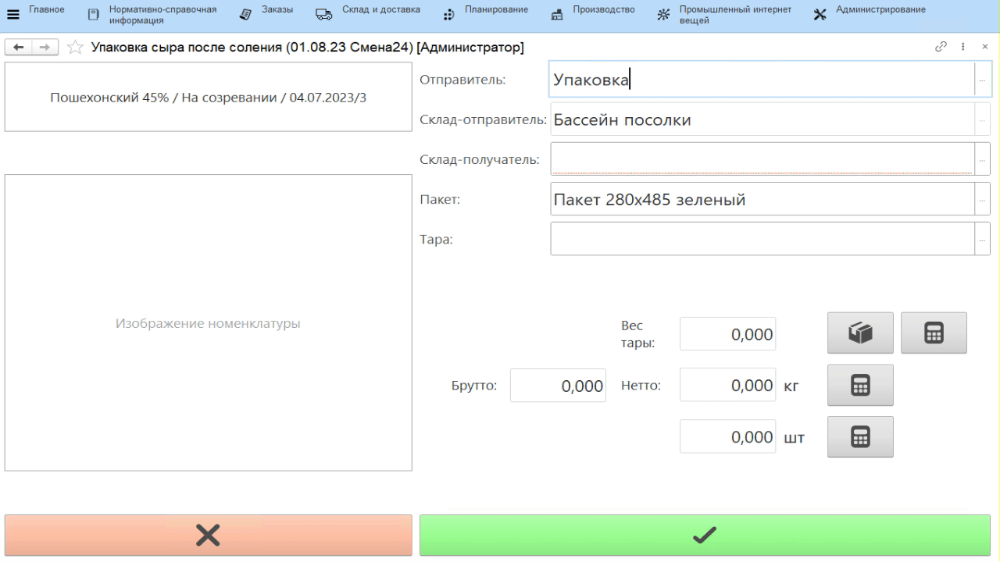

# Учет извлечения сыра из бассейна и упаковки

Учет извлечения сыра из бассейна и его упаковки в системе происходит
через учетную точку, привязанную к участку, где сыр извлекается из
солилки и передается на созревание.

-   Открыть **"Меню учетных точек"**;
-   Указать текущую дату и смену, если они еще не указаны;
-   Указать учетную точку, которая соответствует участку извлечения сыра
    из бассейна соления;
-   Нажать кнопку, соответствующую выпуску сыра. Отобразятся все варки
    сыра в кг и штуках, которые по учету в системе находятся в солилке.
    
Для каждой указано время входа и плановое время выхода, рассчитанное в соответствие с заведенной рецептурой. Варки отображаются в порядке их планового выхода из солилки, т.е. чем раньше сыр планируется извлекать, тем выше соответствующая строка в таблице.

-   Нажать на извлекаемую варку сыра и нажать **"Выбрать"**:

-   В открывшейся форме указать, на какой склад передается варка сыра и в какой пакет упаковывается;
-   Если сыр взвешивается на таре, например, на паллете или в ящиках с
    фиксированным весом, то, нажав **"Калькулятор тары"**,
    можно указать их количество:

   

-   В открывшейся форме указать количество каждого используемого типа
    тары. Для этого нажать на соответствующую строку и, используя
    стрелки "вверх" и "вниз", обозначить число;
-   Подтвердить, нажав кнопку с галочкой.

-   Указать вес (вес сыра + вес тары, если была использована) и количество штук
    сыра;
-   Подтвердить, нажав кнопку с галочкой. Автоматически печатается
    этикетка контейнера, по которой в дальнейшем можно найти информацию
    по контейнеру в системе:

