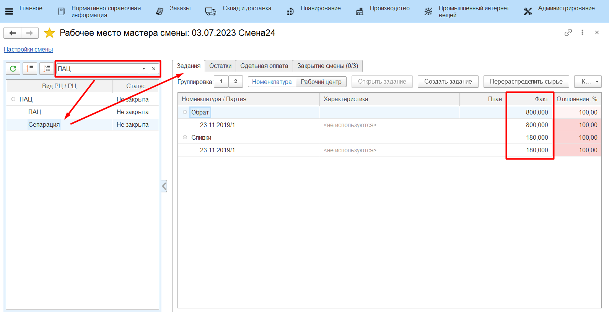
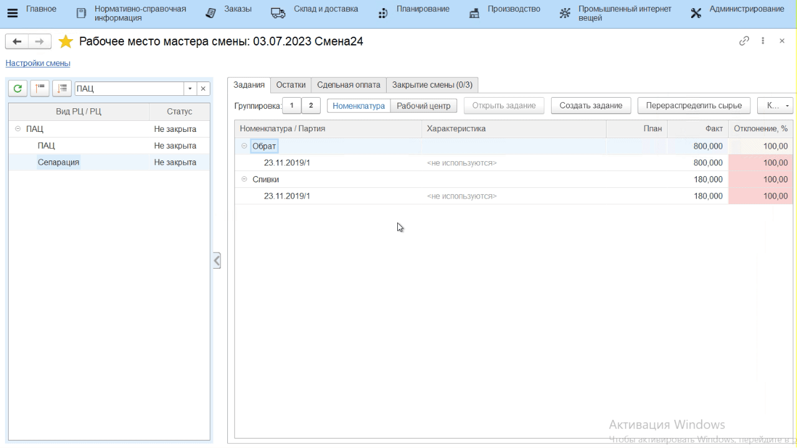
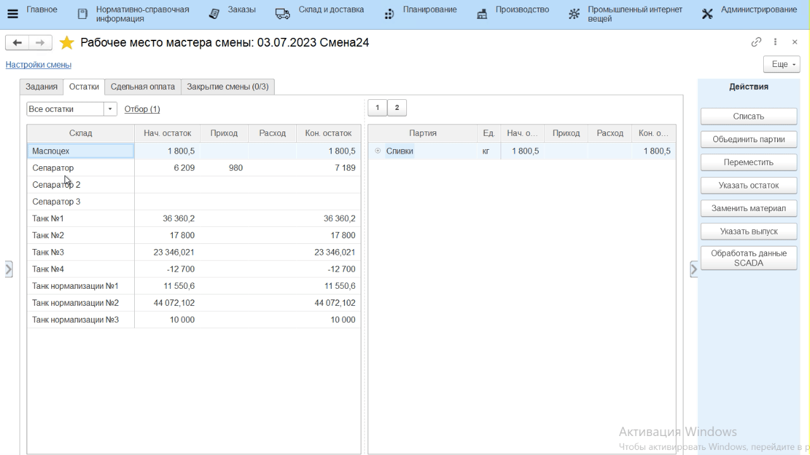
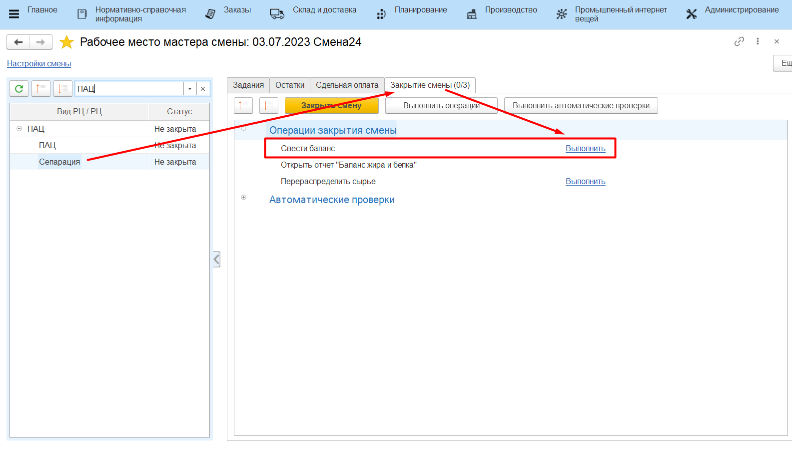
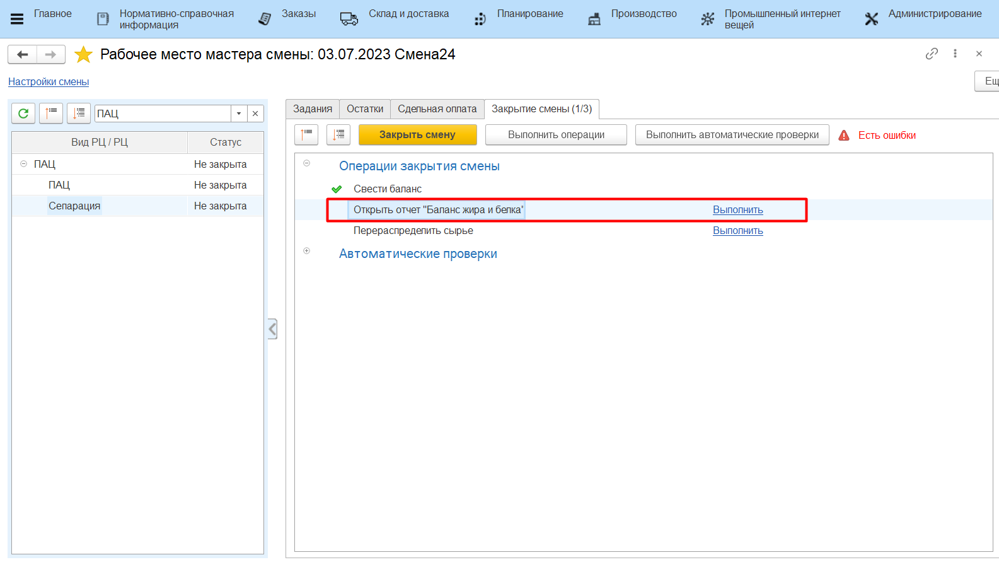
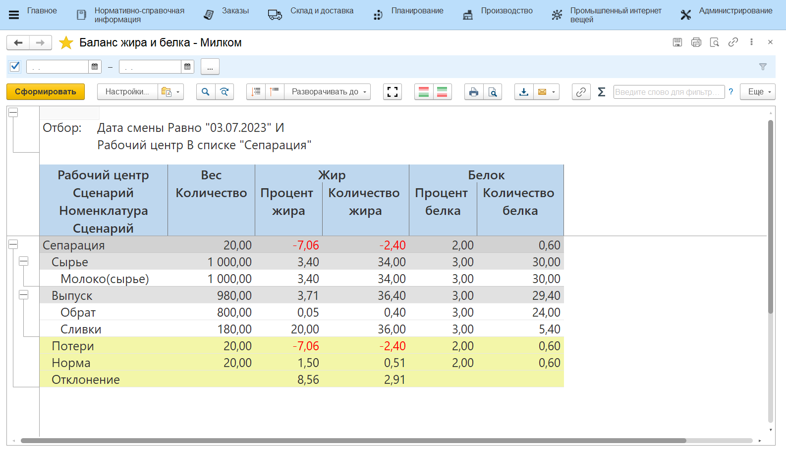

# Закрытие смены

Контроль всех введенных в систему данных за рабочую смену осуществляется
мастером смены через **"Рабочее место мастера смены"**.

-   Открыть **"Рабочее место мастера смены"**;
-   Указать смену для контроля и участок, на котором сепарируется
    молоко;
-   В таблице выбрать участок сепарации молока, который необходимо
    проверить на корректность. Справа заполнится различная информация по
    данному участку. Например, на вкладке *"Задания"* отображается вся
    информация по выпускам за указанную смену: 

    
-   На вкладке *"Остатки"* отображается информация по
    оборотам молока в каждом танке, а также по сепаратору.
    Для просмотра только остатков (по данным системы) можно
    переключиться в режим диаграммы.  

    
-   Если на сепараторе осталось молоко (например, учет в системе
    настроен так, что молоко списывается только в конце смены, а не по
    факту), то его нужно списать и распределить на выпуски сливок и
    обрата. Это распределение автоматически считается в соответствие с
    содержанием жира и белка в каждом из выпусков. Для этого необходимо выбрать партию молока и нажать **"Списать"**;
-   В открывшейся форме указать, что списание идет согласно отраслевой
    методике (т.е. по содержанию жира и белка);

-   На вкладке *"Закрытие смены"* можно свести или посмотреть ранее сведенный
    баланс по жиру и белку. Для сведения баланса на участке нажать
    **"Свести баланс"**;

-   Затем нажать **"Открыть отчет "Баланс жира и белка""**;

-   Здесь можно видеть:
    -   Сколько какого продукта было выпущено, сколько при этом потратилось
    сырья;
    -   Какое было содержание жира и белка в сырье, какое получилось в
    выпусках (как в кг, так и в %);
    -   Получившийся процент потерь по кг, жкг и бкг и нормативный. 
    

-   После выполнения всех вышеперечисленных действий и проверки
    корректности всех данных, смену необходимо закрыть для невозможности
    внесения в нее изменений. Для этого выбрать участок в таблице слева
    и нажать **"Закрыть"**; 
-   При закрытии могут возникнуть ошибки (не сведен баланс, не
    распределено сырье или т.п.) . Исправить их, после чего вернуться и
    снова нажать  **"Закрыть"**.

