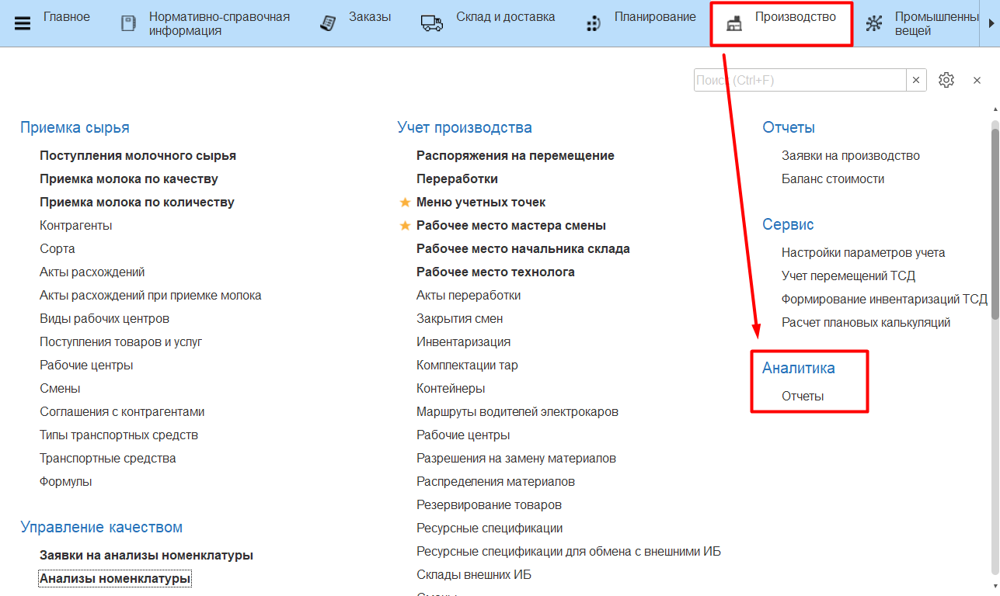
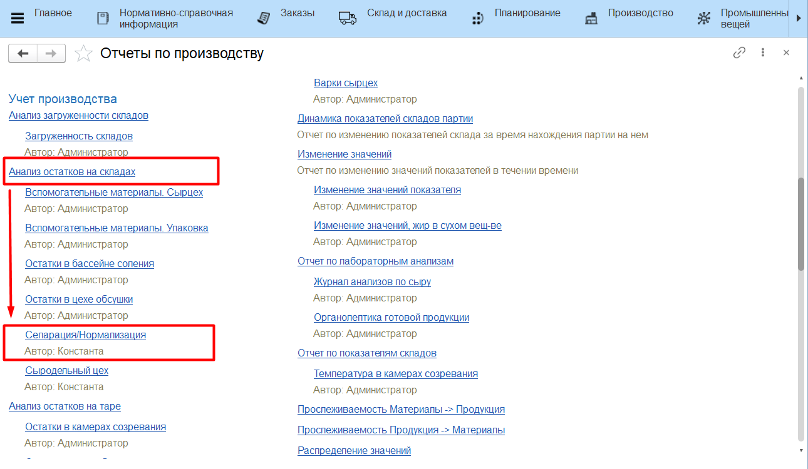
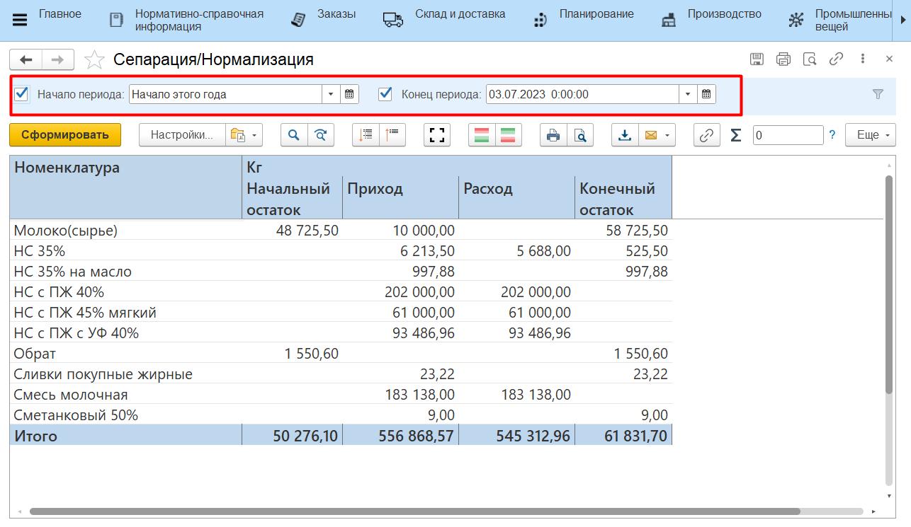
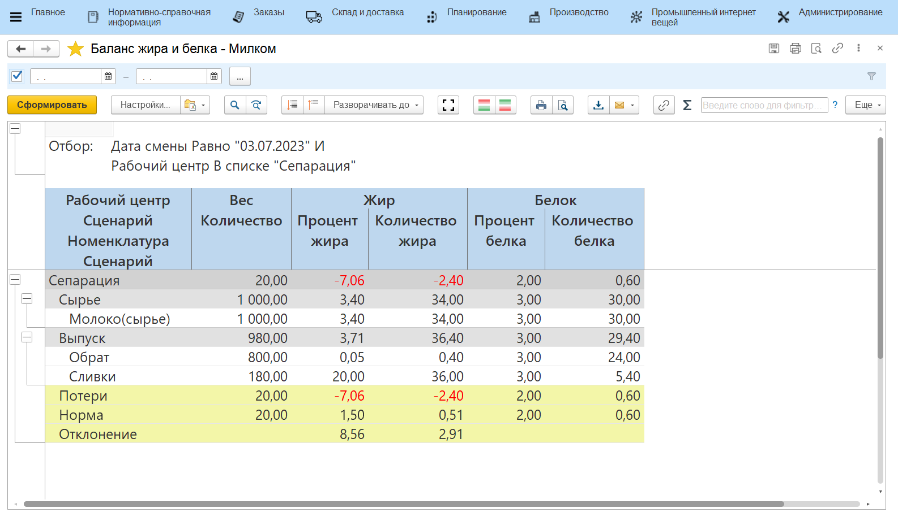

# Анализ потерь

Для анализа информации по участку сепарации молока в системе есть
несколько отчетов. Все они находятся в подсистеме **"Производство"** -\>
"Отчеты":

Начальный/конечный остаток и приход/расход по молоку, сливкам и обрату в кг и жкг  можно посмотреть в отчете **"Анализ остатков на складах"**, вариант *"Сепарация"*.

  

-    Необходимо установить параметры:
    -   Начало периода;
    -   Конец периода.  
-   Cформировать;
-   В отчете отображается приход, расход, начальный и конечный остаток
    молока, сливок, обрата в танках в пределах указанного в параметрах
    периода в кг и жкг.

Баланс по этапу сепарации по кг, жкг и бкг можно посмотреть с помощью отчета **"Баланс жира и белка"**.

- Необходимо установить параметр:
    - Период. 
- Cформировать;
- Здесь можно видеть:
    -   Сколько какого продукта было выпущено, сколько при этом потратилось сырья;
    -    Какое было содержание жира и белка в сырье, какое получилось в выпусках (как в кг, так и в %);
    -   Получившийся процент потерь по кг, жкг и бкг и нормативный в пределах указанного в параметрах периода, а также отклонение от нормы.

