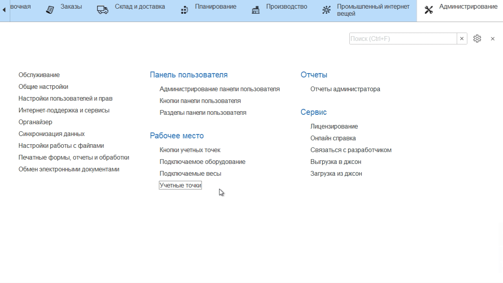
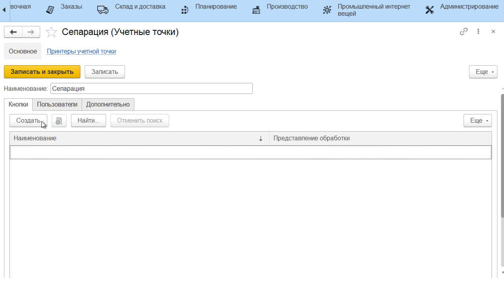
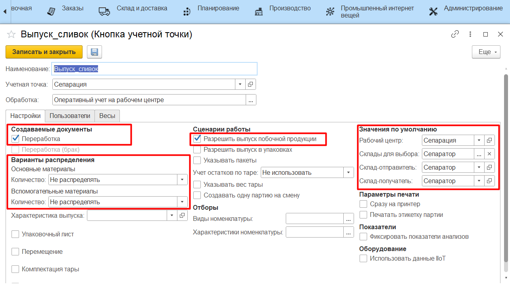

# Учетные точки

Настройка всех интерфейсов, через которые ведется оперативный учет на
участке сепарации, происходит через справочники **"Учетные точки"** и
**"Кнопки учетных точек"**.

## Справочник "Учетные точки"

Данный справочник используется для того,
чтобы отделить наборы операций, выполняемых на разных участках
производства. Например, логично отделить операции, связанные с выпусками на этапе сепарации, от операций, связанных с выпусками на этапе варки. При этом, если на предприятии на один только участок сепарации ставится несколько сенсорных киосков (в ключевых точках - отдельно около счетчика выпущенных сливок, отдельно около выпущенного обрата и т.п.), то разумно на каждый киоск сделать отдельную учетную точку, пусть и с одной операцией.
 

-   Открыть справочник **"Учетные точки"** и перейти к созданию нового
    элемента;
-   Указать наименование;
-   Указать список пользователей, у которых будет доступ к этой учетной
    точке (т.е. только они смогут выполнять операции, относящиеся к этой
    учетной точке);
-  Нажать **"Записать и закрыть"**.

## Справочник "Кнопки учетных точек"

Данный справочник используется для того, чтобы настраивать различные операции, выполняемые на определенном участке производства. Например, для этапа сепарации логично выделить кнопку для выпуска сливок и кнопку для выпуска обрата.  
По факту, для системы эти две операции отличаются только выпускаемой продукцией с одними и теми же настройками.

-   Открыть справочник **"Учетные точки"**. Среди списка найти нужную,
    открыть;  
-   В таблице кнопок нажать **"Создать"**;
-   Указать наименование и выбрать обработку **"Работа с заданиями"** - если
    выпуск сливок и обрата идут строго по заданию на смену или
    **"Оперативный учет на рабочем центре"** - в противном случае;

-   Указать в создаваемых документах **"Переработка"** и что при её создании
    нет списания материалов;
-   Указать, что возможен выпуск полуфабрикатов и что не ведется учет по
    таре;
-   Указать участок сепарации;
-   Ограничить склады для выпуска;
-   Нажать **"Записать и закрыть"**.

Более подробная информация о параметрах кнопок учетных точек описана в
разделе ["Кнопки учетных точек"](../../../../CommonInformation/Handbooks/ButtonOfAccountPoint/readme.md).
