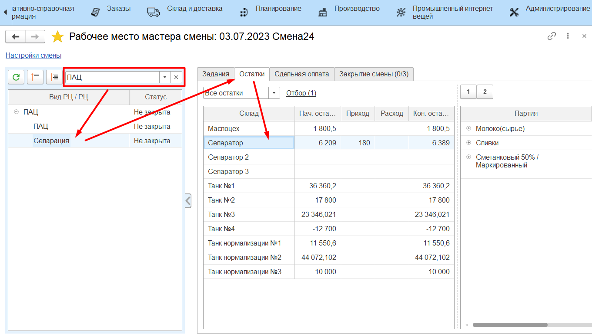
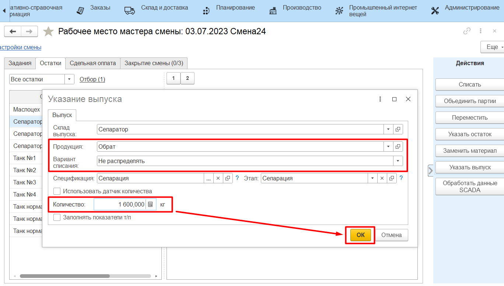

# Выпуск мастером смены

Выпуск обрата в системе также может отразить и мастер смены через свое
рабочее место.

-   Открыть **"Рабочее место мастера смены"**;
-   Указать дату смены, смену и участок приемно-аппаратного цеха;
-   Выбрать участок сепарации; 
-   Перейти на вкладку *"Остатки"*;

-   Выбрать танк сливок, куда они были выпущены. Нажать **"Указать выпуск"**;

-   Указать, выпуск обрата и его количество;
-   В варианте списания указать "Не распределять", чтобы в конце смены
    можно было списать молоко по внесенным позже показателям жира и
    белка, и подтвердить.

