# Приемка полутуш

Приемка полутуш производится оператором через киоски по созданному документу о [плановых поступлениях](./CreatePlanOfAccept.md).

- Открываем **"Меню учетных точек"**:

- Указываем дату планового поступления, смену и рабочий участок, на котором проводится приемка сырья в полутушах. Нажимаем кнопку **"Приемка полутуш"**:

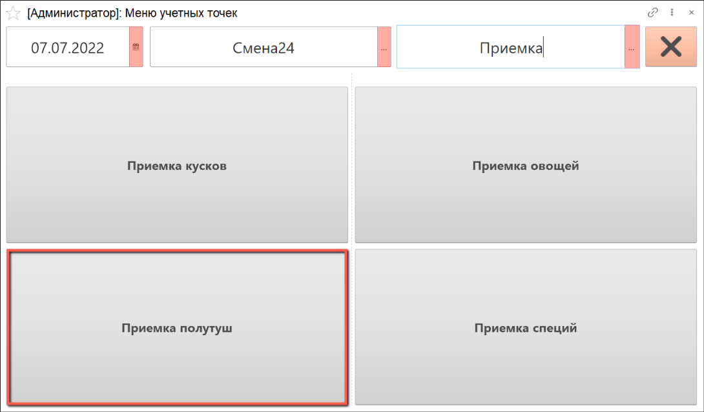

Открывается список плановых поступлений. По умолчанию отображаются только не принятые позиции (переключатель отображения установлен в значении **"К приемке"**).

- Выбираем документ планового поступления, по которому необходимо принять сырье, нажимаем кнопку **"Данные документа"**:

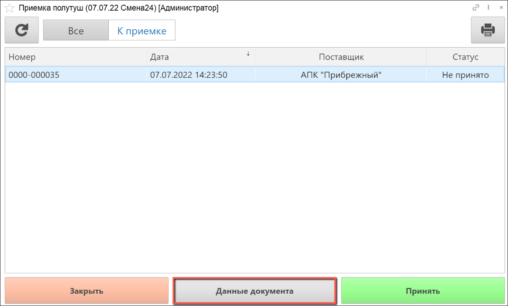

Поля **"Номер накладной"** и **"Дата накладной"** заполнятся автоматически по данным документа поступления, при желании можно изменить вручную.

- Нажимаем на кнопку **"Подтвердить"**:

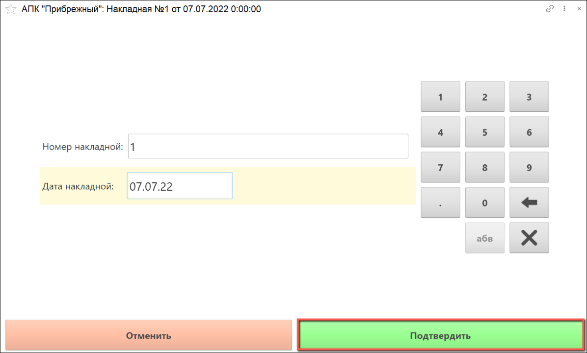

Открывается окно с данными о плановом поступлении полутуши по документу. Колонка **"План"** заполняется автоматически из документа поступления.

- Выбираем позицию номенклатуры и нажимаем кнопку **"Принять"**:

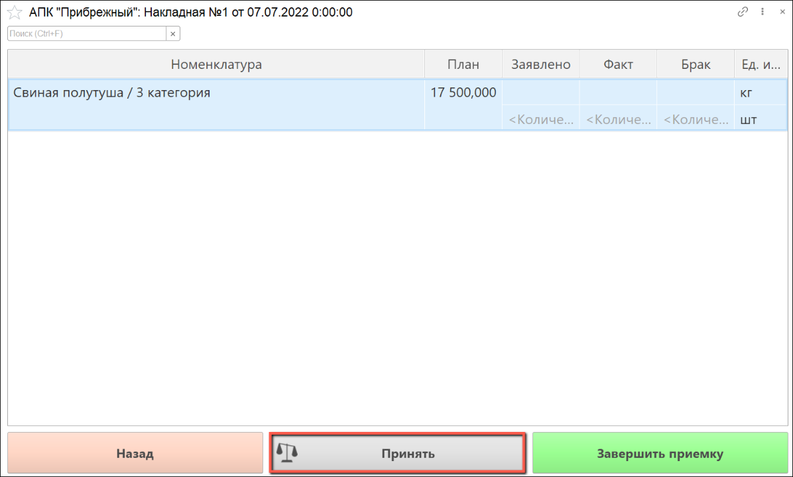

Открывается окно для заполнения данных о принимаемой позиции по накладной поставщика.

- Вводим количество номенклатуры в килограммах и штуках, срок годности, дату изготовления и номер партии сырья.

- Нажимаем кнопку **"Приемка"** для приемки полутуши:

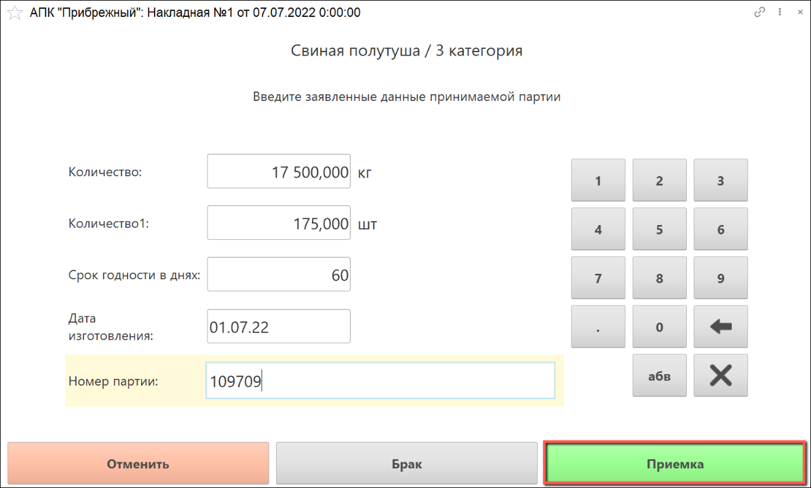

Открывается окно для учета данных взвешивания полутуши. В левом верхнем углу отображается информация о номенклатуре и количестве, которое осталось принять.

- С помощью калькулятора тары выбираем количество крюков, на которых будут взвешиваться полутуши.

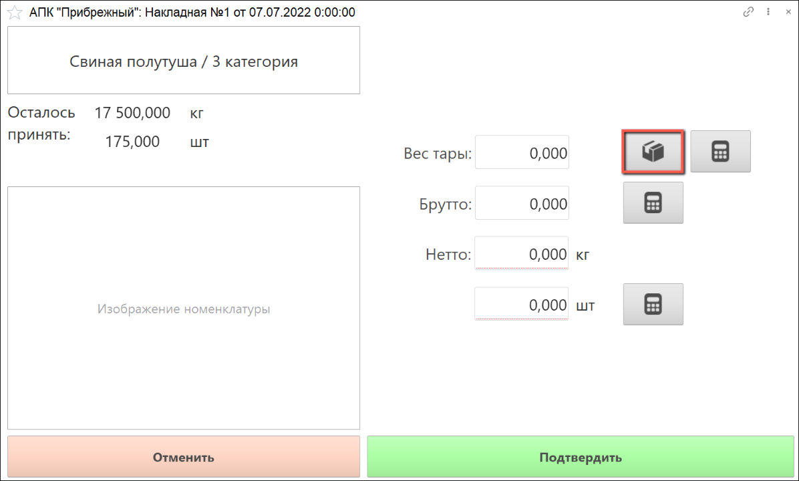

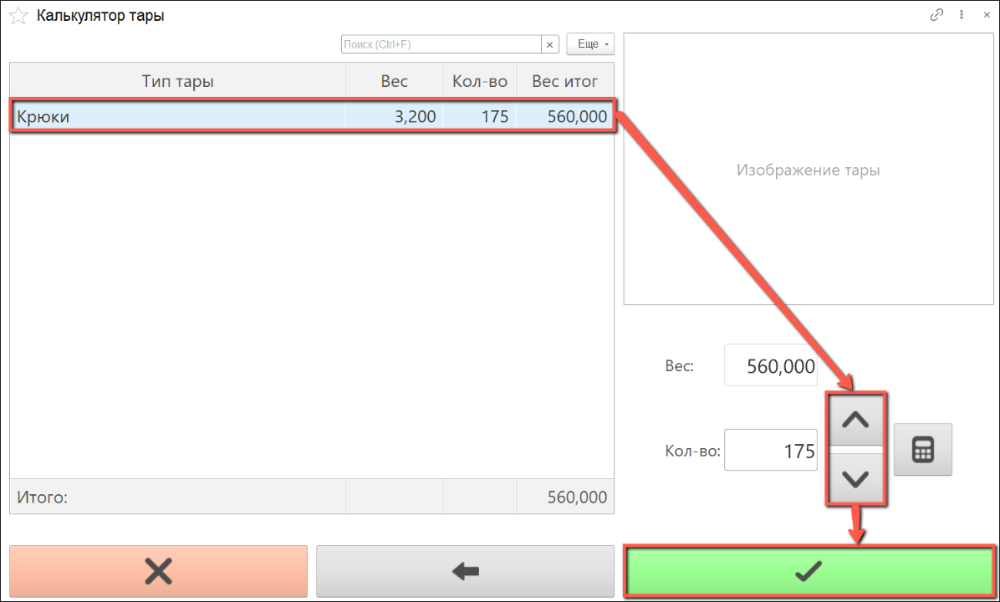

Также вес тары можно ввести вручную. Для этого нужно нажать на кнопку калькулятора справа:

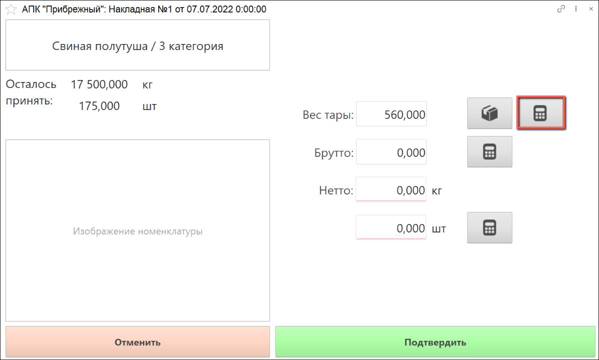

Вес брутто будет автоматически получен с весов, если они подключены. Есть возможность заполнить его вручную. Вес нетто рассчитается автоматически.

Также нужно ввести фактическое количество принимаемых полутуш в штуках.

- Нажимаем на кнопку **"Подтвердить"**

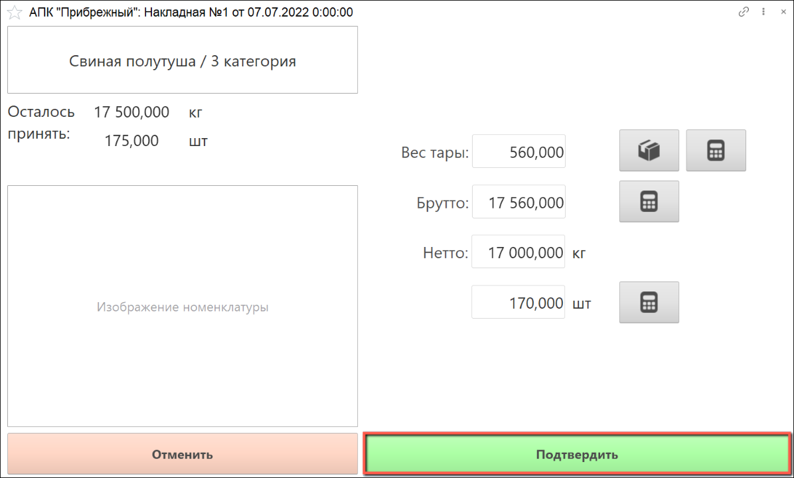

- Распечатывается этикетка партии в количестве, соответствующем количеству сырья в штуках: 

 

Открывается окно со списком отвесов. В колонке **"Факт"** отображается количество сырья, которое уже взвешено при приемке.

Если необходимо распечатать дополнительную этикетку по выбранному отвесу, нажимаем кнопку **"Печать этикетки"**.

Чтобы принять еще один отвес сырья, нажимаем кнопку **"Новый отвес"**.

- Когда все отвесы будут добавлены, нажимаем кнопку **"Назад"**, чтобы перейти к завершению приемки:

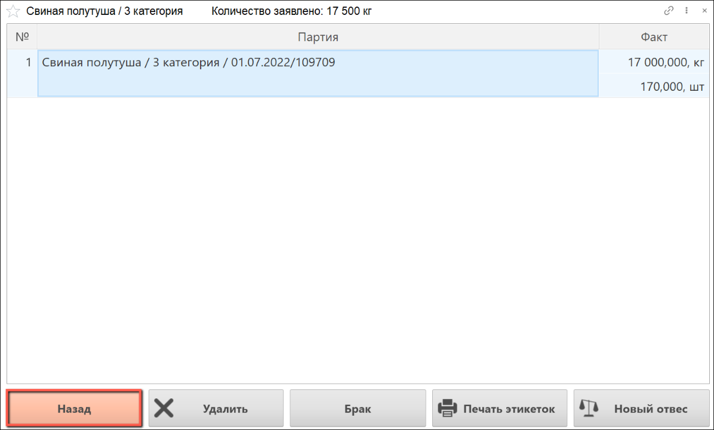

- Если в партии обнаружен брак, необходимо взвесить его, нажав соответствующую кнопку. Подробнее о приемке брака читайте в разделе ["Отбраковка"](./Rejection.md)

Открывается окно со списком партий. Колонка **"Факт"** заполнилась по введенным данным.

В данном окне есть несколько кнопок для работы с учетом сырья:

- **"Назад"** - возвращает к списку партий сырья;
- **"Удалить"** - удаляет из табличной части документа выбранный отвес. Используется в случае, если взвешивание произведено некорректно и данные по отвесу уже зафиксированы в документе (появились в табличной части);
- **"Брак"** - открывает окно для приемки брака, подробнее в разделе ["Отбраковка"](./Rejection.md);
- **"Список отвесов"** - открывает список отвесов по выбранной партии сырья;
- **"Отвес"** - открывает окно для взвешивания нового отвеса по выбранной партии сырья;
- **"Партия"** - открывает окно для ввода данных, заявленных поставщиком, по партии сырья, которая еще не была введена в систему.

- Для завершения операций по учету приемки данной партии сырья нажимаем кнопку **"Назад"**:

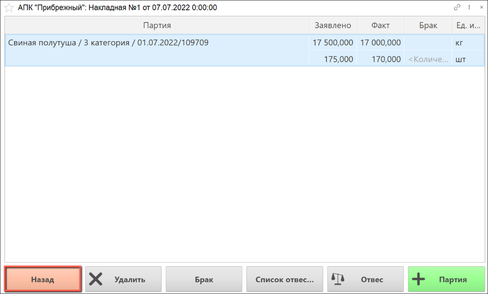

Открывается окно со списком номенклатуры по документу. В табличной части заполнены данные по принятой номенклатуре сырья.

Если необходимо добавить партию или отвес какой-либо номенклатуры, нажимаем кнопку **"Принять"**.

- Если приемка номенклатуры по данному документу завершена, нажимаем кнопку **"Завершить приемку"**:

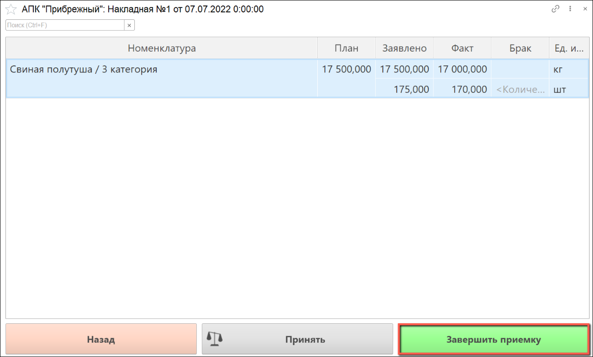

- Откроется окно подтверждения приемки:

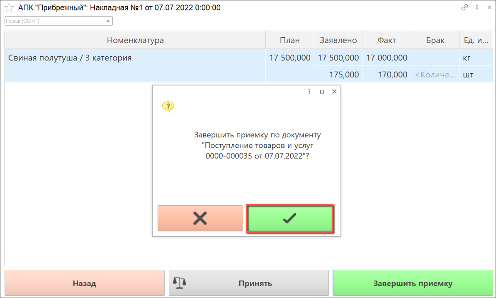

Если по документу выявлены расхождения фактического количества сырья с запланированным, система предложит создать акт расхождений. Если по мнению пользователя, отклонение от нормы в пределах допустимого, он может отказаться от создания акта.

- Если выявлены значительные расхождения, следует создать акт:

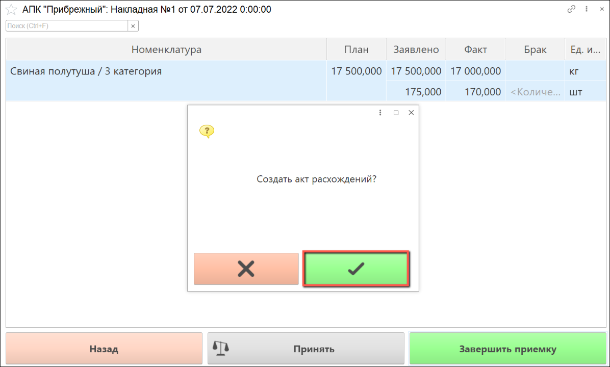

Чтобы увидеть список документов **"Поступление товаров"**, которые были обработаны за текущую смену, в основном окне АРМ переключаем отображение документов в значение **"Все"**. Обработанные документы отобразятся в списке со статусом **"Принято"**:

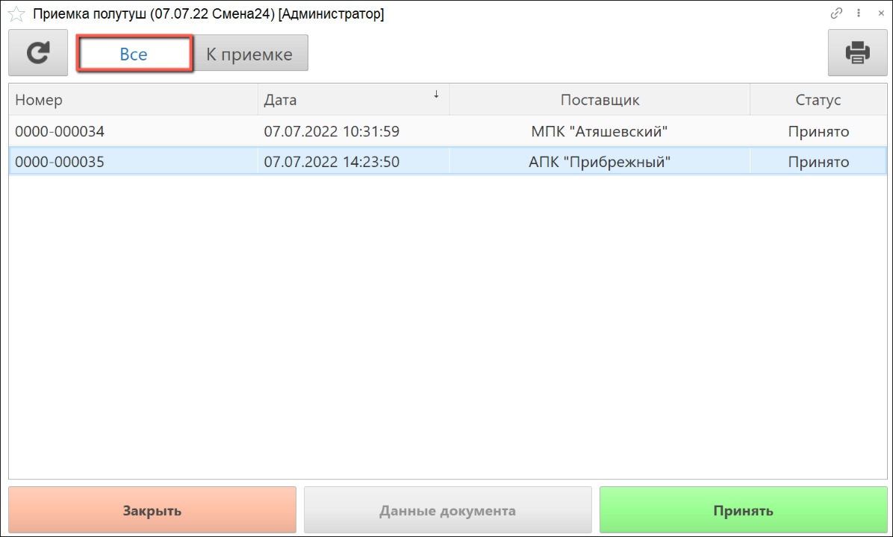