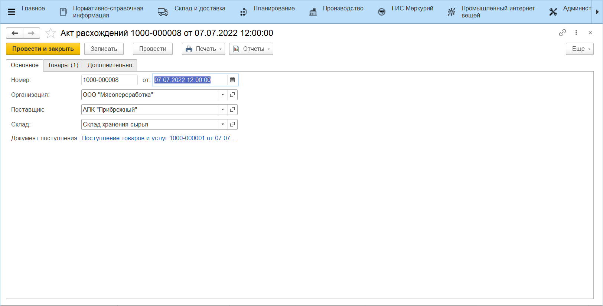
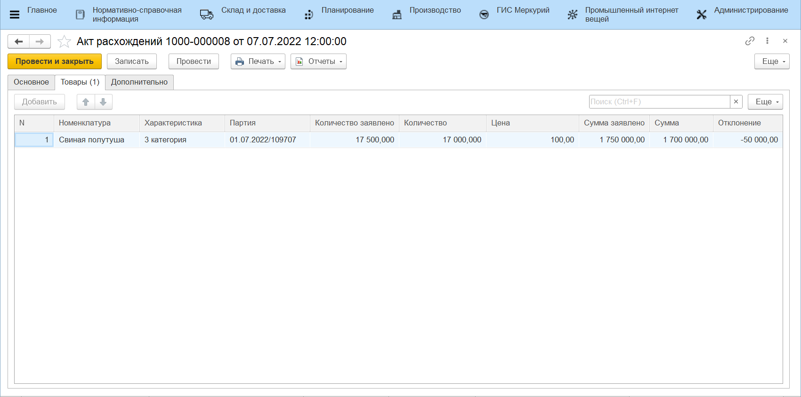
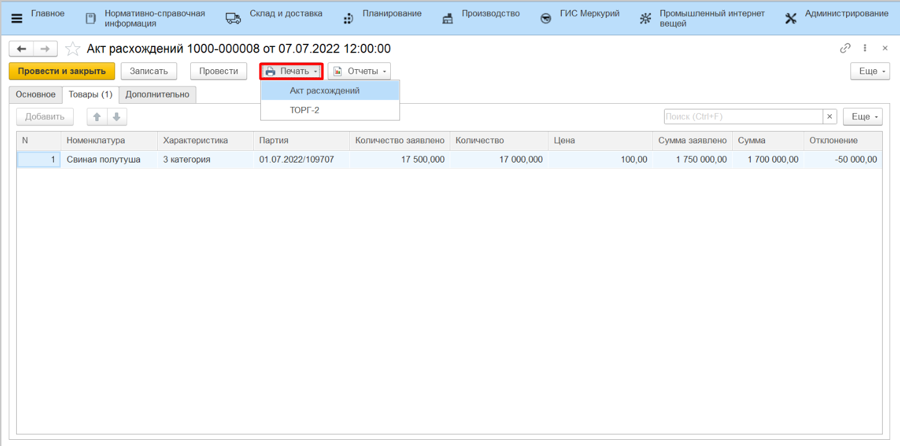
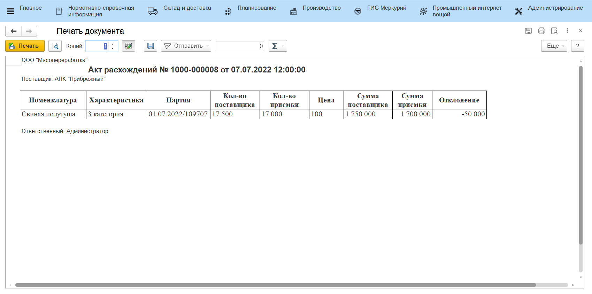

# Акты расхождений

Если в результате приемки по накладным выявлены расхождения между заявленными суммами и фактическими, то система предлагает создать документ **Акт расхождений**. Этот документ позволяет выявить и зафиксировать несоответствия, что является важным шагом в процессе контроля качества поставок и финансового учета.

Сформированный акт расхождений включает следующие данные:

- Поставщик;
- Склад приемки;
- Документ, на основании которого создан акт;
- Таблица соответствия заявленных и фактических количеств и сумм.

Печатные формы для Акта расхождений формируются по кнопке **"Печать"**:

Акт расхождений может быть представлен в двух **печатных формах**:

- "Акт расхождений"

- Унифицированная форма ТОРГ-2 - стандартная форма, используемая для оформления актов расхождений в соответствии с требованиями законодательства

    [Пример формы ТОРГ-2](https://disk.360.yandex.ru/i/Vma7PVGqpJMW8A){target="_blank"}
