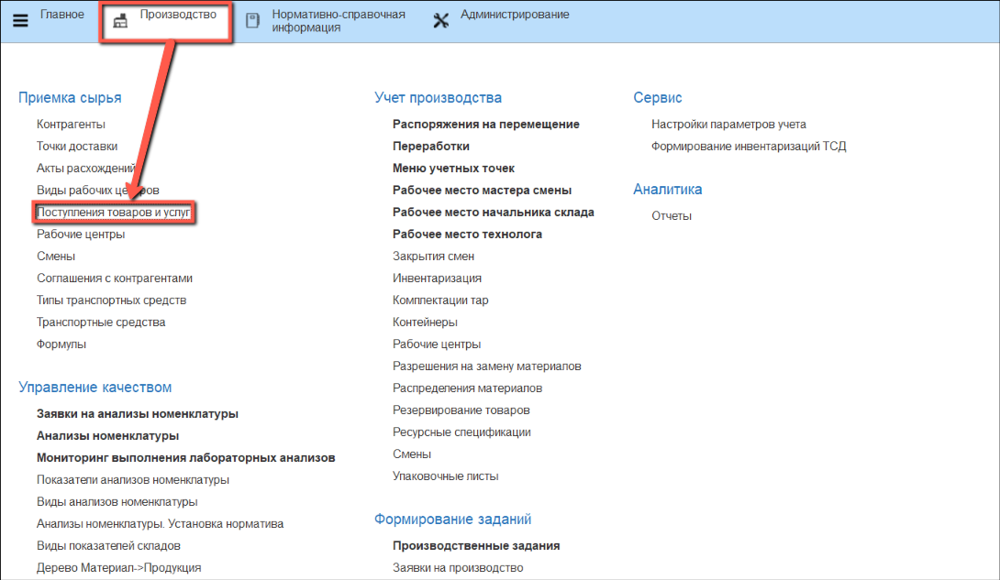
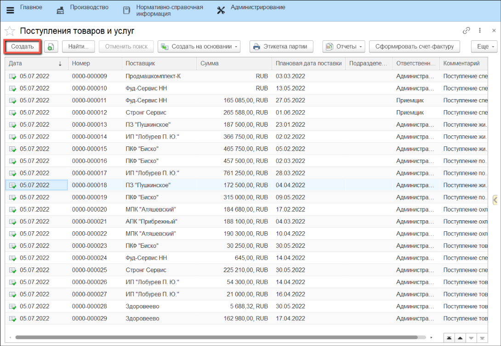
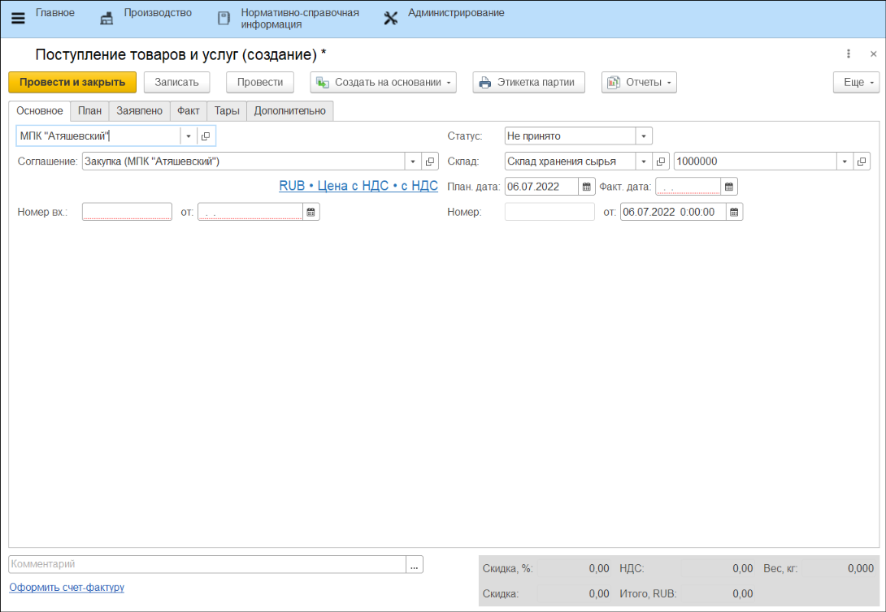
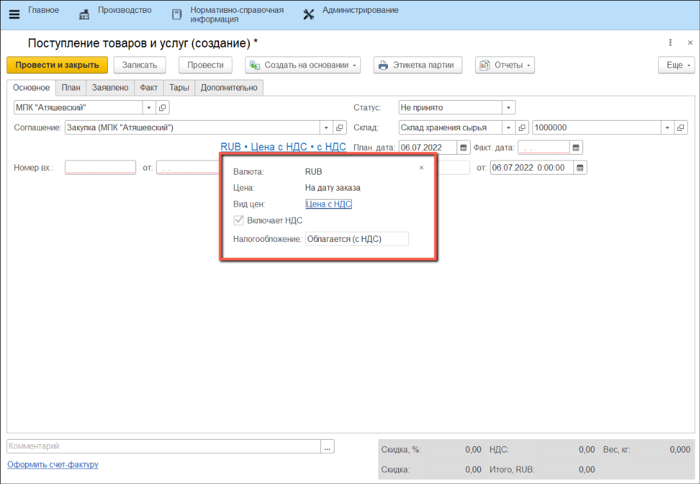
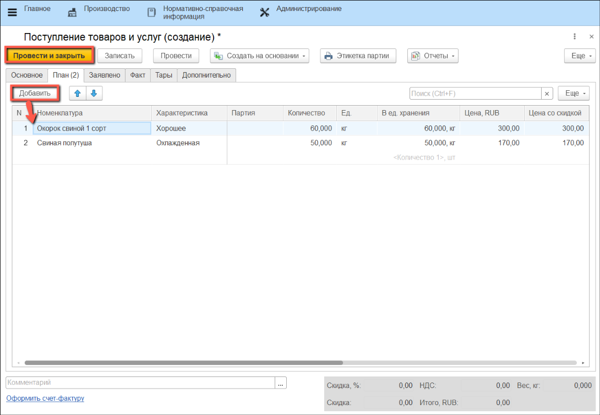

# Создание плана поступлений

Для плановых поступлений товаров: мясного сырья, специй и овощей, а также услуг, в системе создаются документы **"Поступления товаров и услуг"**.

- В подсистеме **"Производство"** в разделе **"Приемка сырья"** выбираем **"Поступления товаров и услуг"**

- Нажимаем кнопку **"Создать"**:

- Заполняем сведения на вкладке **"Основное"**:

1. Поле **"Статус"** заполняется автоматически, по умолчанию установлено значение **"Не принято"** для всех документов **"Поступления товаров и услуг"**;
2. В поле **"Контрагент"** выбираем поставщика товаров и услуг;
3. В поле **"Соглашение"** автоматически отображается действующее на данный момент соглашение с выбранным контрагентом. При необходимости соглашение можно изменить, выбрав другое из списка;
4. В поле **"Склад"** выбираем из списка склад, на который будет осуществляться приемка сырья;
5. Если на выбранном складе используется адресное хранение, автоматически заполнится **"Ячейка"** склада. Ячейку также можно изменить вручную, выбрав из списка;
6. В поле **"План. дата"** заполняется дата ожидаемого поступления сырья.
7. Поле **"Фактическая дата поставки"** будет заполнено автоматически в процессе приемки сырья по данному документу.
8. Поля **"Номер вх."** и **"от:"** необязательны для заполнения. Если ввести значения, то **"Данные документа"** на этапе приемки в АРМе заполнятся автоматически.

Поля **"Валюта"**, **"Цена"**, **"Вид цен"**, **"Налогообложение"** и параметр **"Включает НДС"** заполняются автоматически согласно настройкам параметров учета или данным соглашения с поставщиком.

- Заполняем сведения на вкладке **"План"**:

1. Чтобы добавить новую номенклатуру, которую планируем принять, нажимаем кнопку **"Добавить"**, в табличной части появится строка для заполнения.
2. В поле **"Номенклатура"** выбираем номенклатуру из списка.
3. Если для номенклатуры установлен учет по характеристикам, выбираем характеристику из списка.
4. Вводим вручную количество номенклатуры в установленной для нее основной единице измерения (кг, шт и т. д.);
5. Если для номенклатуры установлены цены поступления, они заполнятся автоматически. Система допускает корректировку цен поступления вручную, но рекомендуется использовать документ **"Установка цен"**.

Остальные поля заполняются автоматически. При желании можно их заполнять вручную

- Нажимаем **"Записать и закрыть"**

