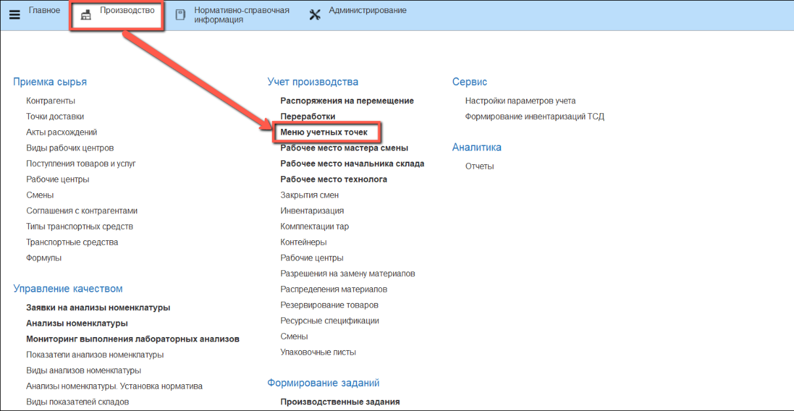
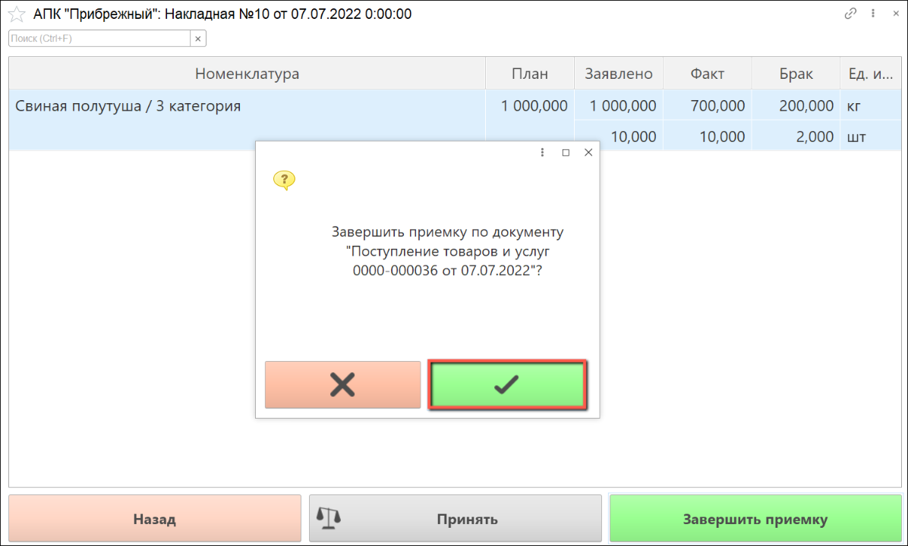

# Отбраковка при приемке

Отбраковка производится оператором через киоски по созданному документу о [плановых поступлениях](./CreatePlanOfAccept.md).

- Открываем **"Меню учетных точек"**:

- Указываем дату планового поступления, смену и рабочий участок, на котором проводится приемка. Нажимаем кнопки: **"Приемка полутуш"**, **"Приемка кусков"**, **"Приемка специй"** или **"Приемка овощей"**, в зависимости от принимаемой номенклатуры:

Открывается список плановых поступлений. По умолчанию отображаются только не принятые позиции (переключатель отображения установлен в значении **"К приемке"**).

- Выбираем документ планового поступления, по которому необходимо принять сырье. Если по выбранному документу еще не осуществлялась приемка сырья, нажимаем кнопку **"Данные документа"** и заполняем все поля так, как это описано в разделе приемки сырья:

[Приемка полутуш](./AcceptOfHalfCarcass.md)

[Приемка кусков, специй, овощей](./AcceptOfSpicesMeat.md)

- Если данные документа уже введены, чтобы открыть список номенклатуры по выбранному документу, нажимаем кнопку **"Принять"**:

- В открывшемся окне выбираем номенклатуру с браком и нажимаем **"Принять"**:

Открывается список партий сырья. 

- Выбираем партию, в которой обнаружен брак и нажимаем на кнопку **"Брак"**:

Открывается окно для учета данных взвешивания сырья. В левом верхнем углу отображается информация о номенклатуре и количестве, которое осталось принять.

В полях сверху выбираем из списка характеристику номенклатуры и причину возникновения брака.

С помощью калькулятора тары подбираем тару для взвешивания брака. Вес тары рассчитается автоматически. Также его можно ввести вручную.

- Получаем вес с весов и нажимаем кнопку **"Подтвердить"**:

- Распечатывается этикетка партии. Если брак принимается в полутушах, количество этикеток соответствует количеству сырья в штуках:

 

Открывается окно со списком отвесов. В колонке **"Факт"** отображается количество в килограммах, которое уже взвешено при приемке.

- Для завершения операций по учету брака нажимаем на кнопку **"Назад"**:

Открывается окно со списком партий.

  - В колонке **"Заявлено"** указано количество сырья, заявленное поставщиком;

  - В колонке **"Факт"** указано количество принятого сырья соответствующего качества;

  - В колонке **"Брак"** видим количество сырья низкого качества.

- Для завершения операций по учету приемки данной партии сырья нажимаем кнопку **"Назад"**:

Открывается окно со списком номенклатуры по документу. В табличной части заполнены данные по принятой номенклатуре сырья.

Если необходимо добавить партию или отвес какой-либо номенклатуры, нажимаем кнопку **"Принять"**. Далее повторяем все действия аналогично первой номенклатуре.

- Если приемка номенклатуры по данному документу завершена, нажимаем кнопку **"Завершить приемку"**:

- Откроется окно подтверждения приемки:

Если по документу выявлены расхождения фактического количества сырья с запланированным, система предложит создать акт расхождений. Если по мнению пользователя, отклонение от нормы в пределах допустимого, он может отказаться от создания акта.

- Если выявлены значительные расхождения, следует создать акт:

Чтобы увидеть список документов **"Поступление товаров"**, которые были обработаны за текущую смену, в основном окне АРМ переключаем отображение документов в значение **"Все"**. Обработанные документы отобразятся в списке со статусом **"Принято"**:

