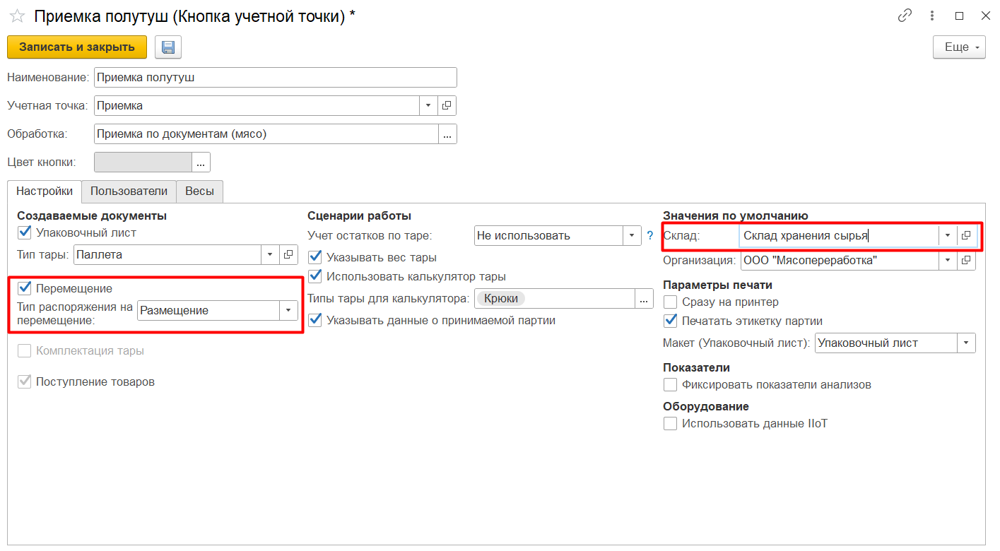
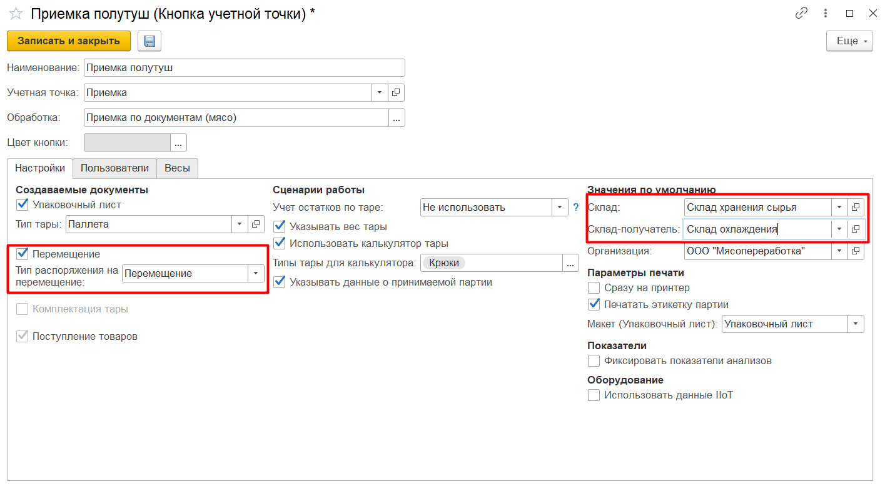
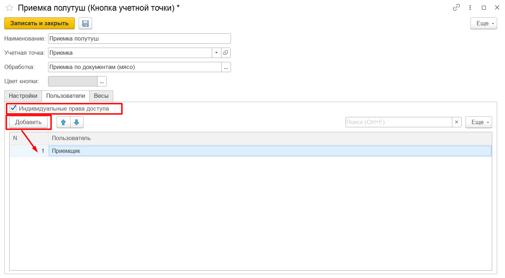

# Создание и настройка кнопки "Приемка"

Кнопки **"Приемка живого скота"**, **"Приемка кусков, специй, овощей"**, **"Приемка полутуш"** используются для приема на склад поступлений от поставщика.

При создании кнопки учетной точки указываются:

- Наименование;
- Учетная точка;
- Обработка - Приемка по документам (мясо).

На вкладке **"Настройки"** заполняются:

- Возможность создания упаковочного листа - если  включена, заполняются поля "Организация" и "Макет для печати", по итогу приемки формируются новые упаковочные листы на каждую паллету.
- Возможность создания документа **"Распоряжение на перемещение"**:
    - Размещение - используется только для приемки на адресный склад. Если выбрана, по итогу приемки для каждой принятой паллеты будет сформирован документ **"Распоряжение на перемещение"** с типом *"Размещение"*:
        - Склад приемки - адресный склад, на который ведется приемка;

        

    - Перемещение - если выбрана, по итогу приемки для каждой принятой паллеты будет сформирован документ **"Распоряжение на перемещение"** с типом *"Перемещение"*:
        - Склад приемки - склад, на который ведется приемка;
        - Склад-получатель - cклад, на который будет запланировано перемещение;

        

- Опция *"Указывать вес тары"* - используется, когда взвешивание происходит на таре. Чтобы получить точный вес продукции нужно из общего веса вычитать вес тары;
- Опция *"Использовать калькулятор тары"* - отображается, когда включено указание веса тары. Можно указать вес тары в виде составных частей с заданным в системе фиксированным весом;
- Опция *"Типы тары для калькулятора"* - отображается, когда включено использование калькулятора тары. Ограничивает список типов тар в калькуляторе;
- Опция *"Указывать данные о принимаемой партии"* - если включена, дает возможность при приемке вносить заявленные данные о партии поставщика (заявленное количество, дата выпуска, номер партии, срок годности);
- Опция *"Сразу на принтер"* - если включена, позволяет печатать выбранный документ без предварительного вывода на экран;
- Опция *"Печатать этикетку партии"* - если включена, создает этикетку для партии принимаемой продукции.

На вкладке **"Пользователи"** можно настроить индивидуальные права доступа на данную команду.

