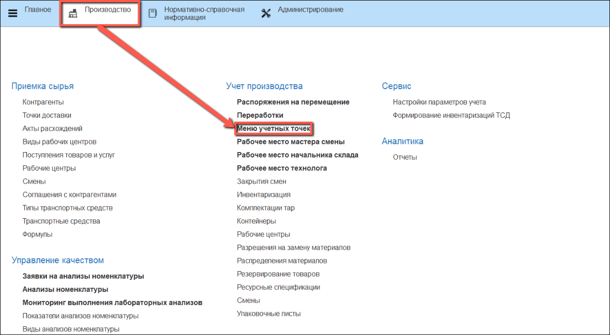
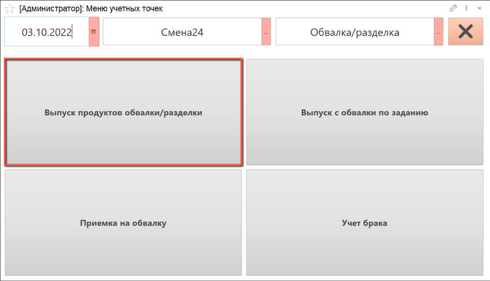
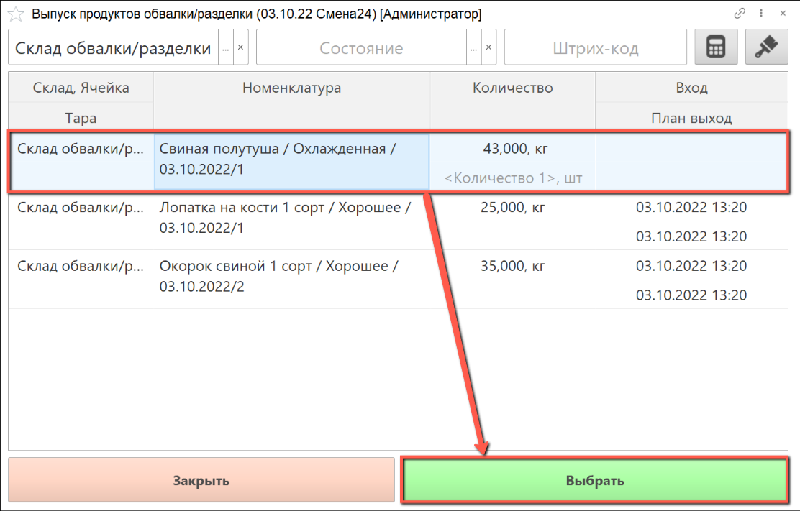
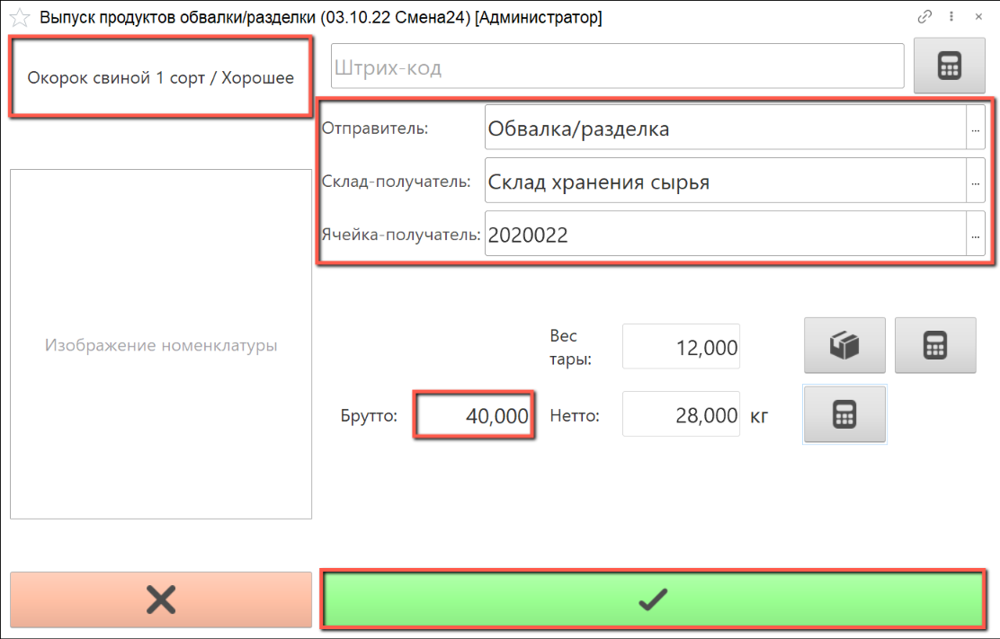
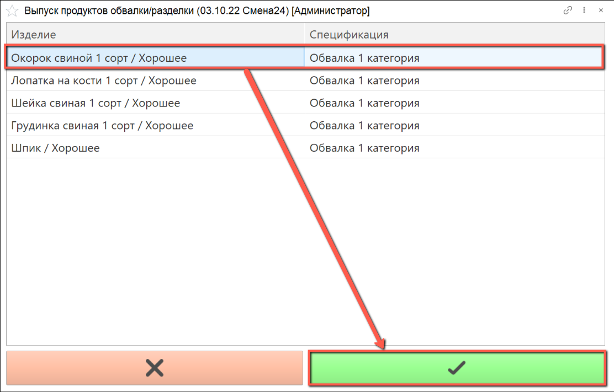
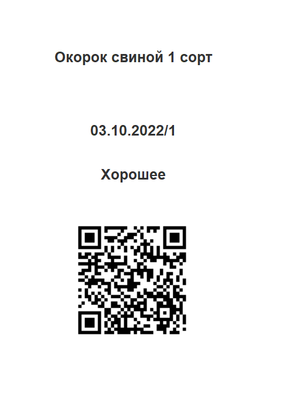
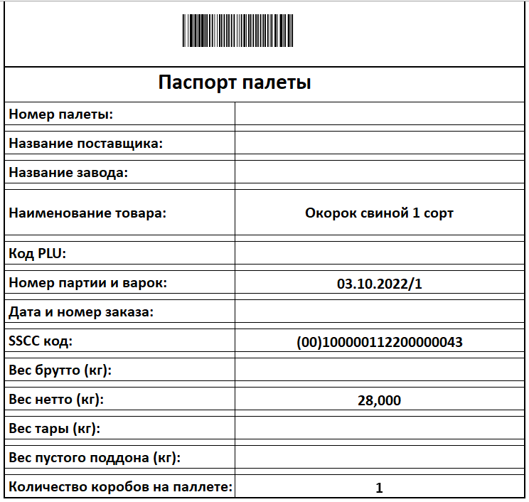
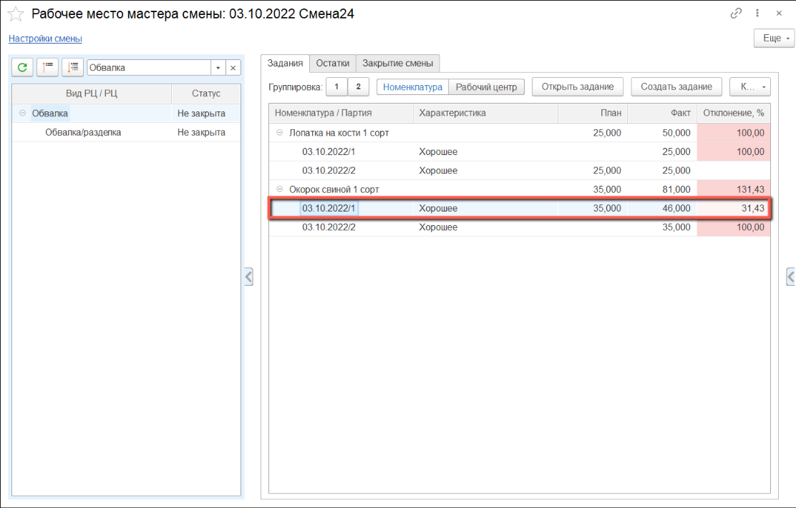

# Учет взвешиваний продуктов обвалки без задания

Взвешивание продуктов обвалки осуществляется оператором через киоски, производственное задание для данной операции не требуется.

- В подсистеме **"Производство"** открываем **"Меню учетных точек"**:

- Указываем дату смены, смену и учетную точку, на которой производится учет взвешивания продуктов обвалки. Нажимаем кнопку **"Взвешивание продуктов обвалки/разделки"**:

Открывается список партий сырья, которые на данный момент находятся на участке обвалки/разделки.

- Выбираем в списке  партию сырья, по которой планируется выпуск продуктов обвалки/разделки:

В левом верхем углу находится информация о номенклатуре выпуска. Если планируется выпуск другой номенклатуры, необходимо выбрать нужную номенклатуру из списка (см. следующий скриншот).

Справа указаны рабочий центр и склад-получатель по умолчанию.

Если на складе-получателе используются складские ячейки, необходимо выбрать ячейку из списка.

- С помощью калькулятора тары указываем тару, в которой производится взвешивание брака.

- Получаем с весов вес брутто, вес нетто рассчитается автоматически, нажимаем на кнопку **"Подтвердить"**:

- Выбор продукта обвалки/разделки производится следующим образом:

- После подтверждения взвешивания печатается этикетка партии сырья и паспорт паллеты:

- По результатам взвешивания сырья в окне рабочего места мастера смены отображается фактический выпуск продукта:

