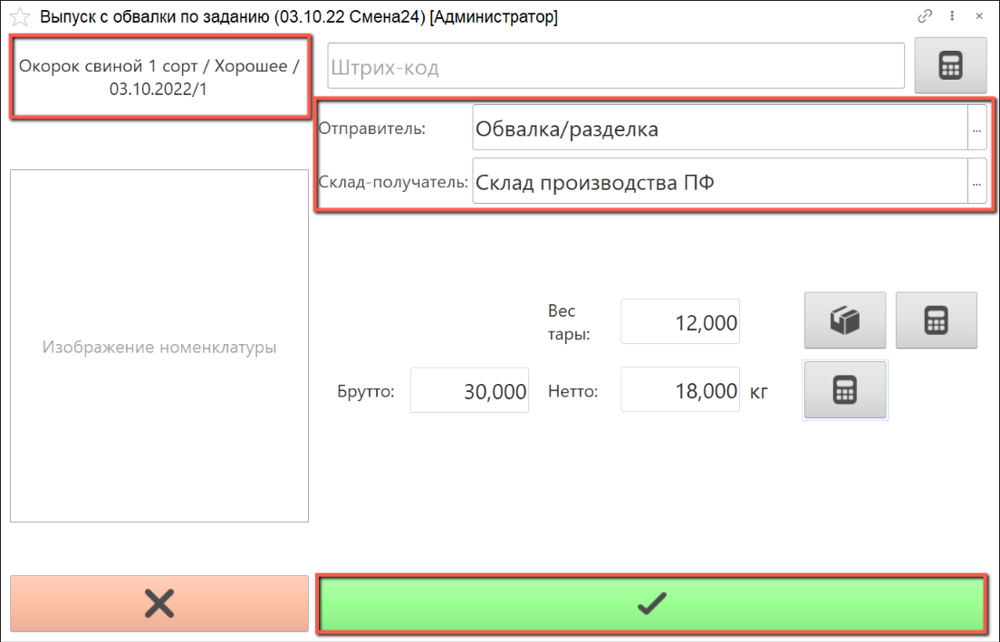

# Выпуск продуктов обвалки по производственному заданию

Для выпуска по заданию необходимо создать производственное задание, как это описано в разделе ["Создание производственного задания"](./ProductionAssignment.md).

- В подсистеме **"Производство"** открываем **"Меню учетных точек"**:

- Указываем дату смены, смену и учетную точку, на которой производится выпуск продуктов обвалки. Нажимаем на кнопку **"Выпуск с обвалки по заданию"**:

- Открывается список производственных заданий на указанную смену.

Для выполнения необходимо выбрать задание в статусе "Не начато" либо "В процессе". При необходимости можно отфильтровать задания в списке по статусу, выбрав нужный в строке "Состояние" в шапке АРМа.

Выбираем в списке  строку задания, по которому планируется выпуск продуктов обвалки/разделки, нажимаем кнопку "Приступить":

- В верхнем левом углу находится информация о номенклатуре выпуска, указанной в задании.

Справа указаны рабочий центр и склад-получатель по умолчанию. Если на складе-получателе используются складские ячейки, необходимо выбрать ячейку из списка.

С помощью калькулятора тары указываем тару, в которой производится взвешивание выходного изделия.

Получаем с весов вес брутто, вес нетто рассчитается автоматически, нажимаем на кнопку **"Подтвердить"**:

- После подтверждения выпуска печатается этикетка партии сырья:

- Если выпущено меньшее количество продукта, чем указано в задании, состояние задания останется **"В процессе"**. 

Если веса недостаточно, для завершения задания, можно завершить его вручную:

- В списке заданий завершенное задание будет выделено зеленым цветом, его состояние изменится на **"Выполнено"**:

- Если взвешено ровно запланированное или большее количество выходного изделия, статус задания изменится автоматически:

- По результатам выпуска продуктов по заданию в окне рабочего места мастера смены отображается фактический выпуск продукта и процент отклонения от плана выпуска:

