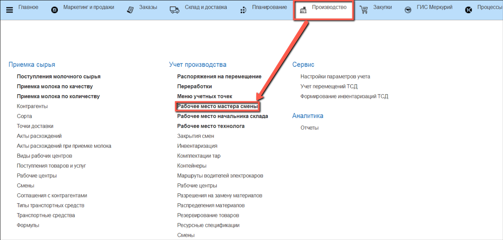
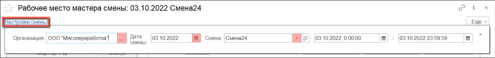
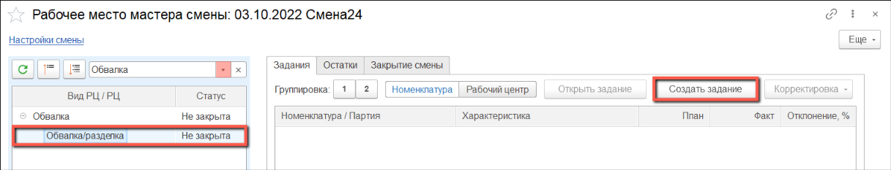
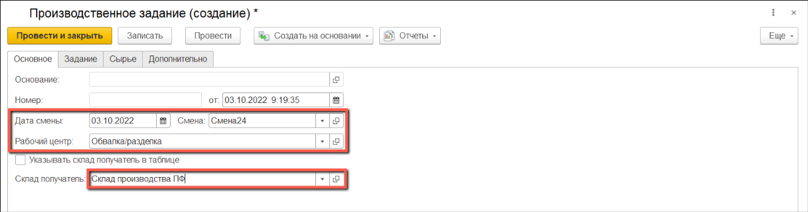
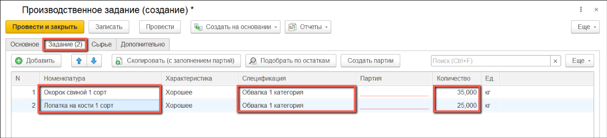
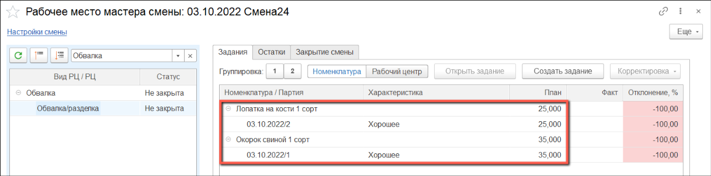

# Создание производственного задания на обвалку/разделку

- В подсистеме **"Производство"** открываем **"Рабочее место мастера смены"**:

- Открываем **"Настройки смены"**.

В открывшемся окне выбираем организацию, смену и указываем дату смены.

Временные рамки указываются автоматически, при необходимости их можно изменить вручную:

- Выбираем из списка вид рабочего центра **"Обвалка"**. 

В левой части окна, в таблице, раскрываем список рабочих центров и выбираем тот, на который будет формироваться задание.

В правой части окна, в таблице, на вкладке **"Задания"** нажимаем кнопку **"Создать задание"**, чтобы создать задание на текущую смену:

- В открывшемся окне проверяем и заполняем сведения на вкладке **"Основное"**:

- Поля "Дата смены", "Смена" и "Рабочий центр" заполнятся автоматически, при необходимости их можно скорректировать вручную;

- Заполняем поле "Склад получатель". Если предполагается отправлять выходные изделия на разные склады, следует установить галку "Указывать склад получатель в таблице":

- Заполняем табличную часть на вкладке **"Задание"**:

Выбираем из списка номенклатуру, которую планируется выпустить в указанную смену.

Спецификация указывается автоматически для каждой номенклатуры, при необходимости ее можно заменить. Если спецификация не указана, возможно в системе заведено несколько действующих спецификаций для выпуска данной номенклатуры, либо не заведено ни одной.

Если на предыдущем шаге была  установлена галка "Указывать склад получатель в таблице", следует указать склады на этой вкладке.

Количество указывается автоматически согласно количеству, указанному в спецификации:

- После проведения документа **"Производственное задание"** в окне **"Рабочее место мастера смены"** отразится план выпуска. Для номенклатуры выпуска автоматически будут созданы партии:

