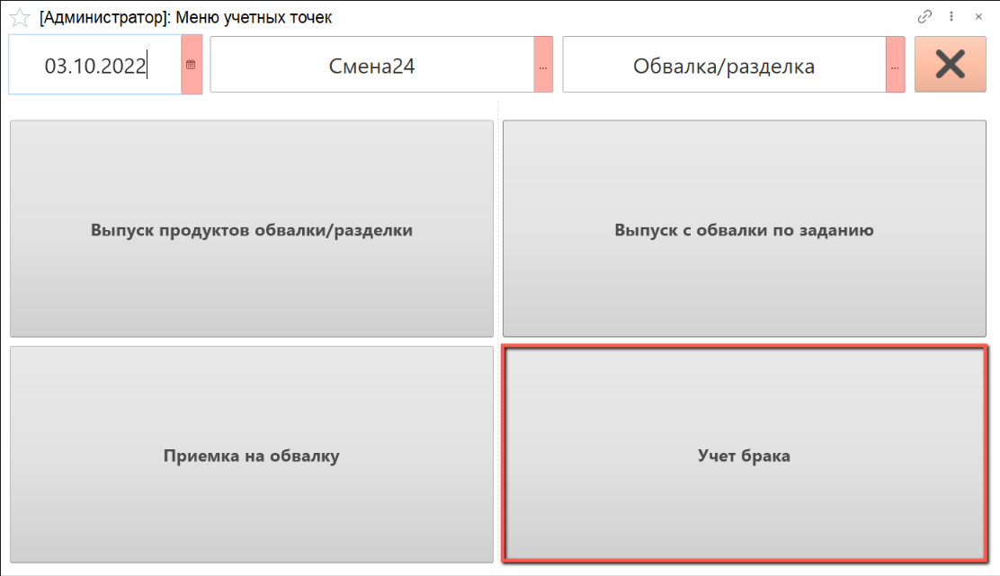
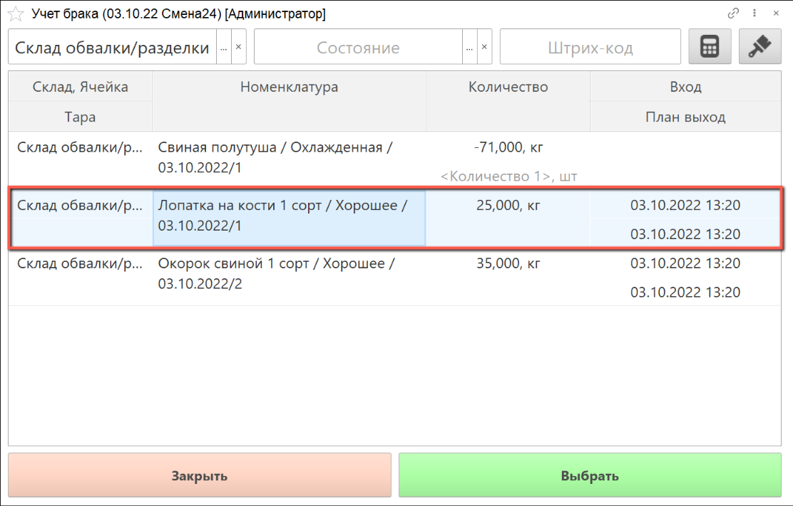
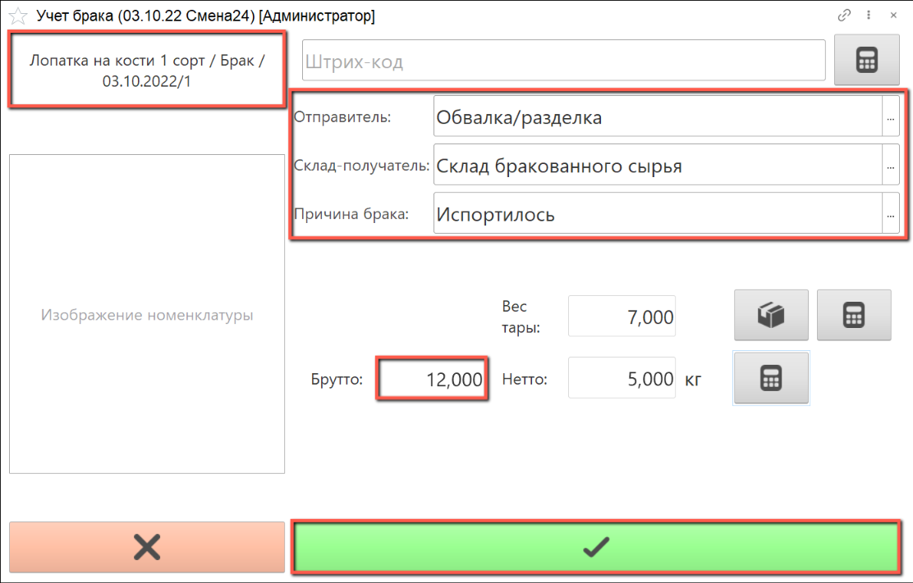
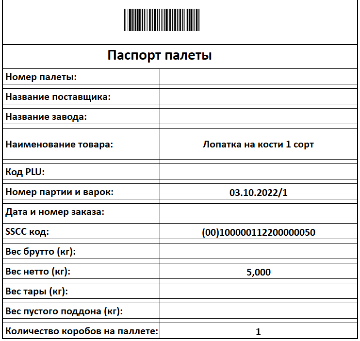

# Отбраковка

Отбраковка осуществляется оператором через киоски, производственное задание для данной операции не требуется.

- В подсистеме **"Производство"** открываем **"Меню учетных точек"**:

- Указываем дату смены, смену и учетную точку, на которой производится отбраковка продуктов обвалки. Нажимаем на кнопку **"Учет брака"**:

Открывается список сырья, которое находится на данном участке.

- Выбираем из списка партию сырья, в которой обнаружен брак, либо сканируем штрихкод этой партии:

  
В верхнем левом углу находится информация о номенклатуре выпуска.

В правой части формы указаны рабочий центр и склад-получатель по умолчанию.

Если на складе-получателе используются складские ячейки, необходимо выбрать ячейку из списка.

- Выбираем из списка причину возникновения брака.

- С помощью калькулятора тары подбираем тару, в которой производится взвешивание брака.

- Получаем с весов вес брутто, вес нетто рассчитается автоматически, нажимаем на кнопку **"Подтвердить"**:

- Распечатывается паспорт паллеты:

