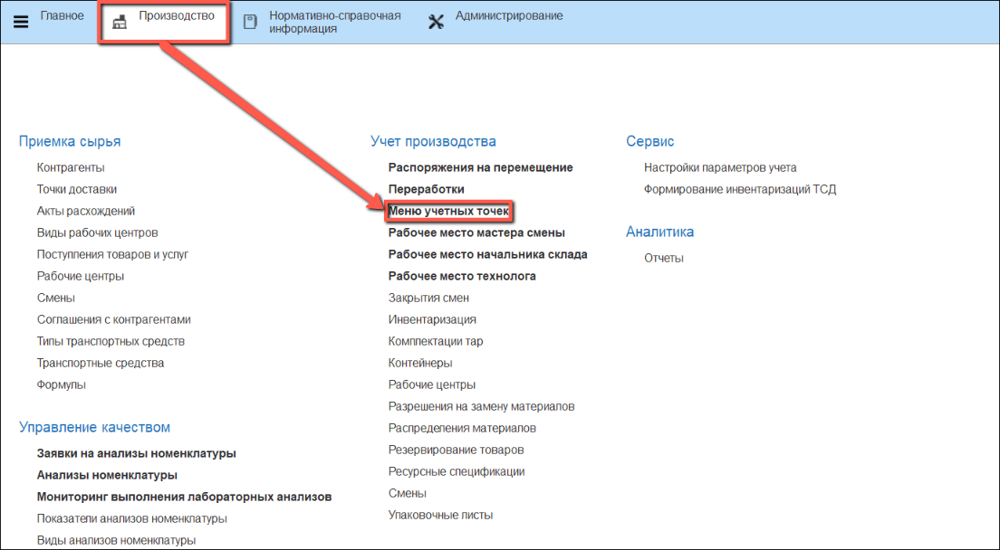
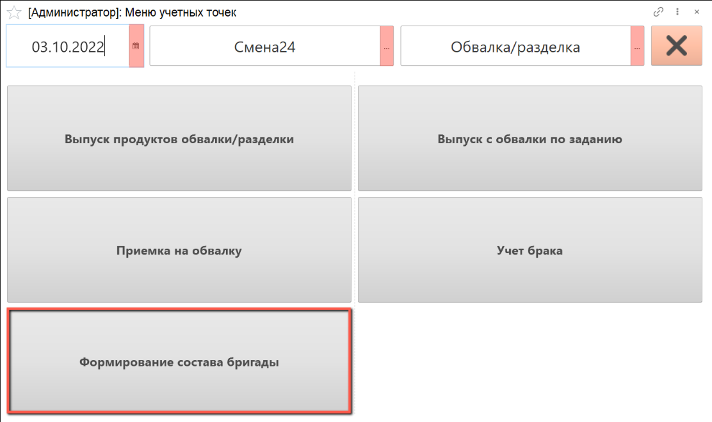
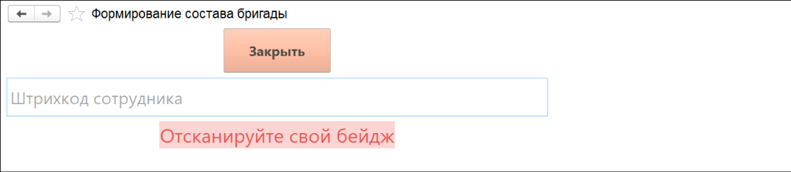
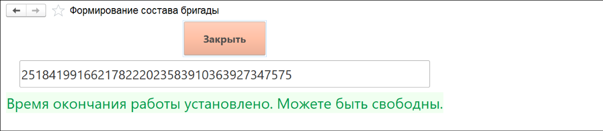

# Учет рабочего времени

Для контроля времени, которое сотрудник отработал за смену, на киоске выполняется учет времени окончания рабочего дня.

- В подсистеме **"Производство"** открываем **"Меню учетных точек"**:

- Указываем дату смены, смену и рабочий центр, на котором производится учет времени работы сотрудника. Нажимаем на кнопку **"Формирование состава бригад"**:

- Открывается окно для сканирования индивидуального штрихкода сотрудника:

- Отсканировав свой штрихкод, сотрудник получает уведомление о том, что его работа на данном участке в текущую смену успешно завершена:

