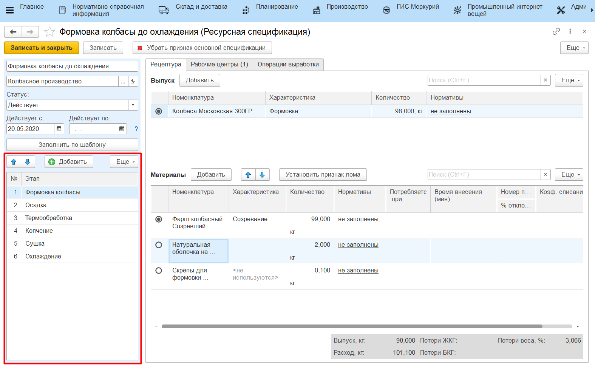
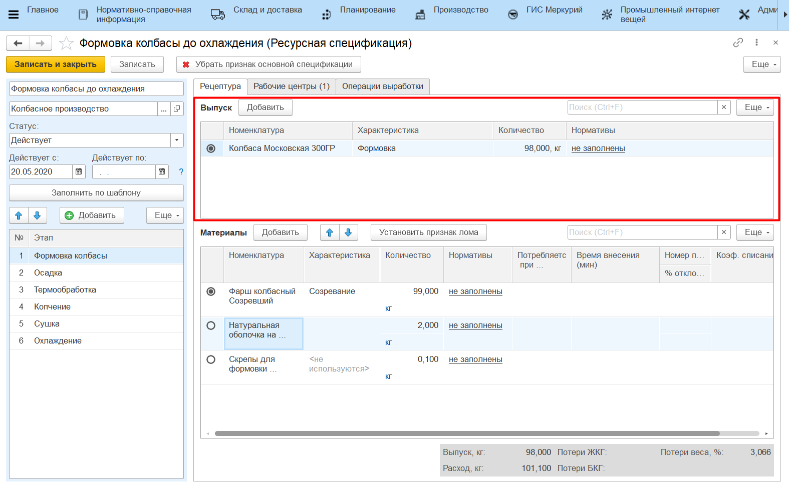

# Ресурсные спецификации

Справочник **"Ресурсные спецификации"** находится в подсистеме **"Производство"**, раздел **"Учет производства"**.

Зеленый кружок рядом с наименованием спецификации сообщает, что спецификация является основной:

Спецификации в системе могут заводиться двумя путями:

- Создание спецификации с нуля;
- Создание спецификации по шаблону, в котором заранее определен набор переделов, которые проходит продукция, а основное изделие одного этапа является основным материалом для следующего. Подробнее в разделе "[Шаблоны ресурсных спецификаций](../TemplateOfResourceSpecifications/TemplateOfResourceSpecifications.md)".

!!! success "Если спецификация создана по шаблону, её можно скопировать"

Указать, для какой номенклатуры (только того же вида номенклатуры) скопировать, все материалы также будут скопированы.

!!! fail "Нельзя создавать спецификацию с пустой датой начала действия"

!!! success "Можно создавать спецификацию с будущей датой начала действия" 

При этом она не станет основной, по ней создастся документ плановой калькуляции с датой = дате начала действия.

## Основная информация

Для каждой спецификации необходимо указать:

- наименование;
- родительскую группу (опционально);
- статус - спецификация создается в статусе *"В разработке"*. Когда спецификация готова к работе, устанавливается статус *"Действует"*. Если срок действия спецификации истек, автоматически устанавливается статус *"Закрыта"*.
- срок действия спецификации:
    - дата начала действия спецификации;
    - дата окончания действия спецификации (опционально). 
- шаблон - предопределенное решение, по которому заполняется спецификация.

!!! info "Важно"
    Дата окончания действия спецификации **не включается** в период её действия. Например, если спецификация действует по 31.01, то последний день, когда с ней можно работать - 30.01 до 23:59.

 

## Табличная часть "Этапы"

Содержит информацию об этапах (переделах), которые проходит продукция. Для каждого выбранного этапа табличные части выпуска и материалов отличаются, согласно тому, что производится на этапе. 

Если спецификация создана не по шаблону, то любой этап производства можно открыть из списка этапов и дозаполнить информацию (необходимо для [планирования по рабочим центрам](../../../../../PooperationalPlanning/Handbooks/ResourceSpecification.md)).

Если спецификация создана по шаблону, то откроется шаблон этапа производства.

## Вкладка "Рецептура"
### Табличная часть "Выходные изделия"

Содержит перечень выходных изделий этапа (**одно** основное изделие, сколько угодно побочных изделий и возвратных отходов) и их количество. Нормативное содержание жира и белка выходного изделия заполняется по необходимости. 

Если система открыта с лицензией на расчет себестоимости и если использование механизма расчета себестоимости включено в [настройках учета](../SettingOfAccounting/SettingOfAccounting.md), то в табличной части также появится колонка "Доля стоимости". Доля стоимости рассчитывается автоматически; если выпуск на этапе один, то можно указать "1" (единицу).

### Табличная часть "Материалы"

- Номенклатура/Характеристика/Количество - на каждом этапе может быть только один основной материал.
- Потребляется при выпуске - если выпусков может быть несколько на этапе, и при этом на эти выпуски по норме тратятся разные материалы, то можно указать все материалы, разделив их потребление с использованием данного столбца.
- Статья затрат - сырьевая статья затрат, по которой материал будет посчитан при расчете сырьевой себестоимости (доступно при включенном механизме расчета себестоимости).
- Номер пакета - если в системе ведется наборка по рецептуре, то этим реквизитом можно указать, какой ингредиент в какой пакет идет (например, когда несколько сыпучих ингредиентов смешивают вместе, чтобы вносить их в один момент);
- Время внесения (мин) - определяет нормативное время внесения ингредиента, считается от начала этапа. Чтобы сравнивать фактическое с нормативным, у партии продукции должно быть заполнено время начала.
- Коэф. списания - определяет, в каком соотношении списывать вторую единицу измерения материала на вторую единицу измерения выпуска. По умолчанию всегда равен 1. Изменить его можно только в случае, если и у материала, и у выпуска есть доп.единицы измерения. 
- % отклонения - возможный процент отклонения от указанного количества материала при выпуске указанного объема продукции этапа.

!!! info ""
    Стрелочками на панели материалов можно менять порядок строк. При выполнении наборки по рецептуре пользователь будет видеть строки материалов, которые нужно взвесить, по заданному порядку: первым всегда показывается основной материал, далее по установленному порядку из таблицы материалов в спецификации.

## Вкладка "Рабочие центры"

Для каждого из созданных этапов на вкладке указывается перечень рабочих центров, на которых выпускается продукция из списка выпусков этапа.

- Контролировать время нахождения - становится обязательным указание нормы времени нахождения продукции на переделе. 

## Вкладка "Операции выработки"

Содержит перечень операций, которые проводятся в рамках создаваемой спецификации. По ним рассчитывается сдельная заработная плата.

