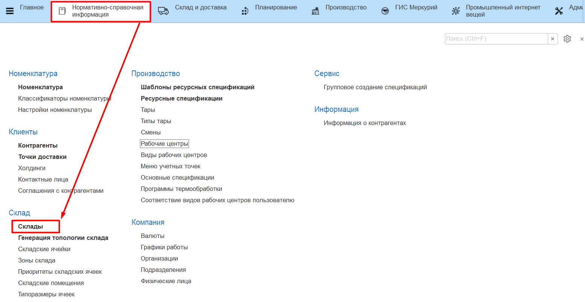
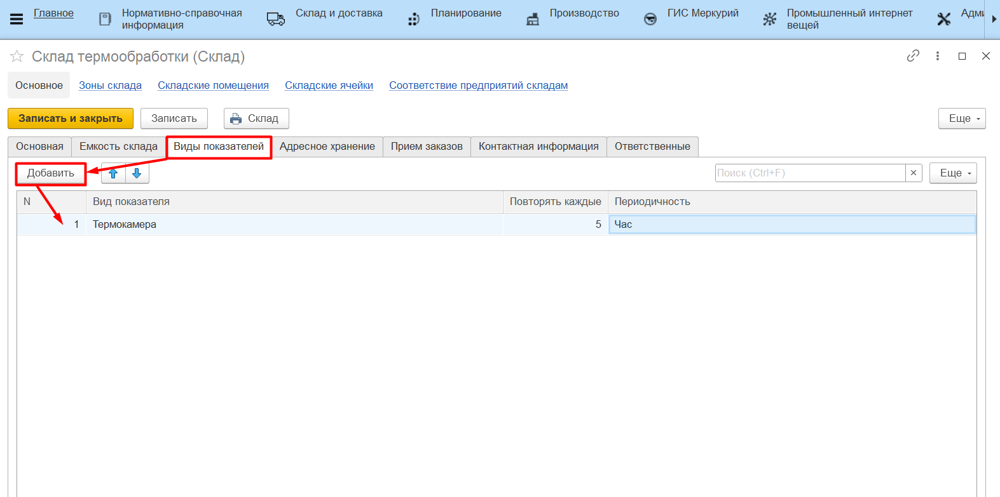
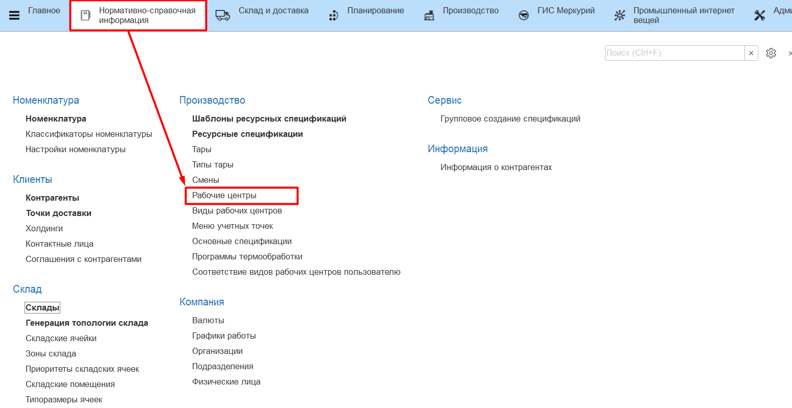
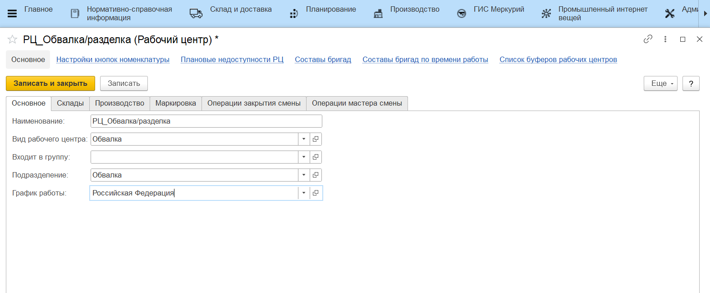
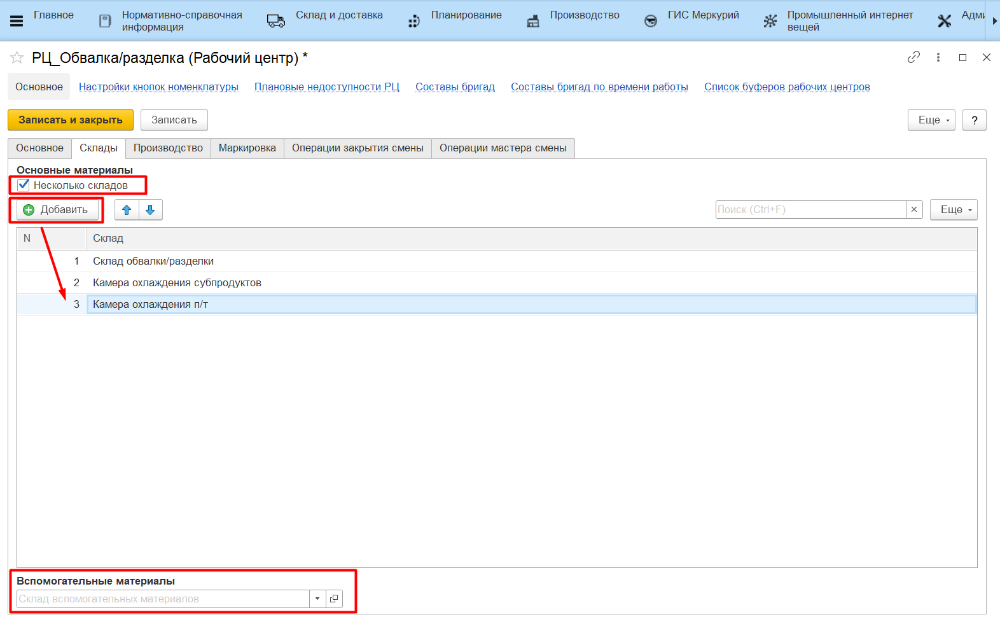
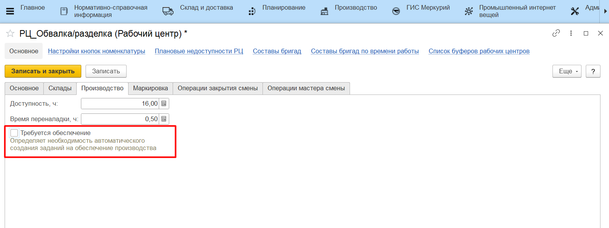

# Рабочие центры и склады

Информация по автоматизируемым участкам производства хранится в справочнике **"Рабочие центры"**, а по помещениям, которые к ним принадлежат (или используются в процессе производства) - в справочнике **"Склады"**.

## Справочник "Склады"

### Вкладка "Основное"

- Настройка контроля остатков - включает/отключает контроль остатков. Если контроль включен - не получится списать больше какого-либо материала, чем есть по учету в системе. Т.к. учет поступления материалов не всегда проходит оперативно, иногда целесообразно отключать такой контроль;
- Вместимость в местах - позволяет указать вестимость по контейнерам;
- Вести учет по таре - включает/отключает учет движений остатков в разрезе тары;
- Отключить учет по доп.единицам измерения - включает/отключает учет по доп.единицам измерения. В случае отключения учета документы не двигают на этом складе регистры по доп.единицам (зануляют), только по основным.

### Вкладка "Виды показателей"

Задается набор видов показателей склада и периодичность, с которой будут создаваться заявки на учет этих показателей в системе.

### Вкладка "Адресное хранение"

Позволяет включать\\отключать деление склада на ячейки (ряды, стеллажи и прочее). [Настройка адресного хранения](../../../../../CommonInformation/Warehouse.md).

## Справочник "Рабочие центры"

### Вкладка "Основное"

- Наименование - наименование рабочего центра;
- Вид рабочего центра - к какому [виду рабочего центра](../../../../../CommonInformation/KindOfWorkCenter.md) относится;
- Подразделение - указывается подразделение организации к которому относится данный рабочий центр;
- График работы - установленный для рабочего центра график работы.

### Вкладка "Склады"

- Склады (склад) производства - задается списком складов или одним складом (если он один), где ведется именно производственный учет - откуда берутся основные материалы, куда выпускается продукция;

- Склад материалов - склад, откуда берутся вспомогательные материалы на этом участке производства.

### Вкладка "Производство"

- Требуется обеспечение - включает/отключает создание дополнительного производственного задания при создании задания на этот участок.

