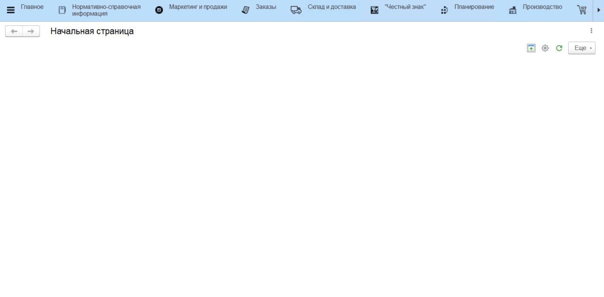
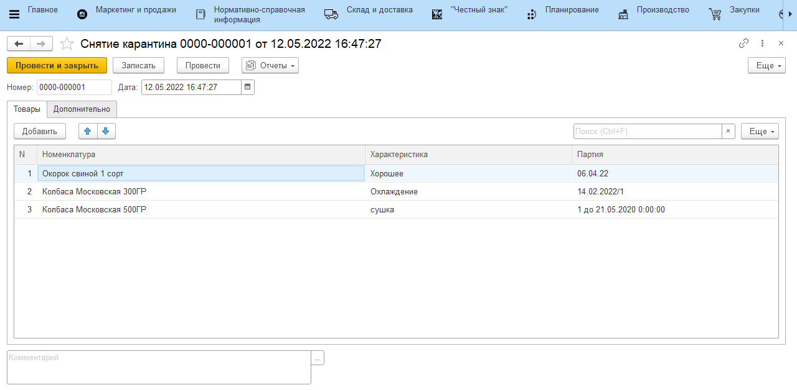
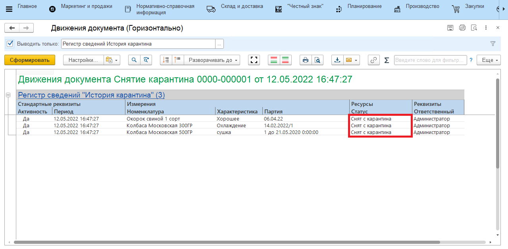

# Документ "Снятие карантина"

Для снятия с карантина нужных партий товара можно воспользоваться документом **"Снятие карантина"**, который располагается в разделе **"Производство"** подсистемы **"Управление качеством"**.

При заполнении необходимо указать следующие реквизиты:

 - Дата
 - Номенклатура
 - Характеристика *(опционально)*
 - Партия

После проведения документа в отчете **"Движения документа"** можно увидеть, что указанные партии имеют **"Статус"** - **"Снят с карантина"**

