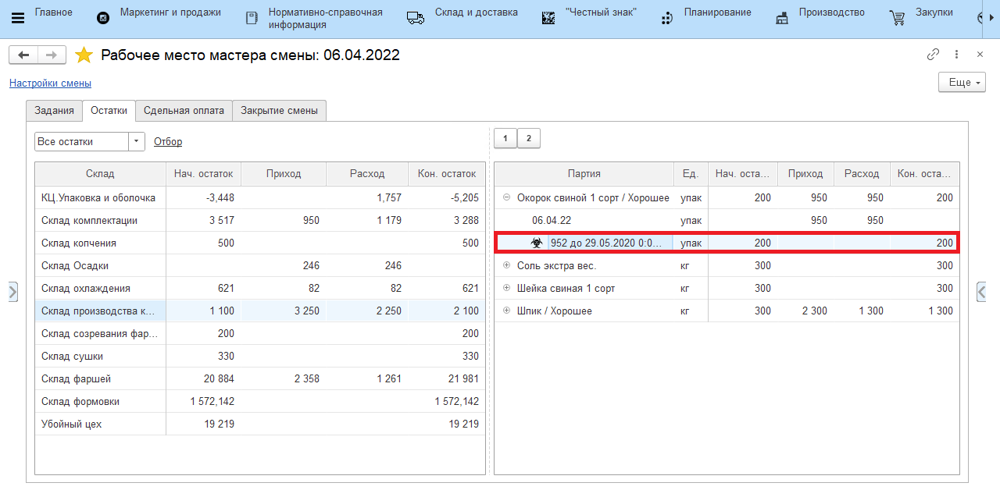
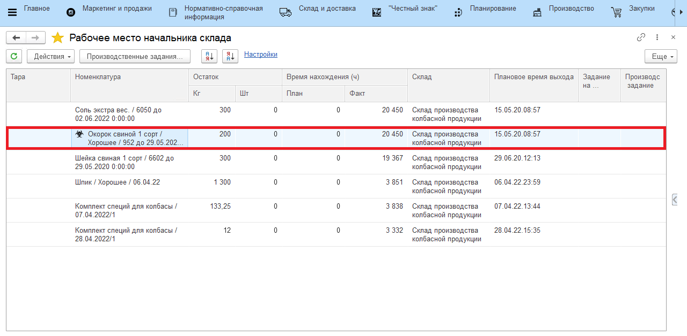
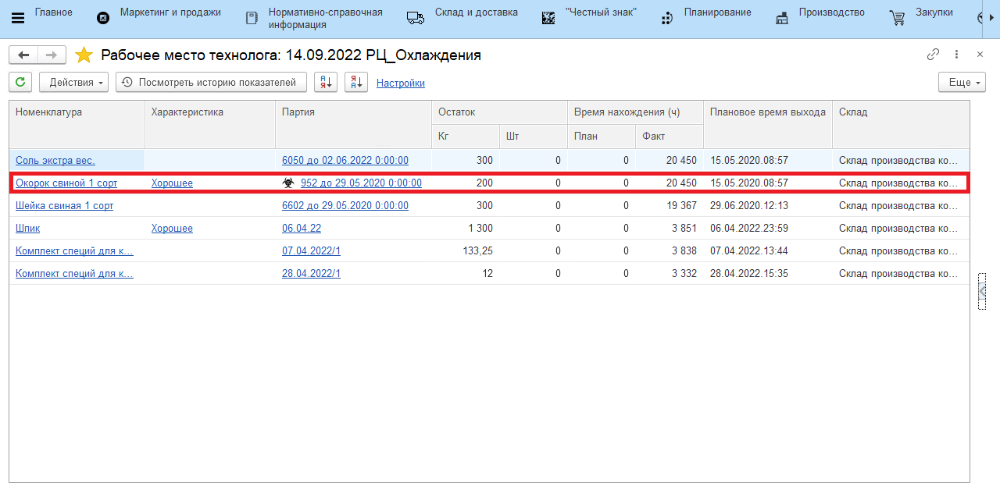
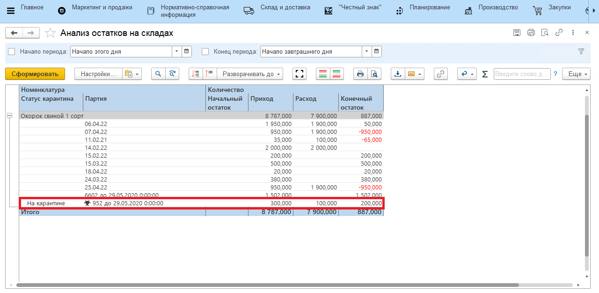

# Карантин при учетных операциях

Партия находящаяся "**На карантине**" будет запрещена к использованию для всех производственных операций:

- При ручном указании партии - не отображаться в формах подбора.

- При указании сканированием - выводиться предупреждение "**Партия на карантине**".

Отображение находящейся ""**На карантине**"" партии в ""**Рабочем месте мастера смены**""

Отображение находящейся ""**На карантине**"" партии в ""**Рабочем месте начальника склада**""

Отображение находящейся ""**На карантине**"" партии в ""**Рабочем месте технолога**""

Отображение находящейся ""**На карантине**"" партии в отчете ""**Анализ остатков на складах**""

