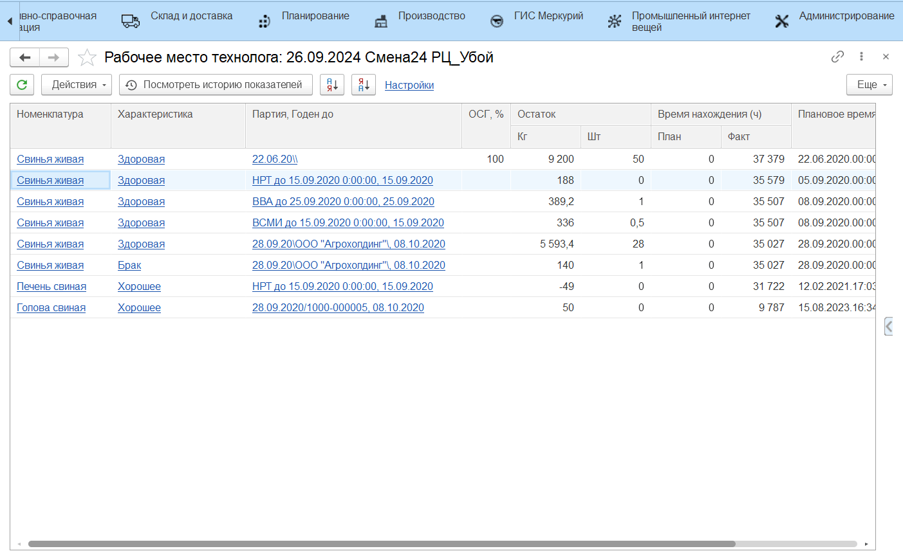
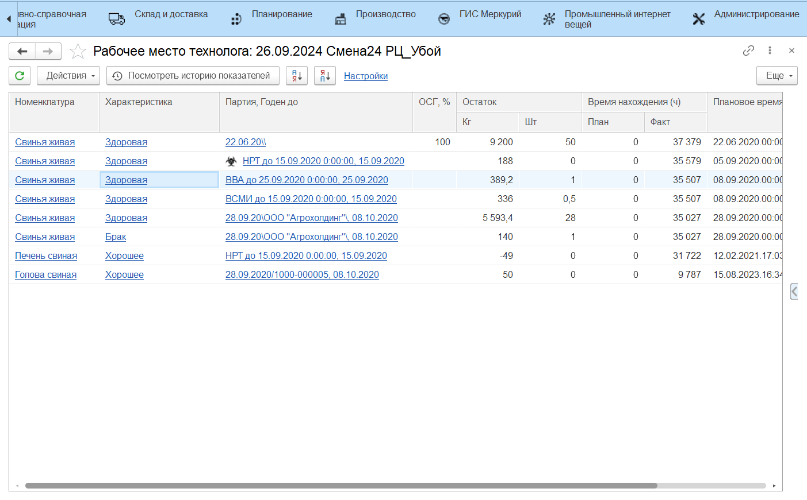

# Постановка и снятие с карантина вручную

В **АРМе Технолога** имеется возможность постановки и снятия с карантина вручную.

Для постановки на карантин необходимо выбрать партию остатка, затем в меню **"Действия"** нажать **"Поместить на карантин"**. При этом формируется документ [**"Помещение на карантин"**](QuarantineDocuments/QuarantinedPremises.md).

Для снятия с карантина необходимо выбрать партию остатка на карантине, затем в меню **"Действия"** нажать **"Снять с карантина"**. При этом формируется документ [**"Снятие карантина"**](QuarantineDocuments/RemovalFromQuarantine.md).

