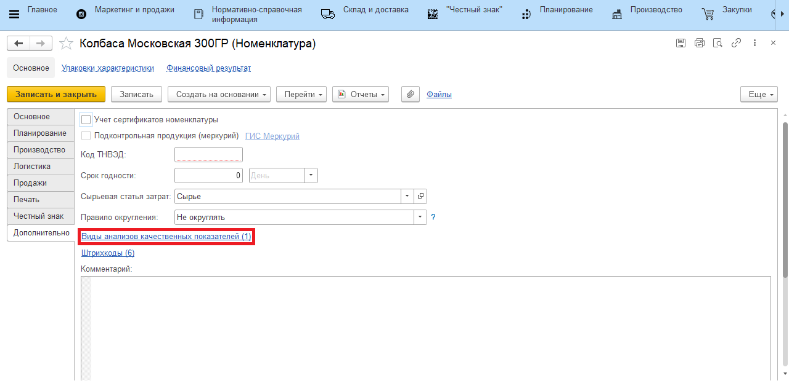
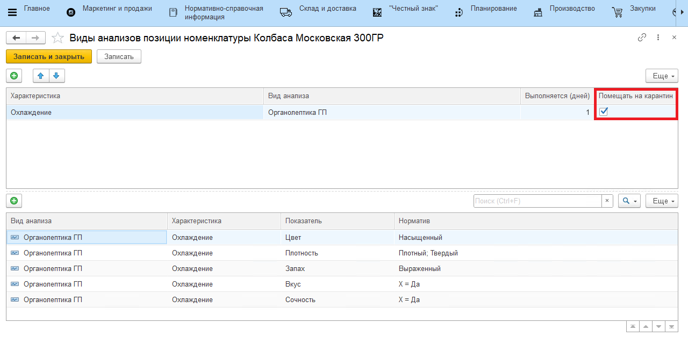
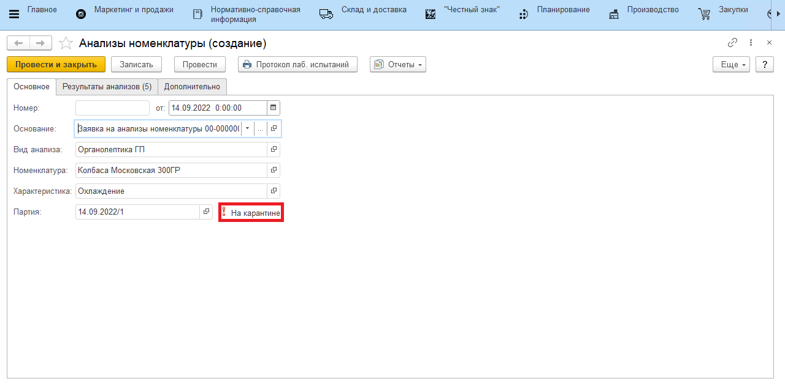
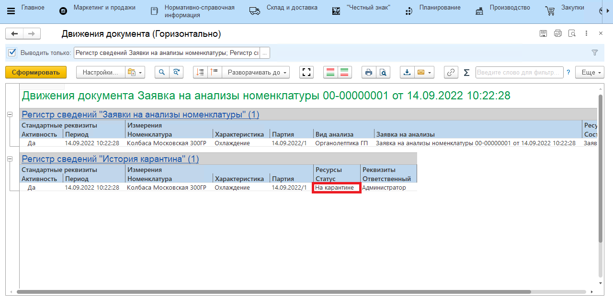

# Признак постановки на карантин в анализах номенклатуры

При включенном функционале **"Блокировать сырье на карантине"** в **Номенклатуре** -> **"Виды анализов номенклатуры"** добавляется колонка **"Помещать на карантин"**. При создании **Переработки** данный параметр будет автоматически указан в **"Заявке на анализы номенклатуры"**. До выполнения **"Заявки на анализы номенклатуры"** партия будет находится **"На карантине"**.

В выбранной **"Номенклатуре"** нужно перейти на вкладку **"Дополнительно"** -> **"Виды анализов качественных показателей"**

В открывшемся окне появится возможность указать **"Вид анализа"**, который будет **"Помещать на карантин"** партию.

После создания **"Переработки"**, автоматически сформируется документ **"Заявка на анализы номенклатуры"** с указанием параметра - "**На карантине**".

В отчете **"Движения документа"** после проведении документа **"Заявка на анализы номенклатуры"** можно будет увидеть факт нахождения партии **"На карантине"**.

