# Рабочее место мастера смены

Для контроля результатов производства за смену  в системе существует специальное рабочее место.

- В подсистеме **"Производство"** открываем **"Рабочее место мастера смены"**:

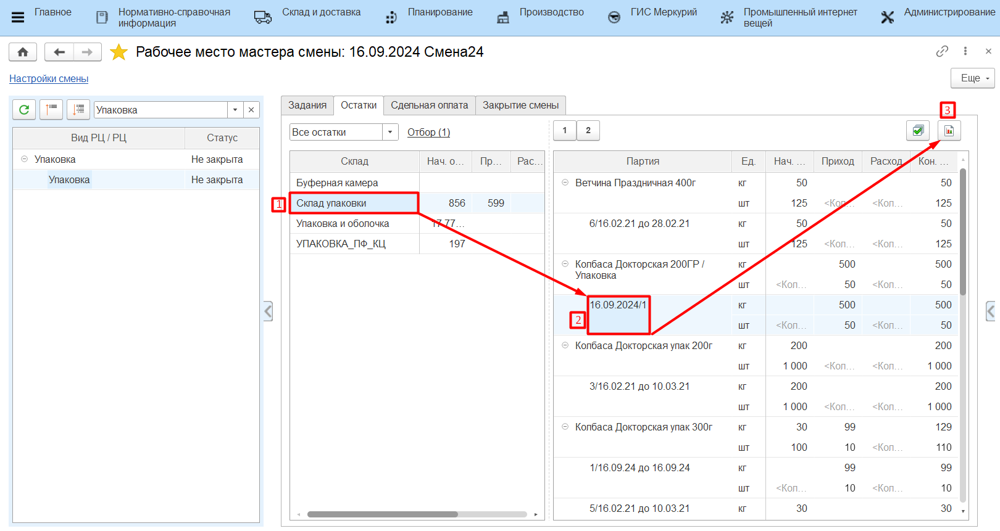

По гиперссылке **"Настройки смены"** открываем окно для ввода параметров смены.

- Вводим дату смены  вручную. Смена и временной диапазон заполнятся автоматически, при необходимости их можно скорректировать вручную.

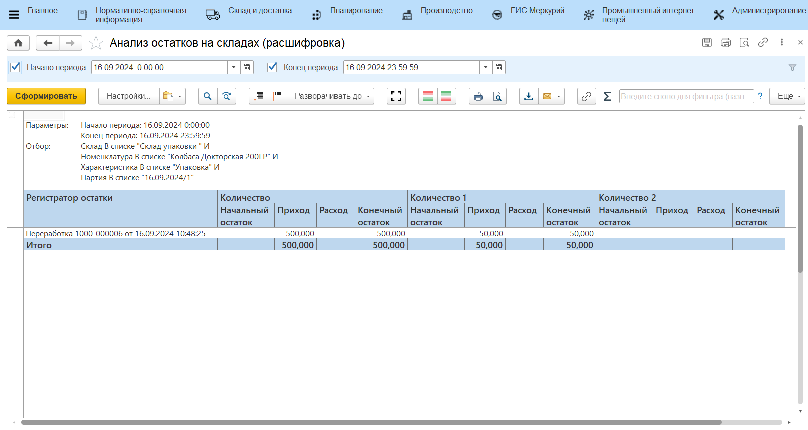

- Закрываем окно ввода параметров смены и выбираем рабочий участок, на котором необходимо подвести итоги смены.

  Нажимаем кнопку "Обновить", в табличной части ниже появится информация о рабочем участке и рабочих центрах, закрепленных за ним.  Выбираем нужный вид рабочего центра, а затем рабочий центр:

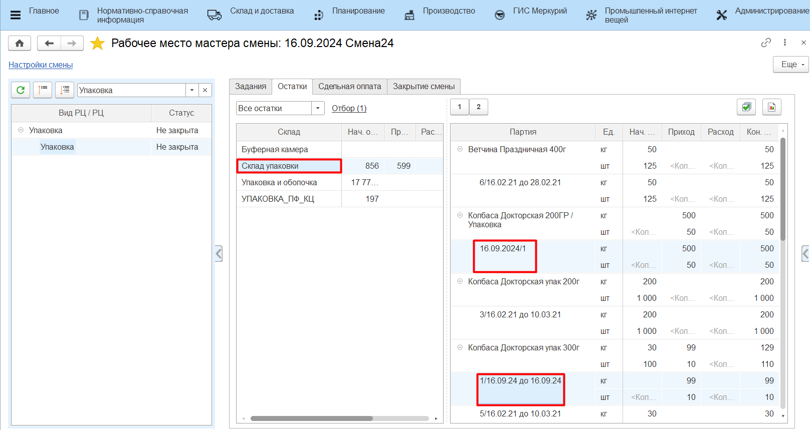

# Задания

- На вкладке **"Задания"** можно увидеть информацию о выпущенных продуктах за текущую смену.

  Чтобы создать задание на смену, нажимаем на кнопку **"Создать задание"** в шапке вкладки. Откроется стандартная форма документа **"Производственное задание"**;

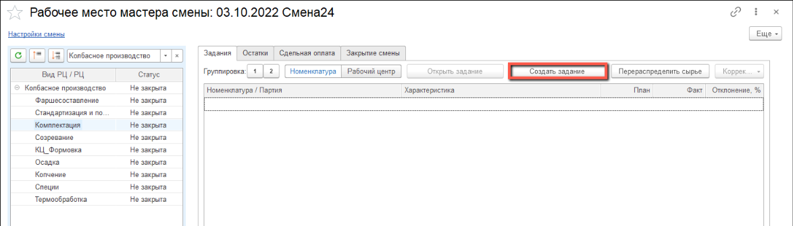

В табличной  части указана номенклатура произведенных продуктов, количество, которое планировалось произвести, фактически произведенное количество и процент отклонения от плана.

Возможны ситуации, когда физически произведено одно количество продукта, а по документам в системе указано другое. Если причиной отклонения является ввод ошибочных данных сотрудником цеха, созданные документы можно скорректировать.

Для этого выбираем партию, нажимаем кнопку **"Корректировка"** и выбираем пункт выпадающего списка **"Откорректировать количество"**:

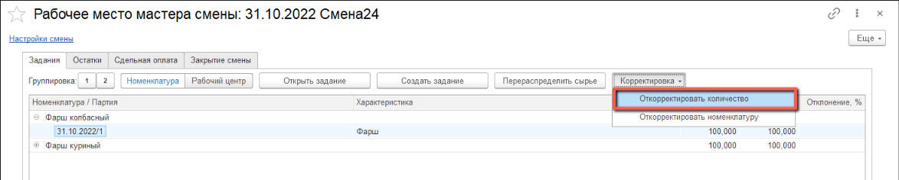

В открывшемся окне вводим новое значение количества выпущенной продукции в используемых единицах измерения (кг, шт.)

- Нажимаем на кнопку **"ОК"**:
  
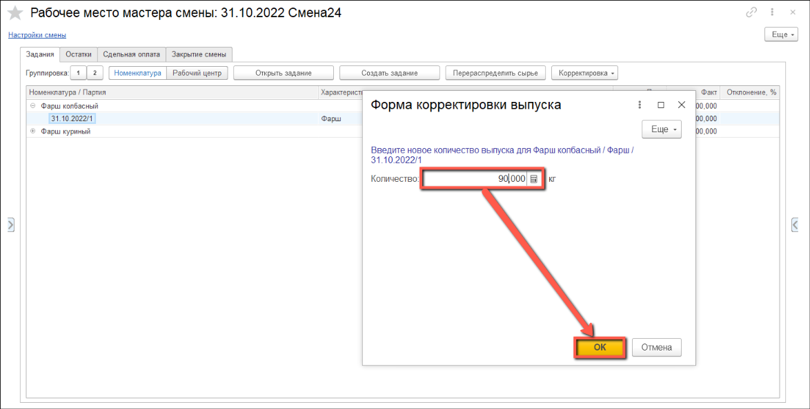
  
Откроется окно корректировки документов. Следует ознакомиться со списком и содержанием документов  и отметить флагом те, которые необходимо изменить.

- По завершении проверки нажимаем на кнопку **"ОК"**:
  
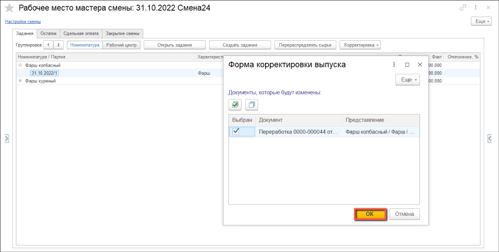
  
- В основном окне рабочего места появится следующее сообщение:

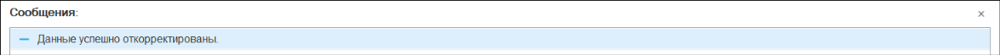

# Остатки
  
- На вкладке **"Остатки"** отображаются текущие остатки материалов на складах рабочего центра и обороты сырья за смену.

  Если за текущую смену физически были зафиксированы потери по материалу, а в системе числятся остатки на складе, следует списать остатки с отнесением на потери при производстве. Для этого разворачиваем вкладку действий:
  
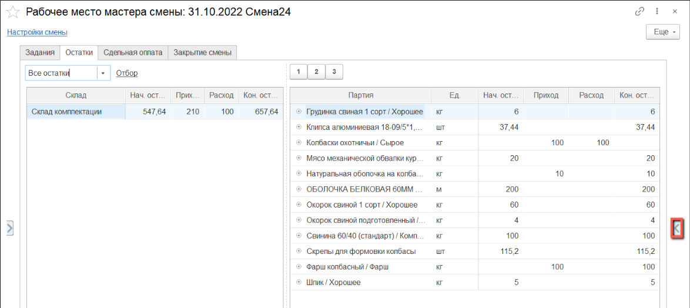
  
- Нажимаем на кнопку **"Списать"**:

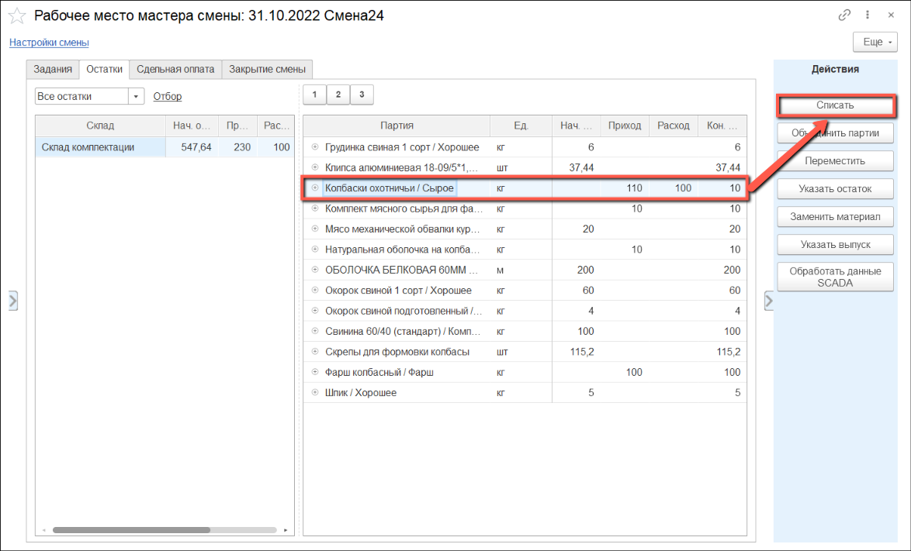

Открылось окно списания. Выбираем вариант списания и нажимаем **"ОК"**:

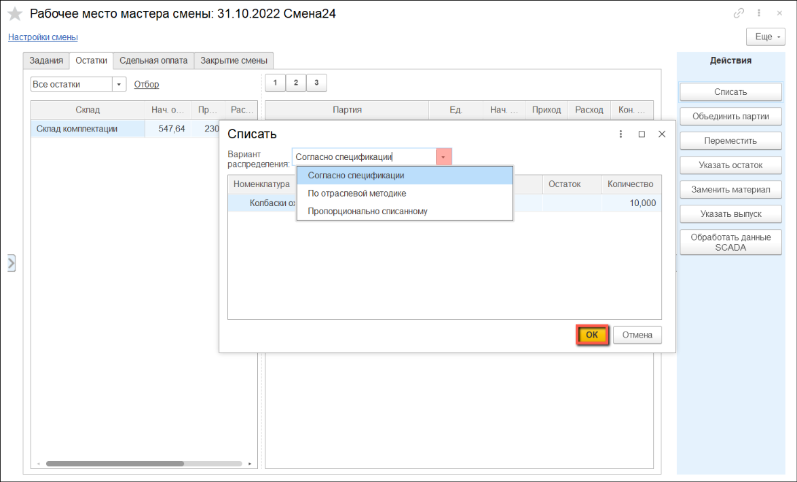

В таблице ниже автоматически скорректируется количество прихода и расхода по выбранной номенклатуре:

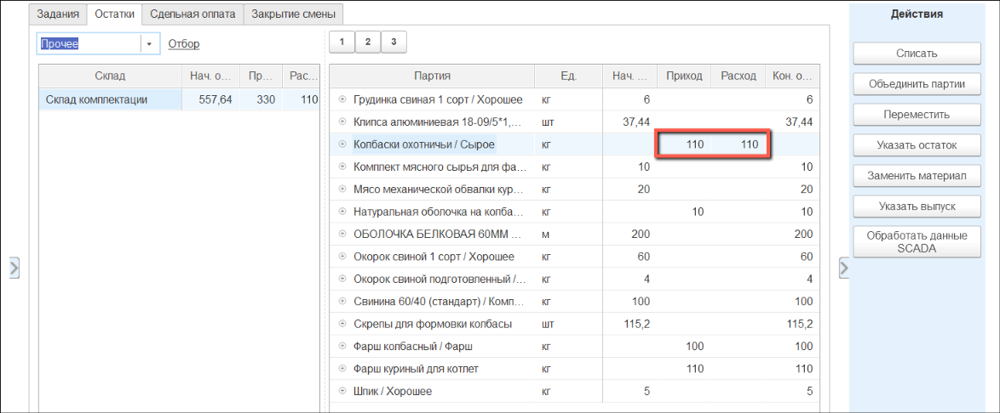

# Закрытие рабочей смены

- Когда  мастер смены удостоверился, что за текущую смену в систему введена корректная информация о выходах и остатках, следует закрыть смену на рабочем центре.

Переходим к закладке **"Закрытие смены"** и нажимаем кнопку **"Закрыть смену"**. 

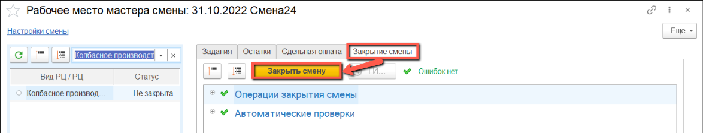

- Откроется предупреждение о закрытии смены по рабочим центрам:

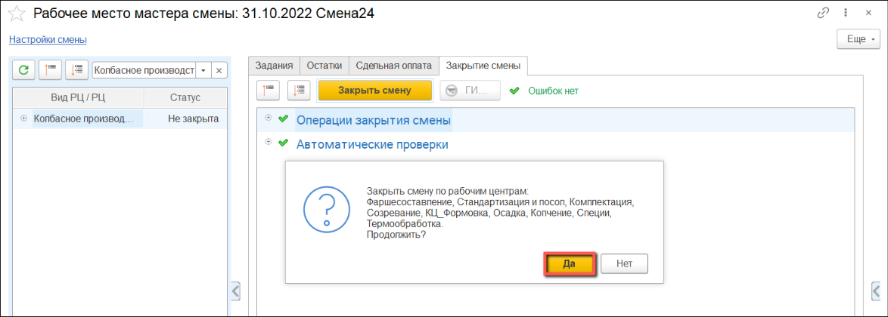

Если при закрытии смены система выявит некорректные данные, статус смены в табличной части слева изменится на **"Есть ошибки"**, а на закладке **"Закрытие смены**" отобразится информация о некорректных данных.

- Если все данные за смену верны, статус смены на рабочем центре изменится на **"Закрыта"**:

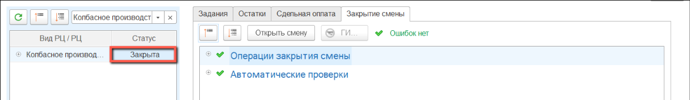