# Рабочее место мастера смены

Для контроля результатов производства за смену  в системе существует специальное рабочее место.

**"Рабочее место мастера смены"** находится в подсистеме **"Производство"**:

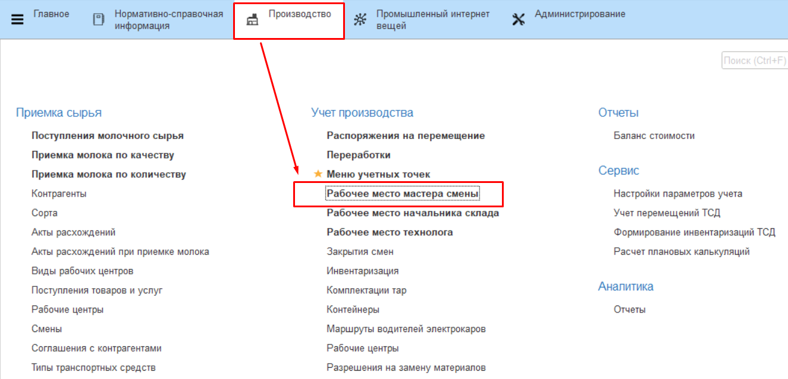

Перед началом работы необходимо настроить смену. Перейдя по гиперссылке **"Настройки смены"**, нужно указать текущую дату и выбрать смену.

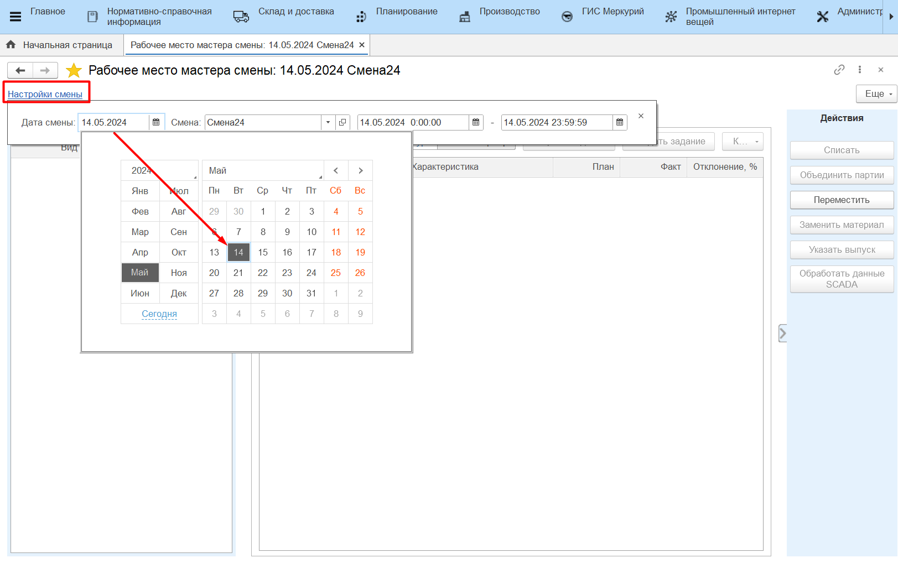

Затем нужно выбрать рабочий участок, на котором необходимо вести учет. В табличной части слева появится информация о рабочем участке и рабочих центрах, закрепленных за ним.

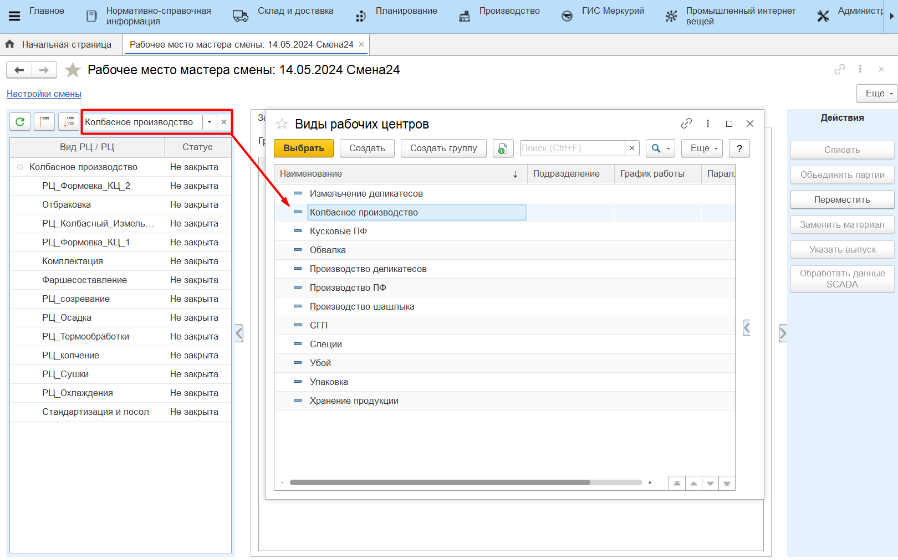

При этом, если для пользователя настроено соответствие, то в списке доступных для работы ВРЦ отобразятся только те, к которым пользователю назначен доступ. Задать соответствие ВРЦ и пользователя можно в справочнике ["Виды рабочих центров"](../../../../../CommonInformation/KindOfWorkCenter.md) или в справочнике ["Пользователи"](../../../../../CommonInformation/Users.md).

# Задания

На вкладке **"Задания"** фиксируется информация по всем совершенным на рабочем центре выпускам. 

Чтобы создать задание на смену, нужно нажать на кнопку **"Создать задание"** в шапке вкладки. Откроется стандартная форма документа **"Производственное задание"**.

После того, как производственное задание было создано, в табличной части на вкладке **"Задания"** появится информация о плановом выпуске.

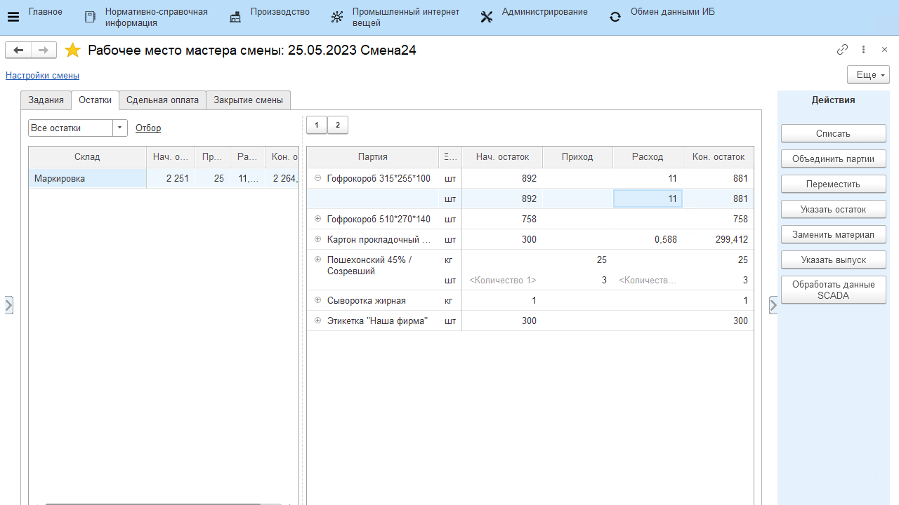

Когда задание будет выполнено, появится информация о фактическом выпуске и об отклонении факта от плана.

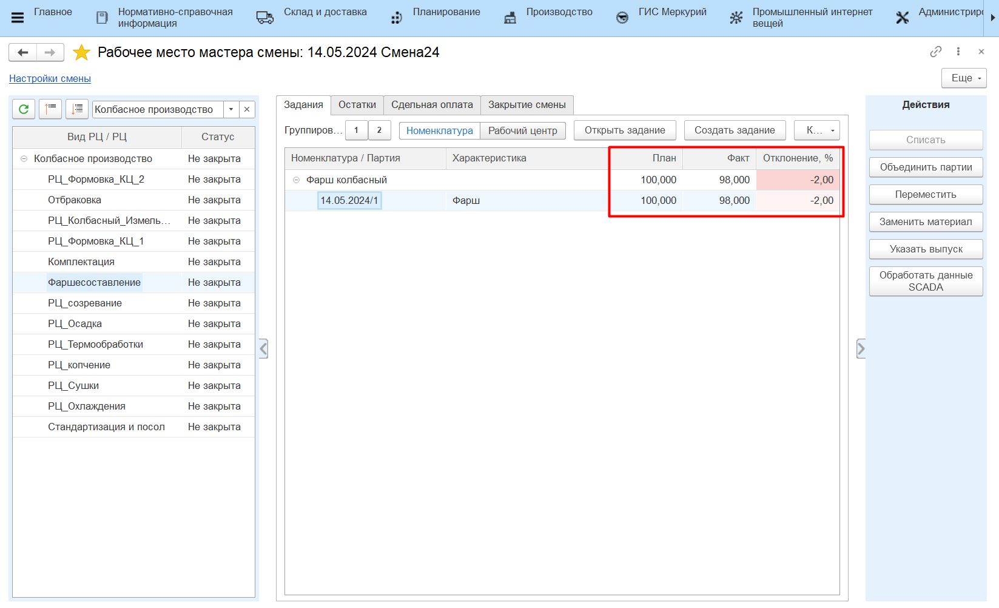

## Корректировка

Если причиной отклонения факта от плана является ввод ошибочных данных сотрудником цеха, созданные документы можно скорректировать. Для этого нужно:

- выбрать партию;
- нажать на кнопку **"Корректировка"**;
- выбрать пункт выпадающего списка **"Откорректировать количество"**;
- в открывшемся окне ввести скорректированное значение количества выпущенной продукции в используемых единицах измерения (кг, шт.);
- нажать на кнопку **"ОК"**.
  
Откроется окно корректировки документов. Следует ознакомиться со списком и содержанием документов и отметить флагом те, которые необходимо изменить. По завершении проверки нужно нажать на кнопку **"ОК"**.
  
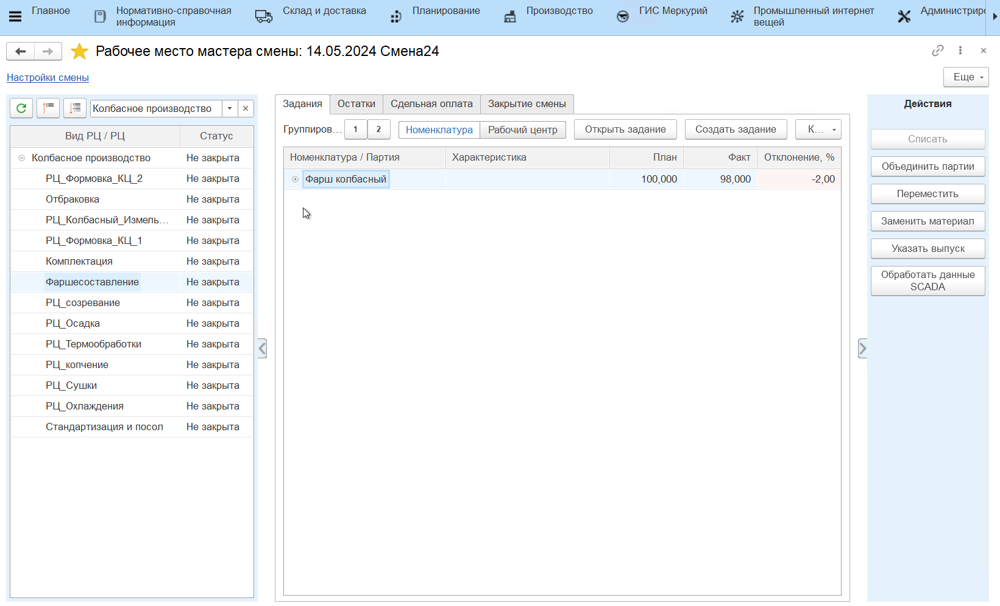

# Остатки
  
На вкладке **"Остатки"** отображаются текущие остатки материалов на складах рабочего центра и обороты сырья за смену. На панели **"Действия"** доступны следующие операции управления остатками для каждого рабочего центра:

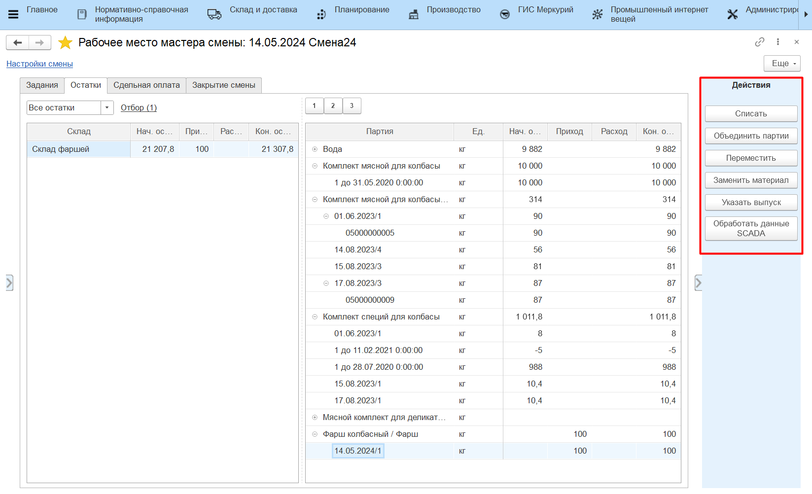

При этом список операций можно настроить в зависимости от сценариев работы на рабочем центре. Например, на рабочем центре нет необходимости объединять партии, тогда кнопку этой операции можно убрать с панели действий. Подробнее см. в разделе [Общая информация - Рабоцие центры](../../../../../CommonInformation/WorkCenter.md). 

## Списать

Если за текущую смену на производстве выпускалась продукция и тратился материал, но в системе этот расход не отражен, и материал все еще числится на складе, следует списать его на сделанные выпуски. Для этого нужно:
  
- встать на строку партии сырья (или выделить несколько партий одного сырья);
- нажать на кнопку **"Списать"**.

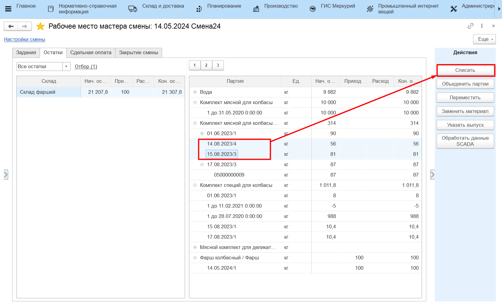

Откроется форма, которая состоит из двух таблиц: таблица выпусков и таблица материалов. В таблицу материалов попадают выбранные пользователем партии сырья. В таблицу выпусков попадают все выпуски за смену, которые по спецификации могли быть сделаны из указанного сырья. 

Пользователь может выбрать одну или несколько партий выпусков, на которые нужно списать указанное сырье. Для этого нужно:

- двойным кликом выбрать нужную партию/-ии выпуска, напротив выбранных партий появится галочка;
- выбрать вариант списания сырья (описаны ниже);
- указать или количество сырья (если списать нужно не всё), или его остаток и нажать **"ОК"**. 

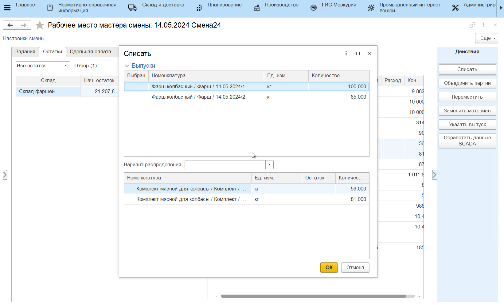

!!! info "Важно"
    Если не выбрана ни одна партия выпуска, то сырье будет списано на **все** партии, подобранные в таблицу выпусков. 

По итогу сформируется документ **"Распределение материалов"**. В таблице остатков в "Рабочем месте мастера смены" автоматически скорректируется количество прихода и расхода по выбранной номенклатуре.

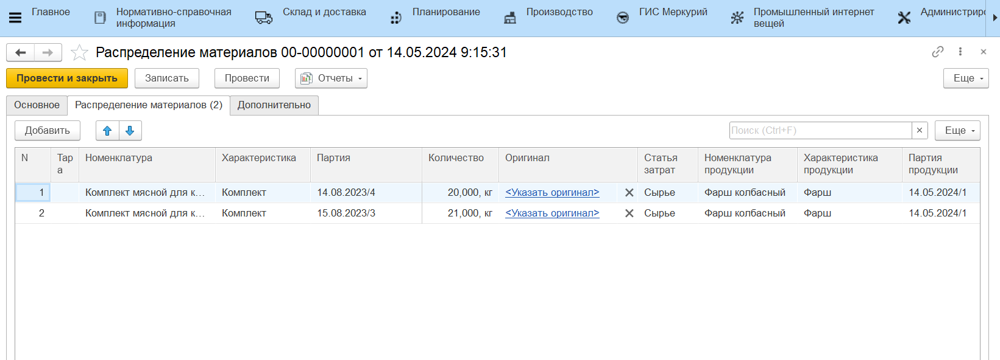

### Варианты списания сырья

- **Согласно спецификации** - списание выбранных материалов происходит на все существующие выпуски за смену, для которых этот материал обозначен в спецификации;  

    ??? info "Пример"
        За смену были упакованы партии колбасы "Московская" (100кг) и "Докторская" (200кг). В спецификациях на эти колбасы в материалах указан "Пакет для вакуумирования". Если списать Пакет **Согласно спецификации** (600шт), то материал ляжет на выпуски и "Московской", и "Докторской" колбасы в объемах, пропорциональных объемам выпусков (200шт и 400шт).

- **Пропорционально списанному** - списание выбранных материалов происходит только на те выпуски, на которые этот материал уже был потрачен;

    ??? info "Пример"
        Если выбранный материал был потрачен на выпуск как *вспомогательный*, то по распределению **Пропорционально списанному**, он будет *досписан* на существующие выпуски. Например, "Пакеты для вакуумирования" были потрачены при упаковке на колбасу "Московскую" (5шт) и на колбасу "Докторскую" (15шт). Если списать по выбранной методике еще 100 пакетов, то 25шт спишутся на "Московскую" колбасу и 75шт на "Докторскую".
    
    - Этой опцией так же можно воспользоваться для списания **усушки**. Если на выпуск продукции уже было сделано распределение сырья, то дополнительное списание *основного* материала по варианту **Пропорционально списанному** отнесет списание на статью затрат Усушка.

    - Списать остатки по этой методике можно в том числе по нескольким рабочим центрам сразу. Если выбрана опция **"Списывать по всем рабочим центрам данного вида"**, то со всех рабочих центров будут подобраны выпуски, на которые уже был потрачен списываемый материал. По итогу списания на каждый рабочий центр будет создан свой документ **"Распределения материалов"**. Такая опция отражает сценарий, когда разные рабочие центры одного вида имеют общий склад и производят продукцию с использованием одних и тех же материалов.

    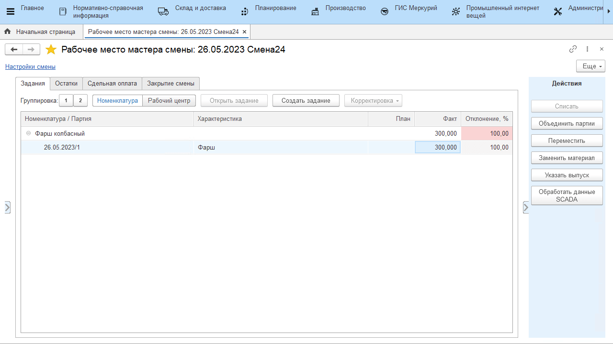

- **Брак** - предполагает списание материалов (только вида "Короб" и "Пакет") на брак. Требует уже учтенного расхода материала. Выбранный материал списывается по статье затрат Брак на уже имеющиеся выпуски пропорционально потраченному. 

    ??? info "Пример" 
        "Пакеты для вакуумирования" были потрачены при упаковке на колбасу "Московскую" (5шт) и на колбасу "Докторскую" (15шт). Если списать на брак 4 пакета, то 1шт будет списана на колбасу "Московскую" и 3шт на колбасу "Докторскую".

## Переместить

Данная функция позволяет отразить перемещение партий продукции и материалов между складами.  

Для этого нужно выбрать в таблице партию (партии), нажать **"Переместить"**. Указать склад-получатель и количество перемещаемого сырья. Создается документ **"Распоряжение на перемещение"**.

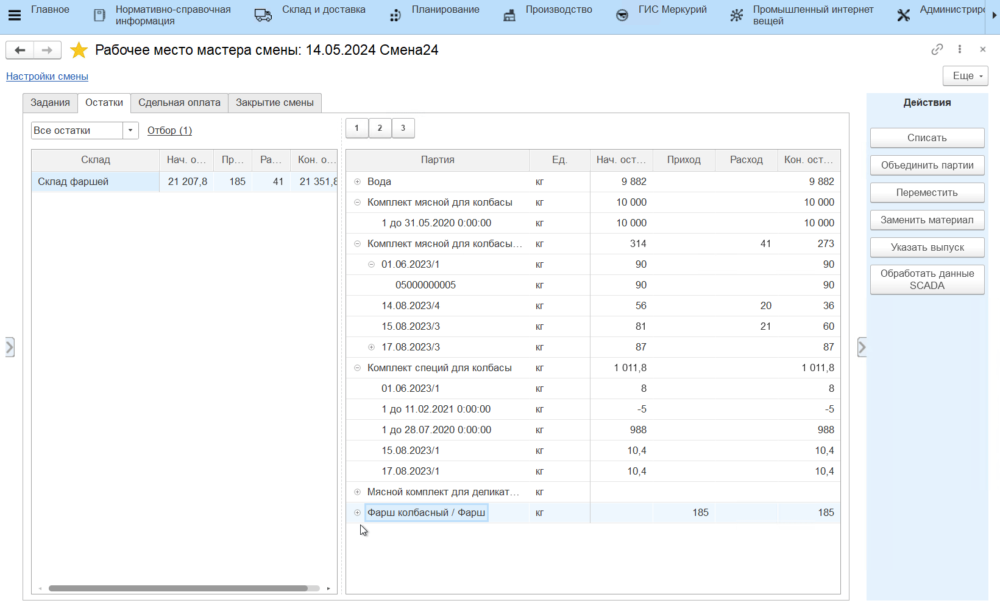

## Заменить материал

С помощью данной операции можно провести замену материала для существующего выпуска. Указанное количество уже использованного (заменяемого) материала приходуется обратно на склад, а материал-замена расходуется на ту продукцию, на которую тратился заменяемый. Для этого нужно:

- выбрать заменяемый материал, нажать **"Заменить материал"**;
- указать, чем заменяется (и серию), количество для замены.  

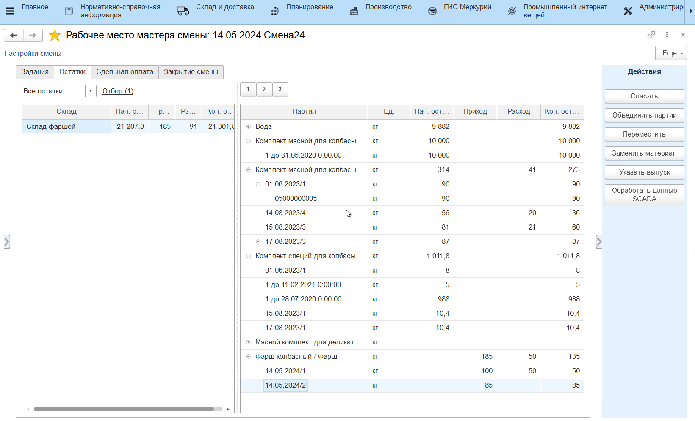

По итогу сформируется документ **"Распределение материалов"**.

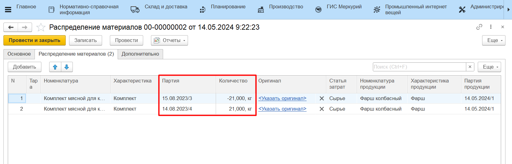

## Указать выпуск

Данная функция может использоваться как для оперативного учета, так и для учета в конце смены. Предполагает отражение фактических выпусков основной продукции, побочных выпусков и возвратных отходов.

??? info "Примечание"
    **Возвратный отход** - это побочная продукция, для которой установлена фиксированная цена. Материал на возвратный отход не распределяется (вариант распределения - **"Не распределять"**).

- Выбрать в таблице склад выпуска, нажать **"Указать выпуск"**. Указать, что и в каком количестве выпускается. Для вариантов распределения **Целиком по спецификации** и **Весь остаток** можно использовать вариант "Количество как сумма материалов", тогда количество выпуска автоматически станет равным количеству списываемого сырья;
- Указать спецификацию, по которой производится продукция.
- Указать вариант распределения;
- Указать склады, с которых расходуются материалы (кроме варианта распределения - **"Не распределять"**);
- Создается документ **"Переработка"** на выпуск указанной продукции. Количество выпуска и данные о материалах заполняются по указанному правилу.

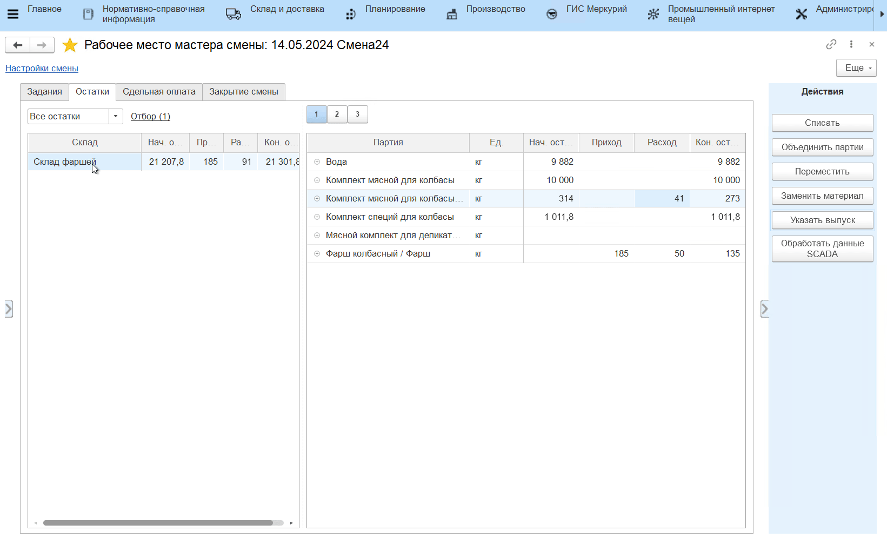

### Варианты распределения:

- **По норме** - списание материалов на данный выпуск будет выполнено в количествах с расчетом на норматив. Нормативное количество делится по партиям материала, которые подходят по спецификации и числятся на выбранном складе, перечень партий и количество к списанию можно корректировать вручную;
- **Целиком по спецификации** - будут списаны все остатки материалов с выбранных складов, которые по спецификации подходят для производства выпуска;
- **Весь остаток** - будут списаны все остатки материалов с выбранных складов;
- **Вспомогательные материалы** - с выбранных складов будут списаны только вспомогательные материалы, которые по спецификации подходят для производства выпуска. Списывается нормативное количество вспомогательных материалов, основной материал необходимо будет списать отдельной операцией;
- **Не распределять** - списание материалов на данный выпуск выполнено не будет. Распределение материалов на выпуск можно будет выполнить в конце смены по кнопке **"Списать"**.

# Закрытие рабочей смены

Когда  мастер смены удостоверился, что за текущую смену в систему введена корректная информация о выходах и остатках, следует закрыть смену на рабочем центре.

Переходим к закладке **"Закрытие смены"** и нажимаем кнопку **"Закрыть смену"**. 

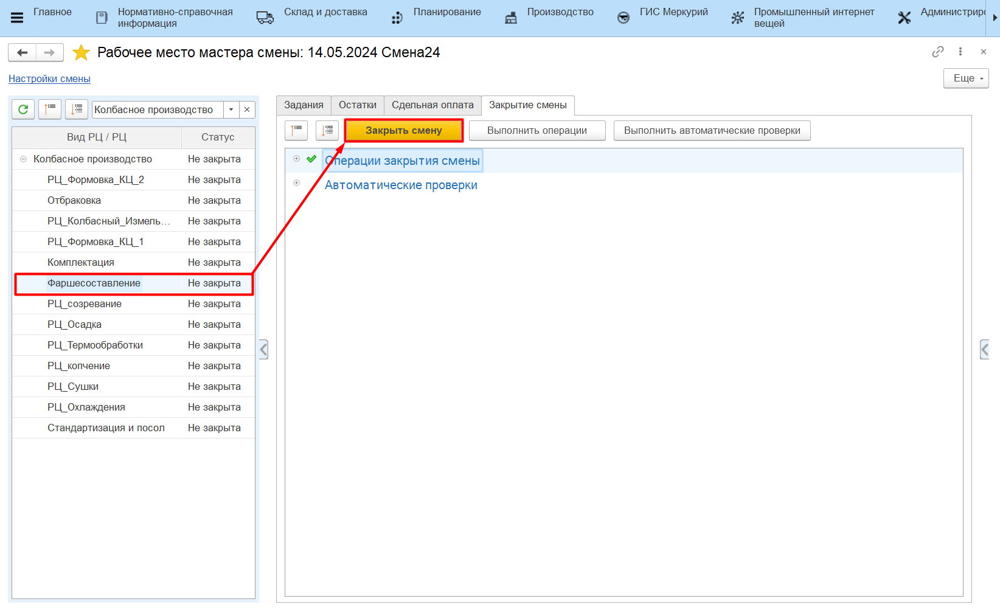

Если при закрытии смены система выявит некорректные данные, статус смены в табличной части слева изменится на **"Есть ошибки"**, а на закладке **"Закрытие смены**" отобразится информация о некорректных данных.

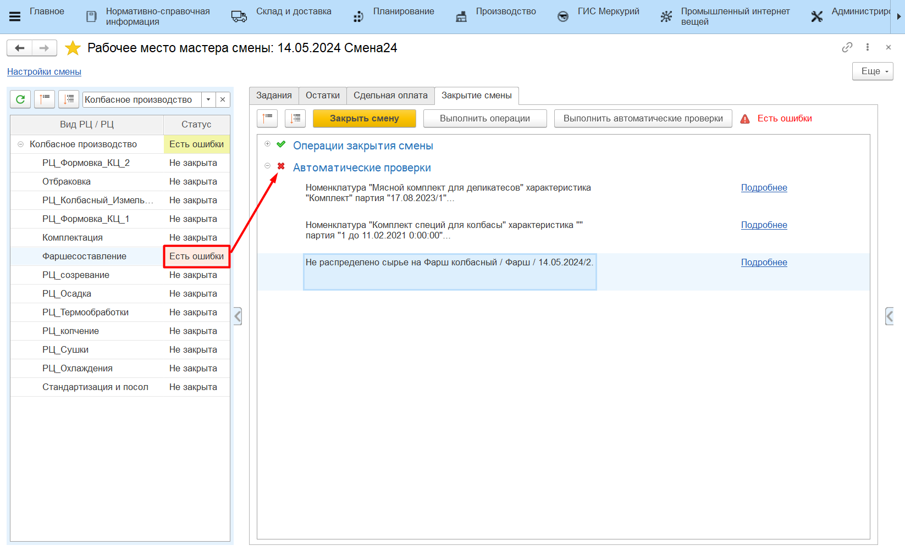

Если все данные за смену верны, статус смены на рабочем центре изменится на **"Закрыта"**:

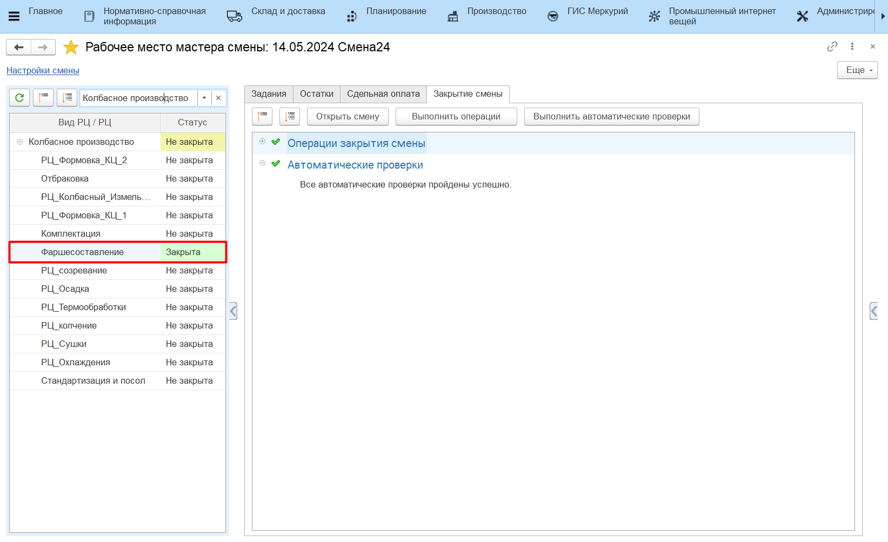