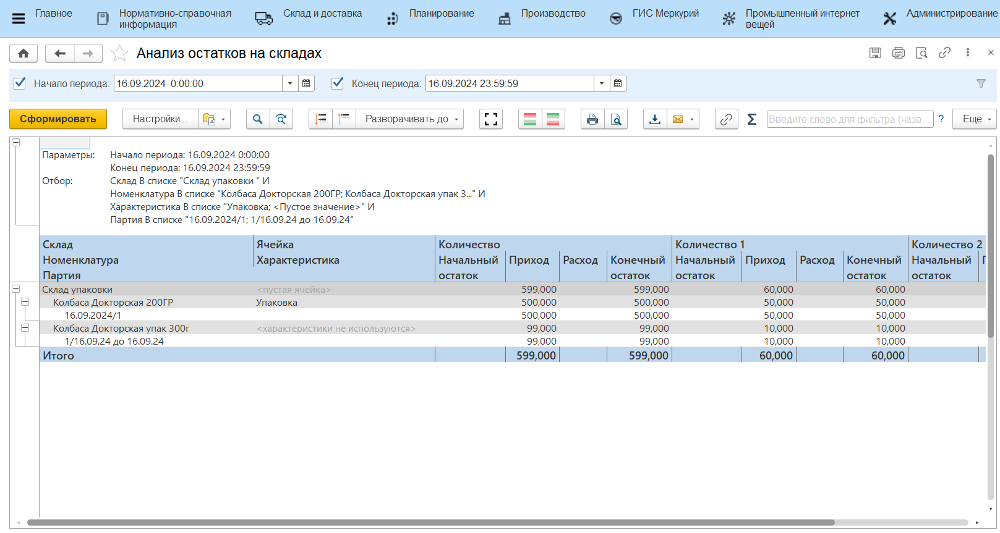
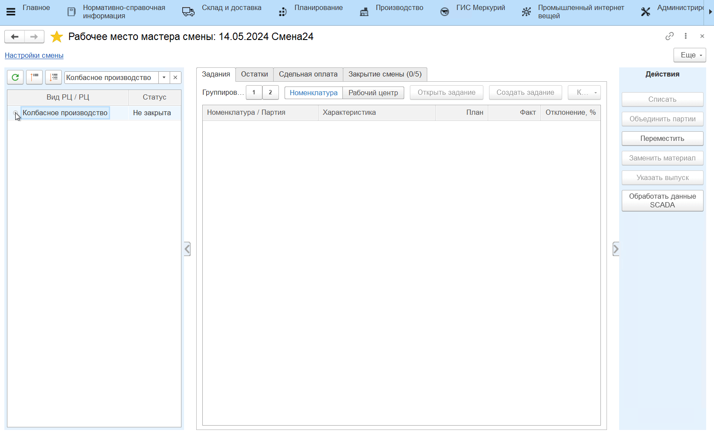

# Рабочее место мастера смены

Для контроля результатов производства за смену  в системе существует специальное рабочее место.

- В подсистеме **"Производство"** открываем **"Рабочее место мастера смены"**:

По гиперссылке **"Настройки смены"** открываем окно для ввода параметров смены.

- Вводим дату смены  вручную. Смена и временной диапазон заполнятся автоматически, при необходимости их можно скорректировать вручную.

- Закрываем окно ввода параметров смены и выбираем рабочий участок, на котором необходимо подвести итоги смены.

  Нажимаем кнопку "Обновить", в табличной части ниже появится информация о рабочем участке и рабочих центрах, закрепленных за ним.  Выбираем нужный вид рабочего центра, а затем рабочий центр:

# Задания

- На вкладке **"Задания"** можно увидеть информацию о выпущенных продуктах за текущую смену.

  Чтобы создать задание на смену, нажимаем на кнопку **"Создать задание"** в шапке вкладки. Откроется стандартная форма документа **"Производственное задание"**;

В табличной  части указана номенклатура произведенных продуктов, количество, которое планировалось произвести, фактически произведенное количество и процент отклонения от плана.

Возможны ситуации, когда физически произведено одно количество продукта, а по документам в системе указано другое. Если причиной отклонения является ввод ошибочных данных сотрудником цеха, созданные документы можно скорректировать.

Для этого выбираем партию, нажимаем кнопку **"Корректировка"** и выбираем пункт выпадающего списка **"Откорректировать количество"**:

В открывшемся окне вводим новое значение количества выпущенной продукции в используемых единицах измерения (кг, шт.)

- Нажимаем на кнопку **"ОК"**:
  

  
Откроется окно корректировки документов. Следует ознакомиться со списком и содержанием документов  и отметить флагом те, которые необходимо изменить.

- По завершении проверки нажимаем на кнопку **"ОК"**:
  

  
- В основном окне рабочего места появится следующее сообщение:

# Остатки
  
На вкладке **"Остатки"** отображаются текущие остатки материалов на складах рабочего центра и обороты сырья за смену.

Если за текущую смену на производстве выпускалась продукция и тратился материал, но в системе этот расход не отражен, и материал все еще числится на складе, следует списать его на сделанные выпуски. Для этого нужно:
  
- встать на строку сырья;
- нажать на кнопку **"Списать"**;
- в открывшейся форме выбрать вариант списания, указать или количество сырья (если списать нужно не всё), или его остаток и нажать **"ОК"**.

В таблице ниже автоматически скорректируется количество прихода и расхода по выбранной номенклатуре.

!!! info "Примечание"
    Кнопка **"Списать"** списывает выбранный материал на **все** подходящие по варианту распределения выпуски, в том числе на побочные. На возвратные отходы сырье не списывается.

### Варианты списания сырья

- **Согласно спецификации** - списание выбранных материалов происходит на все существующие выпуски за смену, для которых этот материал обозначен в спецификации.  

    ??? info "Пример"
        За смену были упакованы партии колбасы "Московская" (100кг) и "Докторская" (200кг). В спецификациях на эти колбасы в материалах указан "Пакет для вакуумирования". Если списать Пакет **Согласно спецификации** (600шт), то материал ляжет на выпуски и "Московской", и "Докторской" колбасы в объемах, пропорциональных объемам выпусков (200шт и 400шт).

- **Пропорционально списанному** - списание выбранных материалов происходит только на те выпуски, на которые этот материал уже был потрачен.

    ??? info "Пример"
        Если выбранный материал был потрачен на выпуск как *вспомогательный*, то по распределению **Пропорционально списанному**, он будет *досписан* на существующие выпуски. Например, "Пакеты для вакуумирования" были потрачены при упаковке на колбасу "Московскую" (5шт) и на колбасу "Докторскую" (15шт). Если списать по выбранной методике еще 100 пакетов, то 25шт спишутся на "Московскую" колбасу и 75шт на "Докторскую".
    
    - Этой опцией так же можно воспользоваться для списания **усушки**. Если на выпуск продукции уже было сделано распределение сырья, то дополнительное списание *основного* материала по варианту **Пропорционально списанному** отнесет списание на статью затрат Усушка.

    - Списать остатки по этой методике можно в том числе по нескольким рабочим центрам сразу. Если выбрана опция **"Списывать по всем рабочим центрам данного вида"**, то со всех рабочих центров будут подобраны выпуски, на которые уже был потрачен списываемый материал. По итогу списания на каждый рабочий центр будет создан свой документ **"Распределения материалов"**. Такая опция отражает сценарий, когда разные рабочие центры одного вида имеют общий склад и производят продукцию с использованием одних и тех же материалов.

    

- **Брак** - предполагает списание материалов (только вида "Короб" и "Пакет") на брак. Требует уже учтенного расхода материала. Выбранный материал списывается по статье затрат Брак на уже имеющиеся выпуски пропорционально потраченному. 

    ??? info "Пример" 
        "Пакеты для вакуумирования" были потрачены при упаковке на колбасу "Московскую" (5шт) и на колбасу "Докторскую" (15шт). Если списать на брак 4 пакета, то 1шт будет списана на колбасу "Московскую" и 3шт на колбасу "Докторскую".

# Закрытие рабочей смены

- Когда  мастер смены удостоверился, что за текущую смену в систему введена корректная информация о выходах и остатках, следует закрыть смену на рабочем центре.

Переходим к закладке **"Закрытие смены"** и нажимаем кнопку **"Закрыть смену"**. 

- Откроется предупреждение о закрытии смены по рабочим центрам:

Если при закрытии смены система выявит некорректные данные, статус смены в табличной части слева изменится на **"Есть ошибки"**, а на закладке **"Закрытие смены**" отобразится информация о некорректных данных.

- Если все данные за смену верны, статус смены на рабочем центре изменится на **"Закрыта"**:

