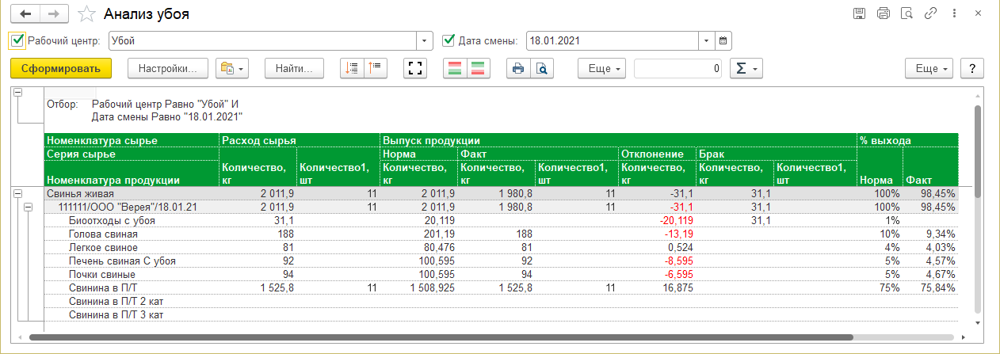

# Анализ участка убоя

Для контроля количественных показателей производства на участке убоя в системе предусмотрен отчет "Анализ убоя".

Для формирования отчета необходимо указать рабочую смену в поле "Дата смены" и нажать кнопку "Сформировать".

Таблица отчета содержит следующие данные:

- Номенклатура сырья - наименование сырья, из которого производился выпуск
- Серия сырья - сведения о партии израсходованного материала
- Номенклатура продукции - наименование туш, полутуш и субпродуктов, произведенных на участке убоя
- Расход сырья - фактические  количественные показатели сырья, использованного в производстве
- Выпуск продукции - количественные показатели выпущенной продукции по нормативу, по фактическим  данным, а также сведения об отклонении от норматива и о выпуске брака
- % выхода - показатели выхода продукции в процентах. В отчете отражен нормативный процент выхода и фактический процент выхода, что позволяет проанализировать качество каждой конкретной партии сырья.

