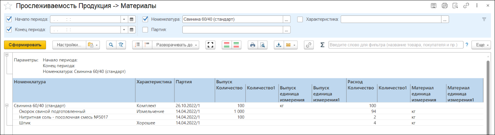
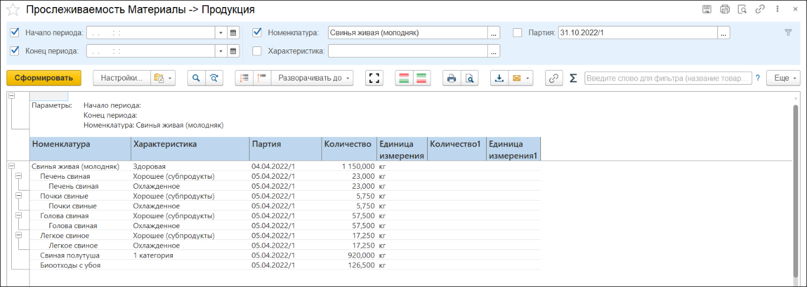

# Прослеживаемость партий

Для отслеживания ошибок, допущенных в производстве или в оперативном учете, в системе предусмотрены отчеты "Прослеживаемость Продукция->Материал" и "Прослеживаемость Материал->Продукция".

## Продукция -> Материал

Данный отчет позволяет определить, какие материалы были использованы для производства одной конкретной партии продукции вплоть до этапа приемки сырья.

Таким образом, если в партии готовой продукции выявлены качественные или количественные отклонения, отчет позволяет определить, корректно ли был соблюден процесс производства и какое сырье было использовано в процессе. 

# Материал -> Продукция

Данный отчет позволяет определить, какие полуфабрикаты и готовые продукты и в каком количестве были произведены из одной конкретной партии сырья.

В случае, если партию продукции переупаковывали путем перевзвешивания (из текущей характеристики выпустили предыдущую характеристику и заново выпустили текущую), отчет не выдает сообщение об ошибке выпуска партии продукции на саму себя.