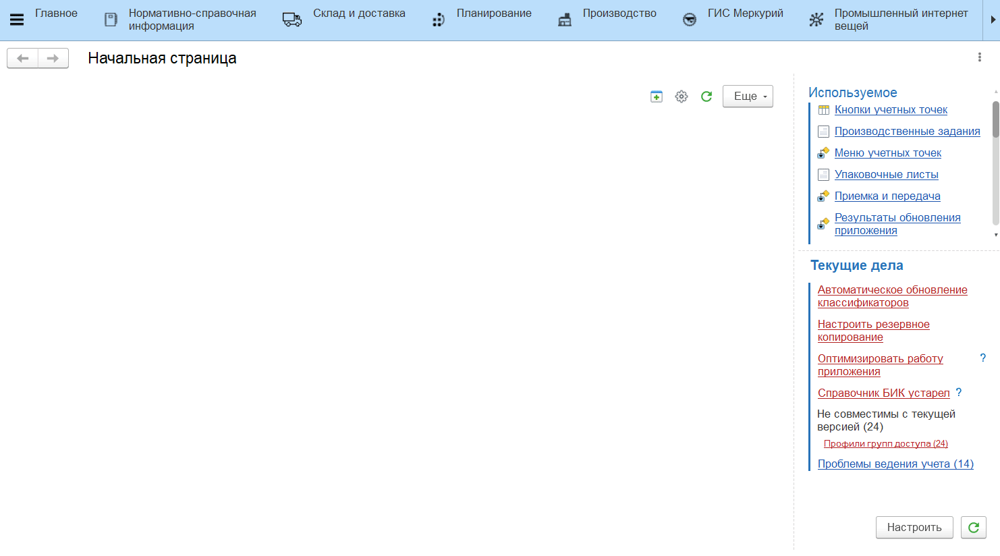
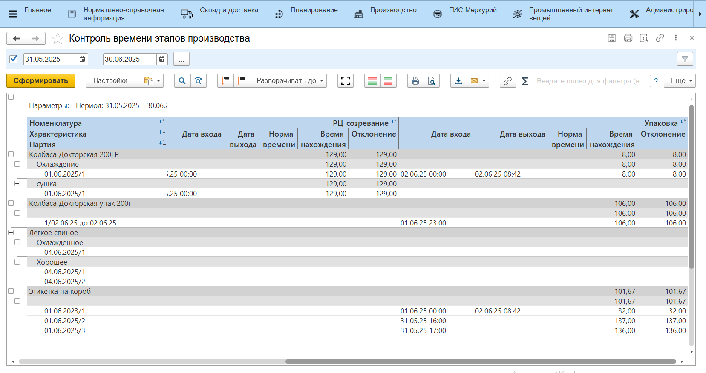

# Контроль времени этапов производства

Для контроля и анализа временных показателей производственного процесса на каждом рабочем центре предназанчен отчет **"Контроль времени этапов производства"**. Отчет расположен в разделе **"Производство"** в подсистеме **"Аналитика"** - **"Отчеты"**.

Для формирования отчета необходимо:

- указать дату начала периода аналитики;
- указать дату окончания периода.
- нажать **"Сформировать"**.

Установка периода аналитики не является обязательным. Можно не задавать даты для отображения всех данных без ограничений.

Для каждого из рабочих центров, задействованных в производственном процессе, отчет содержит следующую информацию:

- **Количество выпуск** - количество выпуска выбранной партии;
- **Дата входа** - дата поступления партии на данный рабочий центр;
- **Дата выхода** -  дата выхода партии с данного рабочего центра. При отсутствии выпуска данная колонка будет не заполненной;
- **Норма времени** -  время, необходимое для обработки партии продукции на данном рабочем центре. Задается в ресурсной спецификации;
- **Время нахождения** -  время нахождения партии на рабочем центре;
- **Отклонение** - отклонение фактического времени нахождения на рабочем центре от нормативного.
