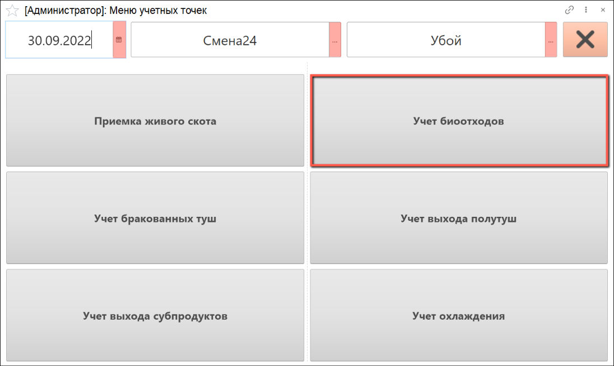
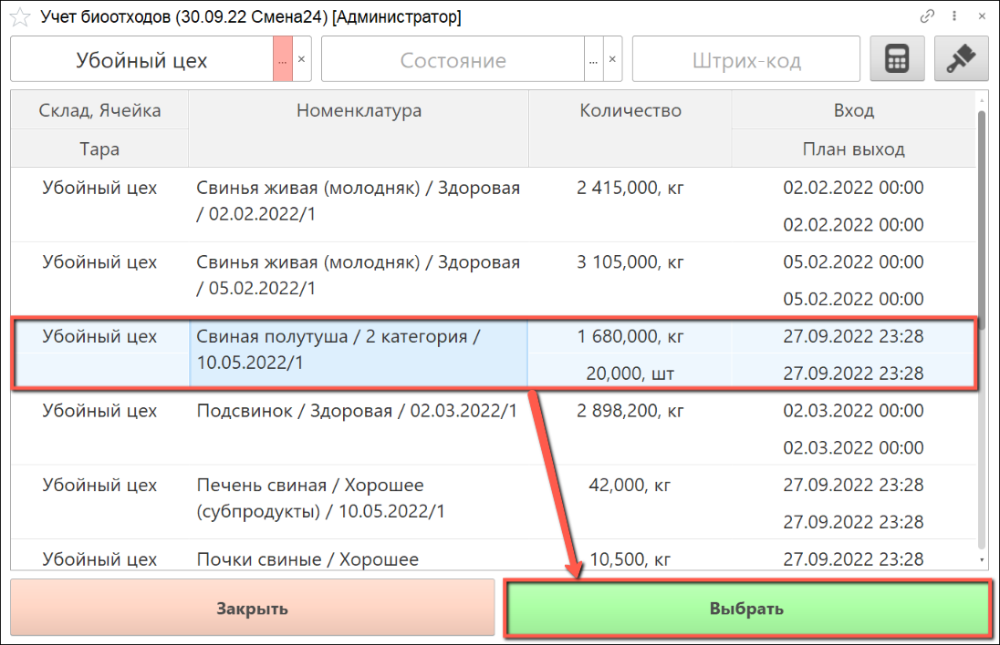
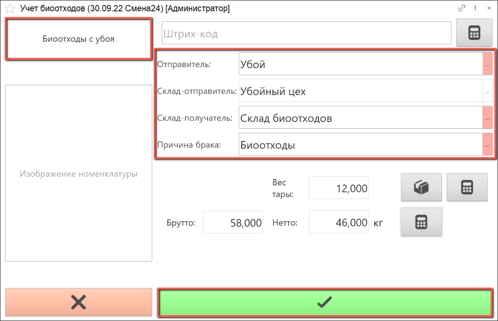
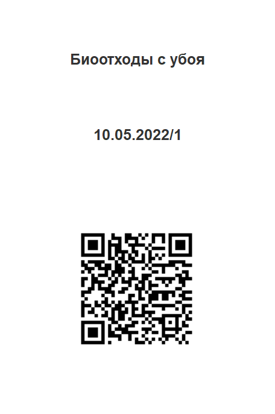

# Учет биоотходов

Учет биоотходов осуществляется через киоск, производственное задание для данной операции не требуется.

- В подсистеме **"Производство"** открываем **"Меню учетных точек"**:

- Указываем дату смены, смену и учетную точку, на которой производится учет. Нажимаем на кнопку **"Учет биоотходов"**:

- Открывается список партий сырья, которые на данный момент находятся на участке убоя.

  Выбираем в списке  партию сырья, по которой планируется учет биоотходов:

- В верхнем левом углу видим информацию о номенклатуре выпуска.

Справа указаны рабочий центр, склад-отправитель и склад-получатель по умолчанию. При необходимости рабочий центр и склад-получатель можно изменить вручную.

В поле **"Причина брака"** выбираем из списка **"Биоотходы"**.

С помощью калькулятора тары подбираем тару, в которой производится взвешивание брака.

Получаем вес брутто с весов, вес нетто рассчитается автоматически, нажимаем кнопку **"Подтвердить"**:

- Распечатывается этикетка партии биоотходов:

