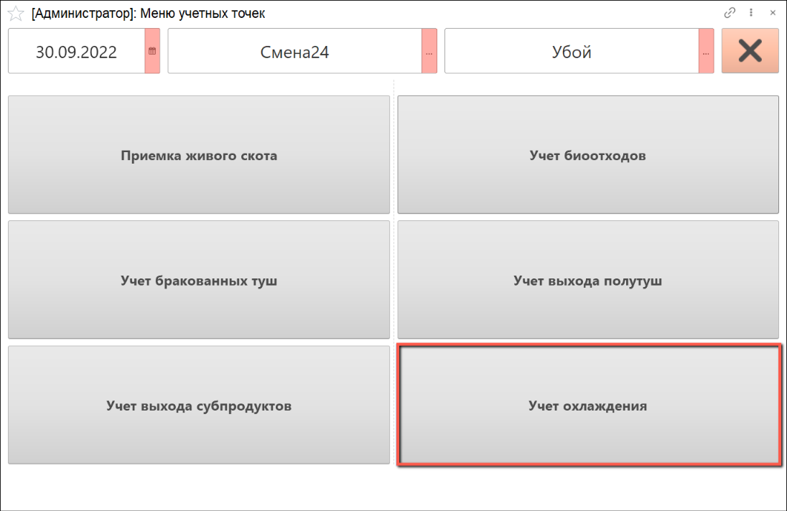
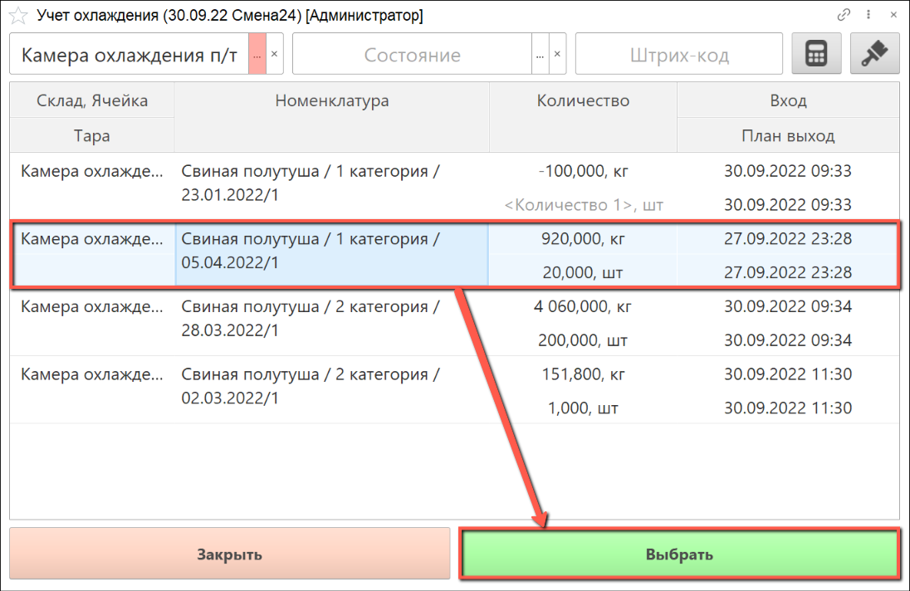
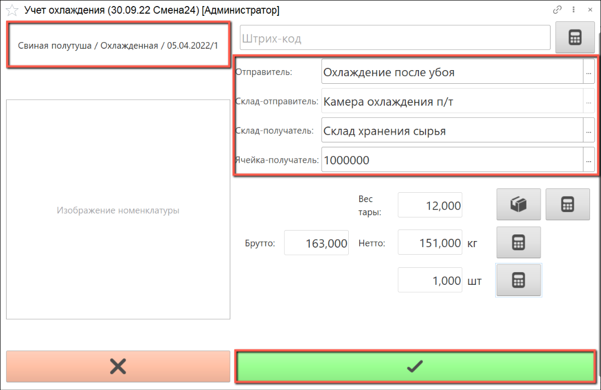

# Учет охлаждения

Учет охлаждения на участке убоя осуществляется через киоск, производственное задание для данной операции не требуется.

- В подсистеме **"Производство"** открываем **"Меню учетных точек"**:

- Указываем дату смены, смену и рабочий участок, на котором производится учет охлаждения. Нажимаем на кнопку **"Учет охлаждения"**:

- Открывается список партий сырья, которые на данный момент находятся на участке убоя.

Выбираем из списка партию сырья, которую собираемся переместить на другой склад:

- В верхнем левом углу видим информацию о номенклатуре выпуска. Номенклатуре выпуска присваивается характеристика "Охлажденная".

Справа указаны рабочий центр, склад-отправитель и склад-получатель по умолчанию. При необходимости склад-получатель можно изменить. Ячейку склада-получателя необходимо заполнить вручную, выбрав ее из списка.

С помощью калькулятора тары подбираем тару, где производится взвешивание охлажденного сырья. Если осуществляется охлаждение туш и полутуш, количество штук рассчитывается автоматически, при необходимости его можно изменить с помощью сенсорной клавиатуры.

- Получаем вес брутто с весов, вес нетто рассчитается автоматически, нажимаем кнопку **"Подтвердить"**:

  