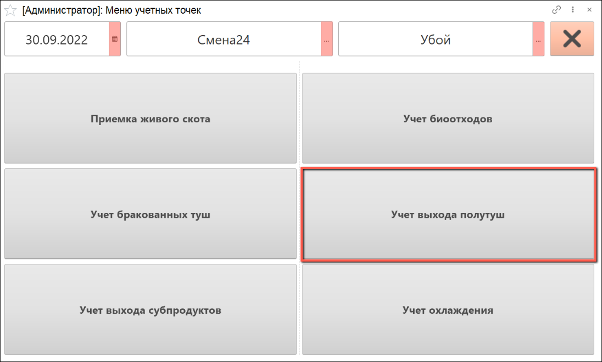
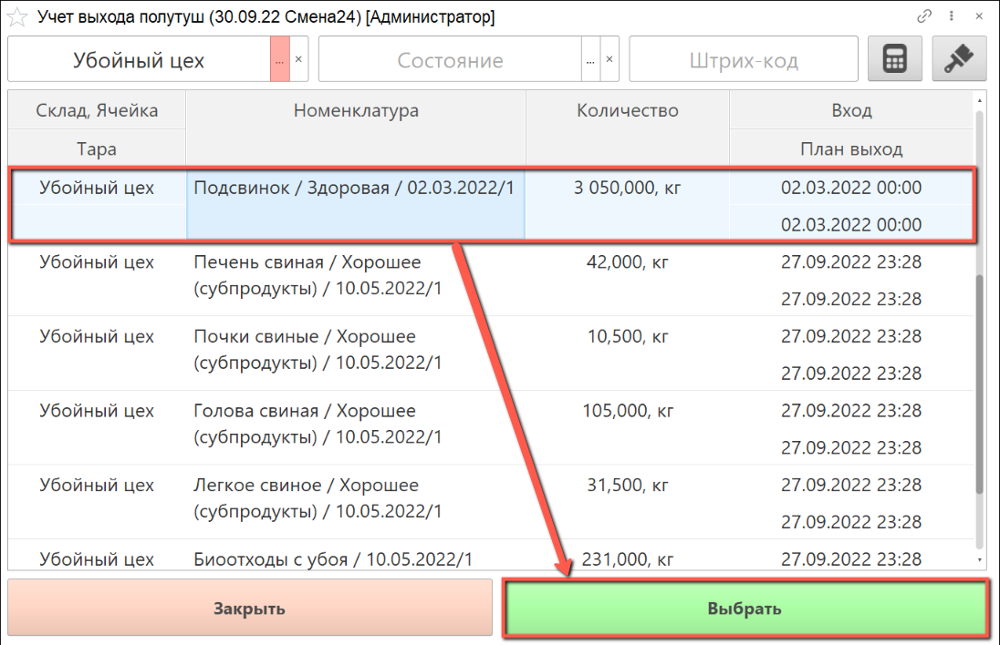
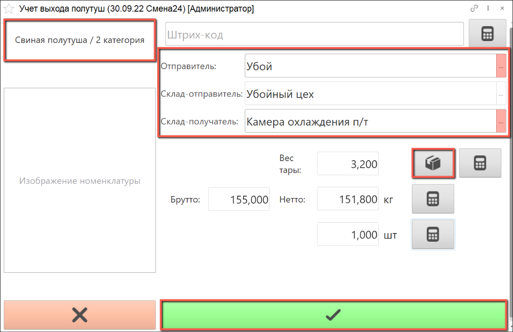
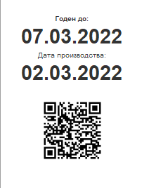

# Учет выхода полутуш

Учет выхода полутуш осуществляется через киоск, производственное задание для данной операции не требуется.

- В подсистеме **"Производство"** открываем **"Меню учетных точек"**:

- Указываем дату смены, смену и учетную точку, на которой производится учет. Нажимаем на кнопку **"Учет выхода полутуш"**:

- Выбираем склад, на котором производится взвешивание полутуш. Находим партию сырья, по которой необходимо произвести учет выхода полутуш и нажимаем кнопку "Выбрать":

- Открывается окно для заполнения данных о номенклатуре сырья. 

Слева указана номенклатура выходного изделия, которое нужно взвесить.

Справа автоматически указываются рабочий центр, на котором производится взвешивание сырья, склад-отправитель и склад-получатель. При желании, можно изменить рабочий центр и склад-получатель вручную

- С помощью калькулятора тары указываем количество крюков, на которых производится взвешивание. Количество полутуш система указывает автоматически, при необходимости данное значение можно скорректировать вручную при помощи сенсорной клавиатуры.

- Получаем вес брутто с весов, вес нетто рассчитается автоматически.

- По окончании взвешивания нажимаем на кнопку "Выпуск":

- По окончании операции взвешивания полутуш печатаются этикетки на указанный выпуск в количестве, соответствующем количеству выпущенных полутуш:

