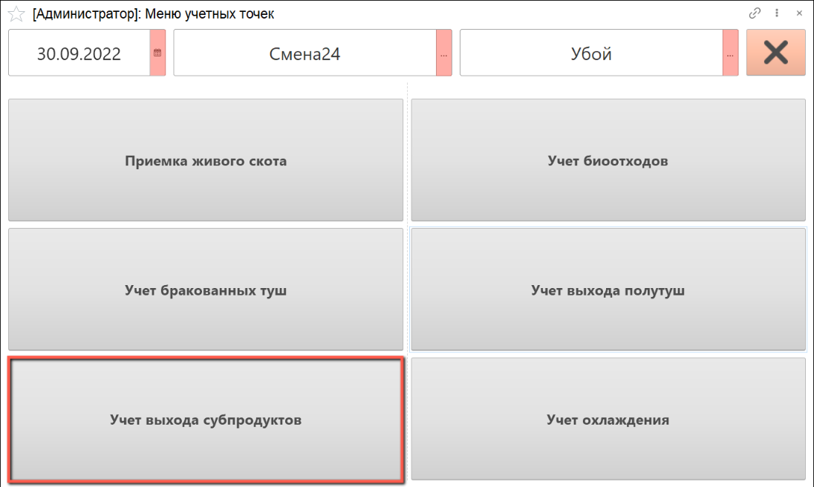

# Учет выхода субпродуктов

Учет выхода субпродуктов осуществляется через киоск, производственное задание для данной операции не требуется.

- В подсистеме **"Производство"** открываем **"Меню учетных точек"**:

- Указываем дату смены, смену и учетную точку, на которой производится учет. Нажимаем на кнопку **"Учет выхода субпродуктов"**:

- Выбираем склад, на котором производится взвешивание полутуш. Находим партию сырья, по которой необходимо произвести учет выхода субпродуктов и нажимаем кнопку "Выбрать":

- Открывается окно для заполнения данных о номенклатуре субпродуктов.

Слева указана номенклатура выходного изделия, которое предполагается взвесить. Если номенклатура не соответствует, ее следует выбрать из списка, нажав на номенклатуру (см.ниже).

Справа автоматически указываются рабочий центр, на котором производится взвешивание сырья, склад-отправитель и склад-получатель. При желании, можно изменить рабочий центр и склад-получатель вручную.

- С помощью калькулятора тары указываем тип и количество тары, в которой производится взвешивание.

- Получаем вес брутто с весов, вес нетто рассчитается автоматически.

- По окончании взвешивания нажимаем на кнопку **"Подтвердить"**:

- При изменении номенклатуры выходного изделия открывается список, указанный в ресурсной спецификации. Выбираем номенклатуру и нажимаем на кнопку **"Подтвердить"**:

- По окончании операции взвешивания сырья печатается этикетка на указанный выпуск:

